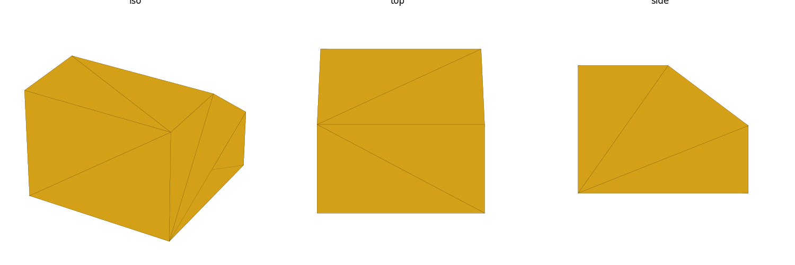
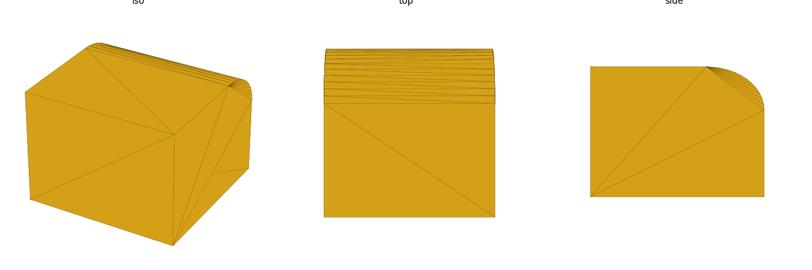
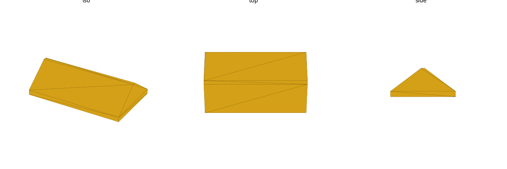
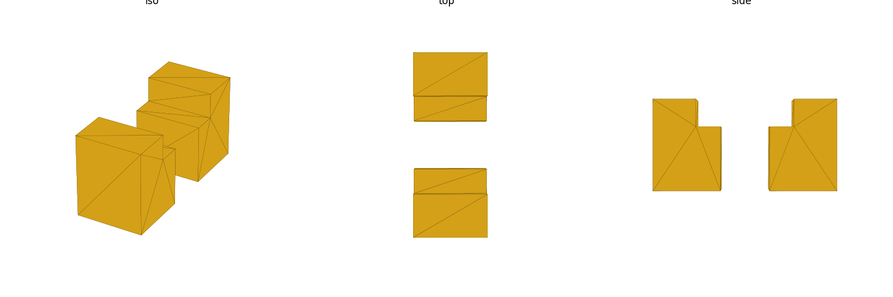
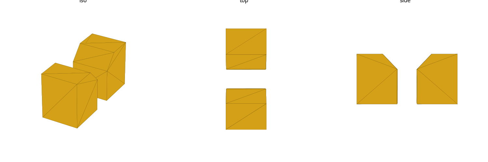
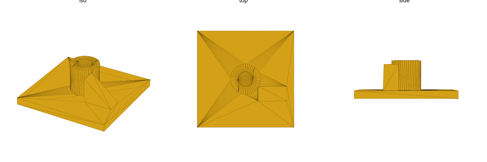
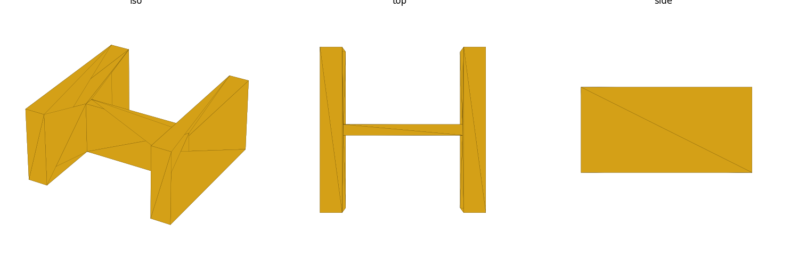
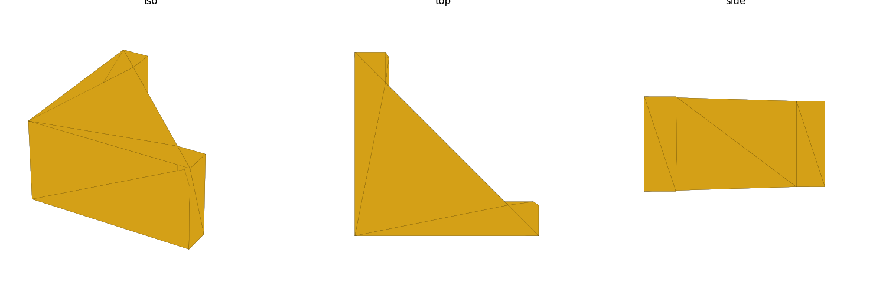
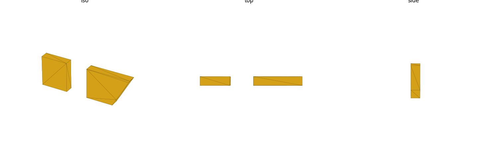
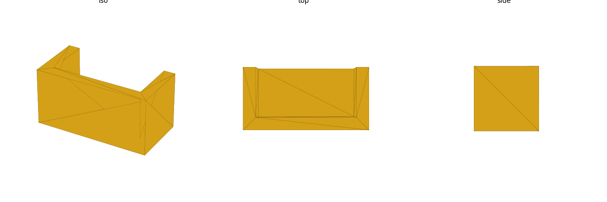

# Glossary of Print and CAD Terms

Short definitions for the geometry vocabulary this skill and this repo use.
Each entry differentiates the term from its closest neighbor, notes a
print/physics implication, and points at the guidance page with the fuller
reasoning.

## Chamfer

A flat angled cut across an edge, replacing a sharp 90° edge with a straight
bevel face (usually 45°). **Differs from a fillet**: a chamfer is a flat
plane, a fillet is a curved (radiused) surface.

- Pros: easy to print self-supporting (a 45° chamfer is exactly at the
  self-support limit), easy to parametrize in OpenSCAD (`hull()` of two
  offset shapes, or `chamfer()`-style corner cuts), forgiving of elephant's
  foot at a part's base.
- Cons: less smooth to the touch/eye than a fillet; doesn't reduce stress
  concentration as well as a fillet for load-bearing internal corners.
- When to use: base edges (elephant's foot relief), the entry/exit of a
  horizontal hole (avoids a flat unsupported roof), the underside of an
  overhang you want to keep support-free.
- Print/physics note: a 45° chamfer is the standard way to eliminate an
  overhang without adding a support structure — see `overhangs-supports.md`.

## Fillet

A curved (radiused) transition replacing a sharp edge or internal corner.
**Differs from a chamfer**: curved, not flat; **differs from a round**: in
this glossary "fillet" specifically means a *structural/internal* radius,
while "round" (below) is used more loosely for any rounded edge, including
purely cosmetic external ones.

- Pros: spreads stress over a curved surface, cutting stress-concentration
  at inside corners; smoother surface finish; often stronger than a sharp
  or chamfered corner at the same material cost.
- Cons: an external fillet on top of a horizontal surface has a curved top
  that starts as a near-flat overhang and gets progressively easier — it can
  still need modest bridging/overhang care right at its start, unlike a
  chamfer which is self-supporting from its very first layer.
  Slightly harder to parametrize than a chamfer in raw CSG.
- When to use: any internal corner carrying load (rib-to-wall, boss-to-wall,
  bracket inside corner) — this is the default choice for structural
  corners in this repo.
  See baseline research: the repo's own reasoning on an M3 boss junction
  picked a **fillet**, not a chamfer, specifically for stress relief.
- Print/physics note: fillet internal corners to cut stress concentration —
  see `strength-physics.md`.

## Bevel

A flat angled surface on an edge — geometrically the same construction as a
chamfer. **Differs from a chamfer only in convention/scale**: "chamfer"
is typically used for a small, functional edge-break (sub-mm to a few mm,
often driven by a print or fit requirement), while "bevel" is more often
used for a larger, visible angled face that's part of the part's design
language (e.g. a beveled panel edge for a specific look, or a large
sloped face that also happens to double as a self-supporting angle).

- Pros/cons: same as chamfer — flat, self-supporting up to 45°, easy to
  parametrize.
- When to use: large angled faces where "chamfer" would undersell the
  visual/functional role (a beveled lid edge, a sloped enclosure face).
- Print/physics note: like a chamfer, a bevel at ≤45° from vertical is
  self-supporting — see `overhangs-supports.md`.

## Round

A general/informal term for any rounded (radiused) edge — the geometric
result is identical to a fillet. **Differs from fillet only in register**:
"round" is the everyday word (e.g. "round over that edge"), "fillet" is the
CAD/engineering term used when the radius is doing structural work. This
glossary uses "fillet" whenever the radius matters for strength, and treats
"round" as its casual synonym elsewhere.

- When to use: cosmetic edge-break where comfort/finish matters more than
  stress (a handle edge, an external corner nobody will load).
- Print/physics note: same self-support caveat as fillet above — a round
  external edge on top of a horizontal surface starts as a near-flat
  overhang.

Reuses  — same geometry as fillet, no separate image.

## Counterbore

A stepped, flat-bottomed cylindrical recess around a hole, sized so a bolt
head (or nut) sits flush or recessed with straight (not angled) walls.
**Differs from a countersink**: counterbore walls are vertical/flat-bottom
for a socket-head or hex bolt/nut; countersink walls are angled for a flat
(csk) screw head.

- Pros: flush-mount hardware, clean visible top face, works for socket-head
  cap screws and nuts.
- Cons: the flat recess ceiling is itself a small unsupported horizontal
  span when the hole's axis is horizontal — same bridging concern as any
  flat internal roof.
- When to use: socket-head screws, embedded nuts, anywhere you need a flat
  bottomed pocket rather than an angled seat.
- Print/physics note: keep the counterbore axis vertical (parallel to the
  print's Z) where possible so its recess floor prints as a normal
  horizontal layer, not a bridge — see `overhangs-supports.md`.

## Countersink

A conical, angled recess around a hole sized so a flat/countersunk screw
head sits flush. **Differs from counterbore**: angled walls, not a flat
vertical-walled pocket. This repo's chassis uses countersunk M3 screws for
the lid — see `csk_head_extra` in `house-rules.md`.

- Pros: flush finish for flat-head screws, and — usefully for
  support-free printing — a *conical* countersink is itself a self-supporting
  shape as long as its cone half-angle stays under ~45° from vertical (a
  naive flat-bottomed counterbore used where a countersink was intended can
  reintroduce a flat overhang; a true angled countersink avoids it).
- Cons: needs a countersunk (not pan/socket) screw head to seat properly.
- When to use: flush lid/panel fasteners, this repo's `csk_head_extra`
  convention for M3 lid screws.
- Print/physics note: a countersink's cone is naturally self-supporting if
  its half-angle is ≤45° — don't approximate it with a flat-bottom
  counterbore on a horizontal hole, that reintroduces an unsupported flat
  roof. See `overhangs-supports.md`.

## Boss

A raised, usually cylindrical, local wall-thickening around a hole or
insert — the material that surrounds a heat-set insert bore or a screw
boss. **Differs from a rib or gusset**: a boss is a solid-of-revolution
local thickening around a hole; ribs/gussets are thin, planar
reinforcement fins elsewhere on the part.

- Pros: gives an insert or screw enough surrounding material to resist
  splitting/pull-out without thickening the whole wall.
- Cons: a boss that stands freestanding off a floor with no wall/rib tying
  it in becomes a weak, easily-snapped-off cantilever — see baseline
  research below.
- When to use: every heat-set insert or screw boss in this repo
  (`board_insert_bore`, `lid_insert_bore` in `house-rules.md`). **Always
  tie a boss into an adjacent wall or add a gusset** — a freestanding boss
  with no local reinforcement is a known failure mode this skill exists to
  prevent.
- Print/physics note: boss wall thickness (`boss_wall` = 3.2 mm in this
  repo's chassis) and fillet the boss-to-wall junction — see
  `strength-physics.md`.

## Rib

A thin, planar reinforcing fin that stiffens a large flat face against
flexing, without thickening the whole wall. **Differs from a gusset**: a
rib runs along/across a flat face (stiffens against bending/flex of that
face); a gusset is a triangular brace specifically at a corner/joint
(transfers load between two faces meeting at an angle).

- Pros: adds stiffness for far less material/print time than thickening
  the whole wall; can be tuned in height/spacing independently of the
  part's outer shape.
- Cons: a rib that's too tall or too thin relative to the wall it's on can
  warp, or can itself need support if it stands proud of a horizontal
  overhang; over-spacing ribs leaves gaps that still flex.
- When to use: large flat panels, chassis floors/lids that need to resist
  oil-canning or flex without going to a uniformly thick wall.
- Print/physics note: prefer several thin ribs over one tall thick one, and
  keep rib thickness related to nominal wall thickness (rule-of-thumb,
  see `strength-physics.md`) rather than an arbitrary pick.

## Gusset

A triangular (or filleted-triangular) brace spanning the inside corner
where two faces meet, transferring bending load between them.
**Differs from a rib**: a gusset specifically braces a *corner/joint*
(e.g. a cantilevered arm meeting its mounting wall); a rib stiffens a
*face*. A gusset is the direct fix for a freestanding/cantilevered
feature that would otherwise flex or snap at its base.

- Pros: turns a weak cantilever joint into a triangulated, much stiffer
  load path; solid + filleted gussets outperform thin unfilleted ones.
- Cons: adds bulk/print time at the joint; needs its own overhang/orientation
  check if the part is printed in an orientation where the gusset face
  itself becomes an overhang.
- When to use: any arm, shelf, or boss projecting from a wall under load —
  this is the repo's answer to "freestanding boss" and "load hanging off
  one end" failure modes.
- Print/physics note: prefer a gusset (or fillet-reinforced local
  thickening) over either (a) a thin unsupported shelf, or (b) uniformly
  thickening the whole wall — see `strength-physics.md`.

## Draft

A small taper angle applied to a vertical wall or a feature's sides so it's
easier to demold/separate (injection molding heritage) or, in FDM context,
easier to keep self-supporting and dimensionally forgiving.
**Differs from a chamfer**: draft is a small angle applied across an
entire wall height (a few degrees), not a discrete edge cut.

- Pros: in FDM, a drafted (tapered) vertical hole or boss is easier to
  print accurately than a perfectly vertical one, and a drafted pocket
  is easier to remove a mating part from.
- Cons: changes the part's nominal dimensions top-to-bottom — needs to be
  accounted for in any measured fit.
- When to use: tall bosses/pockets to sit assembled or removable, print-in-place
  features.
- Print/physics note: minor draft doesn't meaningfully change the 45°
  self-support calculus for FDM unless it's large — see
  `overhangs-supports.md`.

## Shell / Wall

The solid perimeter thickness enclosing a part's interior — in slicer terms,
"walls"/"perimeters" (2D, per-layer) build up into a "shell" (3D, the
overall enclosing skin). **Differs from infill**: infill is the internal
lattice/fill pattern inside the shell; the shell/walls are the outer
skin that actually carries most structural load.

- Pros: wall count/thickness dominates strength for most parts — increasing
  wall count is usually a better strength-per-gram trade than increasing
  infill density (see `strength-physics.md`).
- Cons: very thick uniform walls cost print time/material without the
  targeted benefit a rib or gusset gives at an actual stress point.
- When to use: as the default first lever for strength before reaching for
  higher infill; pick wall thickness as a multiple of nozzle width
  (this repo's 0.4 mm nozzle → 3–4 perimeters ≈ 1.2–1.6 mm is a reasonable
  starting shell thickness, rule-of-thumb, see `strength-physics.md`).
- Print/physics note: perimeters beat infill for strength in most FDM
  parts — see `strength-physics.md`.

