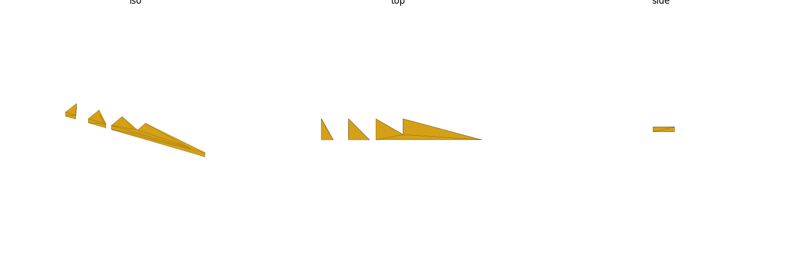
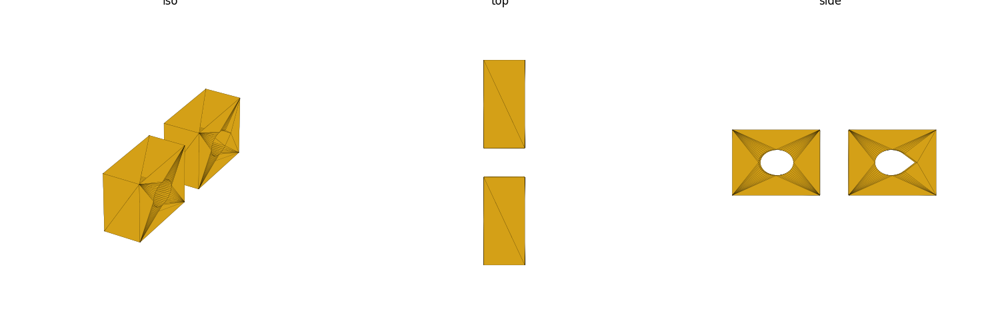
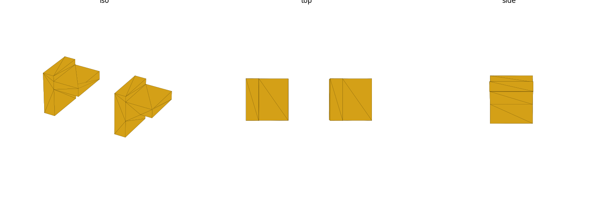
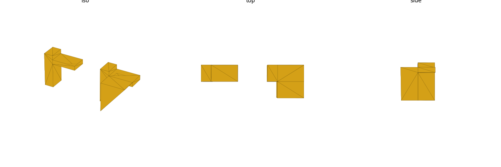

# Overhangs, Supports, Bridging, and Orientation

This repo prints support-free (see the hard constraint in
`house-rules.md`). This page is the concrete toolkit for achieving that:
know the two escape hatches (self-supporting overhangs, bridging), then
default to the design patterns below whenever a naive design would need a
support.

## The 45° self-support rule

An overhang steeper than 45° from vertical (i.e., a wall leaning more than
45° from straight up) generally needs support material; at 45° or less,
each new layer still overlaps roughly half of the layer beneath it, which
is enough bonding to print clean. This is a broad FDM consensus figure — [B]
(<https://www.snapmaker.com/blog/45-degree-rule-3d-printing/>,
corroborated by <https://www.hubs.com/knowledge-base/how-design-parts-fdm-3d-printing/>
and <https://www.xometry.com/resources/design-guides/design-guide-fused-deposition-modeling-fdm-3d-printing/>).

Caveats worth carrying into a design decision:

- It's a guideline, not a hard physical limit — cooling, layer height, and
  nozzle size shift the real number a few degrees either way. Don't treat
  46° as an automatic failure or 44° as automatically safe; leave margin.
- Material matters: PETG's practical ceiling (this repo's default material)
  is closer to the 45° line than PLA's — see `house-rules.md`. Don't borrow
  overhang confidence from PLA advice.
- **A fillet on top of a horizontal surface starts as a near-flat (0° from
  horizontal, i.e. ~90° from vertical) overhang** — the curve only gets
  self-supporting partway through its own sweep. A **chamfer** at 45° is
  self-supporting from its very first layer. This is why the glossary and
  `strength-physics.md` recommend fillets for load-bearing internal corners
  but chamfers when the corner also has to survive print-in-place at that
  orientation.
- Image (the sweep from vertical wall → 45° self-supporting limit → flat
  overhang, and where a chamfer sits on it):

## Bridging: spanning open air between two supports

A bridge (material printed in mid-air between two solid anchor points, with
no support underneath) behaves differently from an overhang because
tension in the just-extruded filament between the two anchors, plus
cooling, keeps it from sagging — up to a limit.

- **≤5 mm: reliably self-supporting, minimal-to-no sag.** This is the
  figure both Hubs/Protolabs Network and Xometry's FDM design guides give
  as their bridging threshold — [B]
  (<https://www.hubs.com/knowledge-base/how-design-parts-fdm-3d-printing/>,
  <https://www.xometry.com/resources/design-guides/design-guide-fused-deposition-modeling-fdm-3d-printing/>).
- **~5–10 mm: usually fine functionally, expect minor first-layer droop** —
  rule-of-thumb, corroborated informally across several independent DFM
  guides but not a single authoritative number; treat it as "acceptable if
  the surface doesn't need to be cosmetic or precisely dimensioned."
- **>30 mm unsupported: don't** — rule-of-thumb; sag becomes significant and
  the failure mode compounds with span length. Prusa's own knowledge base
  explicitly declines to give one hard number and instead recommends test
  prints, since span tolerance is filament/settings/printer-size dependent
  (<https://help.prusa3d.com/article/poor-bridging_1802>).
- If a design needs a wider unsupported gap than these figures allow,
  redesign rather than accept a support: split the span with an
  intermediate tie/rib, reorient the part so the span becomes vertical, or
  narrow the feature.

## Teardrop and chamfered horizontal holes

A round hole printed with its axis horizontal has a problem at its top: the
last few degrees of the circle before the top center are effectively a
flat, unsupported overhang (well past 45° from vertical) — it sags, ovals,
or needs a support.

- **Teardrop cross-section**: replace the top of the circle with two faces
  meeting at ≤45° from vertical (a "roof" instead of a dome), so the hole
  is self-supporting at every point around its perimeter, at the cost of a
  slightly non-circular top that a round pin/rod doesn't fill. This is the
  standard FDM answer to "I need a round-ish horizontal hole with no
  support" and directly counters the temptation to leave a plain round
  hole horizontal (see this skill's baseline reasoning on press-fit lids + cable holes).
- **Chamfered entry/exit**: if you counterbore or countersink the mouth of
  a horizontal hole, chamfer/cone it rather than using a flat-bottomed
  counterbore — a flat-bottomed recess on a horizontal hole reintroduces
  exactly the flat-overhang problem the teardrop shape was fixing. See
  "Countersink" vs "Counterbore" in `glossary.md`.
- If dimensional accuracy of a true circular bore matters more than
  print-cleanliness (e.g. a precision bearing bore), the better fix is
  usually to **reorient the part** so the hole axis is vertical (see
  below), not to force a horizontal round hole through supports.

## Orient to eliminate overhangs

Before reaching for a chamfer or a teardrop shape, ask whether reorienting
the whole part removes the overhang entirely — it's usually cheaper than
locally patching geometry.

- A hole that's a headache horizontal (round, needs teardropping) may be
  trivial vertical (every layer prints a full undistorted circle — see
  "Counterbore" in `glossary.md` on keeping bore axes vertical).
- A boss or rib that would print as a cantilevered overhang in one
  orientation may print as a standard vertical extrusion in another.
- Reorientation isn't free: it can turn a different feature into a new
  overhang, expose a new face to elephant's foot (`tolerances-fits.md`), or
  change which axis carries load across weak interlayer bonds
  (`strength-physics.md`) — check all three before committing to an
  orientation, not just the overhang you're trying to fix.

## Support-free structural patterns

Two patterns specifically counter the "prop something up with a bare shelf
or a freestanding post" temptation:

- **Chamfer under an overhang, not a flat shelf.** A flat shelf/ledge
  sticking out to catch a horizontal overhang is itself an unsupported
  horizontal span at its outer edge if it's cantilevered, and it does
  nothing to reduce the overhang angle above it. A 45° chamfer transition
  instead removes the overhang geometrically — nothing to catch because
  there's no longer a flat roof to sag.
- **Gusset instead of a shelf/freestanding boss.** A boss or arm
  cantilevered off a wall with no triangulating brace is both a
  print-orientation problem (it either overhangs or needs a raft under it)
  and a strength problem (weak moment joint at the base — see
  `strength-physics.md`). A gusset ties the cantilever back to the wall
  along a printable, self-supporting triangular face, fixing both problems
  in one feature. This directly counters the "freestanding boss" temptation
  flagged in this skill's own baseline research.

## Cross-references

- Term definitions (chamfer, fillet, counterbore, countersink, boss, rib,
  gusset): `glossary.md`
- Printer/material context (why PETG's ceiling is close to 45°), no-supports
  constraint: `house-rules.md`
- Why load direction also matters when picking an orientation:
  `strength-physics.md`
- Fit clearance for anything sized after a reorientation decision:
  `tolerances-fits.md`
