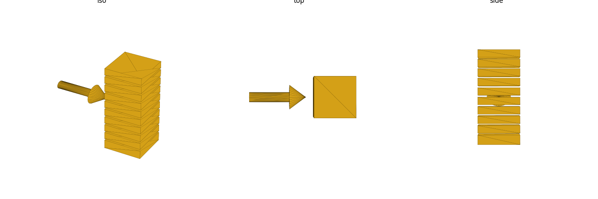
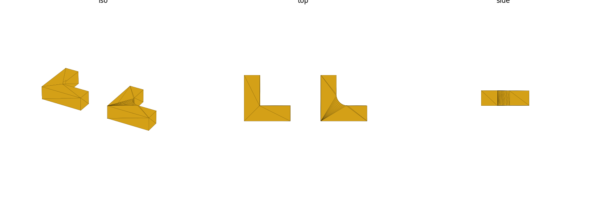

# Part Strength, Layer Direction, and Structural Design

FDM parts are not structurally uniform in every direction the way a molded
or machined part is. This page covers the anisotropy fact and the concrete
design moves (orientation, ribs/gussets, fillets, boss wall thickness) that
follow from it.

## Layer anisotropy: Z is the weakest direction

FDM builds a part as a stack of welded layers. Within a layer (the XY
plane, along the filament path) the material is close to the bulk polymer's
strength; between layers (the Z direction, across the weld) it's
substantially weaker, because that bond depends on how well two already
partly-cooled layers fused, not on the polymer chain itself.

- Reported ratios vary by source, material, and print settings, but the
  consensus direction is consistent and the *typical* range cited is
  roughly **Z ≈ 30–75% of XY tensile strength** (some sources report an even
  larger gap under certain conditions) — [B]
  (<https://rapidmade.com/isotropic-vs-anisotropic-strength-in-3d-printing/>,
  <https://www.mlc-cad.com/resources/3d-printing/why-fdm-3d-prints-are-weaker-on-the-z-axis-anisotropy-explained/>).
  Treat any specific percentage as approximate — the actionable takeaway is
  "expect Z to be meaningfully weaker," not a number to design a safety
  factor around precisely.
- **Design rule: orient the part so the primary load direction runs across
  layers (within the XY plane), not through them (along Z).** For a load
  hanging off a bracket or arm, that generally means orienting the part so
  its bending-stress gradient lies in the plane of the bed, not stacked
  vertically through it. This is the reasoning this skill's own baseline
  research used correctly on a wall-mount-bracket task — identify the one
  axis with no bending-stress gradient and stack layers along *that* axis,
  not the load-bearing axis.
- Orientation is never free of trade-offs: check the chosen orientation
  against overhang/support implications too (`overhangs-supports.md`) — the
  orientation that's best for load direction can be the one that
  reintroduces an overhang elsewhere.

## Perimeters (walls) beat infill for strength

For most functional FDM parts, increasing wall/perimeter count is a more
effective strength lever than increasing infill density, because the
majority of load-bearing stress runs through the outer shell, similar to
how a hollow tube's strength comes mostly from its wall, not its interior.
Going from 2 to 3 perimeters typically buys more stiffness than doubling
infill density — [B]
(<https://xometry.pro/en/articles/3d-printing-strong-parts/>,
<https://ilove3dprinting.com/understanding-the-strength-of-3d-prints-walls-vs-infill/>).

- Rule-of-thumb starting point for a 0.4 mm nozzle (this repo's default,
  `house-rules.md`): 3–4 perimeters (≈1.2–1.6 mm shell thickness) before
  reaching for higher infill.
- This is a slicer setting (wall count), not purely a CAD one — but it
  informs CAD wall-thickness choices: don't design a wall thinner than
  ~3–4 perimeters' worth of extrusion width if it needs to carry load, and
  don't assume high infill compensates for a thin wall.

(shared with `glossary.md`)

## Ribs and gussets over uniformly thick walls

Targeted reinforcement (a rib along a flexing face, a gusset at a loaded
corner) is usually more material- and print-time-efficient than thickening
an entire wall, and — because "thick" alone doesn't fix a bad load path —
can outperform a thicker wall that still funnels stress through a sharp
transition. This is standard FDM/DFM design advice — [B]
(<https://xometry.pro/en/articles/3d-printing-strong-parts/>,
<https://us.qidi3d.com/blogs/news/how-to-make-3d-prints-stronger-complete-guide>).

- **Ribs** stiffen a large flat face against flex/oil-canning; prefer
  several thin ribs over one tall thick one.
- **Gussets** brace a corner/joint (a cantilevered arm meeting its wall,
  a boss meeting a floor) — this is the direct structural fix for a
  freestanding boss or an unsupported cantilevered shelf, tying it back
  into the surrounding wall so load transfers through a triangulated path
  instead of a single weak moment joint at the base. This is the pattern
  this skill's own baseline research applied correctly (a filleted gusset
  at the inside corner of a load-bearing bracket, and the
  general "reinforced pad + gusset, not freestanding" reasoning for a boss).
- Sizing rib/gusset thickness relative to wall thickness (e.g. rib ≈ half
  the adjacent wall thickness, spaced roughly 2× wall thickness apart) is a
  **rule-of-thumb** common across FDM/injection-molding DFM guides; it was
  not independently re-verified against a single citable source this pass
  — treat it as a reasonable starting ratio, not a fixed law.
- See also "Boss," "Rib," and "Gusset" in `glossary.md`, and the
  chamfer-under-overhang / gusset-vs-shelf patterns in
  `overhangs-supports.md`.

## Fillet internal corners to cut stress concentration

A sharp (unfilleted) internal corner is a stress riser — load funnels
through the small radius at the corner tip and cracks tend to initiate
there first, well before the surrounding material reaches its rated
strength. A fillet spreads that same load over a curved transition instead
of a point, which is standard mechanical-design practice and applies
directly to FDM parts, where the interlayer weld makes crack initiation at
a stress riser even more consequential — [B]
(<https://xometry.pro/en/articles/3d-printing-strong-parts/>).

- Apply a fillet (not a chamfer — see "Fillet" vs "Chamfer" in
  `glossary.md`) at any internal corner that carries load: boss-to-wall,
  rib-to-face, bracket inside corners.
- A fillet's radius should be big enough to visibly round the corner (a
  few tenths of a mm is not meaningfully better than a sharp corner);
  1.0–1.5 mm was the range this skill's own baseline research used for an
  M3 boss-to-wall junction, reasoned as stress relief rather than sourced
  from a table — treat that as a reasonable starting point, not a fixed
  spec, and flag it `//VERIFY` if it drives a real safety-critical fit.
- Remember the print-orientation caveat from `overhangs-supports.md`: an
  external fillet sitting on top of a horizontal face starts as a near-flat
  overhang. An *internal* corner fillet (the load-bearing case here) is
  usually a concave feature and doesn't have the same overhang problem —
  but double check the specific geometry before assuming it's automatically
  self-supporting.

## Boss and insert wall thickness

A heat-set insert boss needs enough surrounding wall thickness to resist
the insert's installation and pull-out forces without splitting the boss —
too thin a boss wall cracks radially when the insert is pressed/heated in,
or pulls out under load later.

- This repo's precedent: `boss_wall = 3.2 mm` (lid-post wall thickness
  around the `lid_insert_bore` = 4.2 mm insert bore,
  `projects/bpir4-1u-chassis/params.scad`, see `house-rules.md`) — a
  print-validated, working ratio (boss wall ≈ 0.76× the bore diameter for
  this repo's M3 insert). Reuse this ratio for new M3 heat-set boss designs
  in this repo rather than picking a fresh wall thickness.
- Always tie the boss into an adjacent wall, or add a gusset, rather than
  leaving it freestanding — see "Boss" and "Gusset" in `glossary.md` and
  the gusset-vs-shelf pattern in `overhangs-supports.md`. A freestanding
  boss combines the worst of both problems on this page: it's a Z-loaded
  cantilever (weak interlayer bond carrying bending load) with no
  triangulated load path back to the part body.
- Fillet the boss-to-wall junction for the same stress-concentration reason
  as any other internal corner, above.

## Cross-references

- Repo-precedent numbers (`boss_wall`, insert bores): `house-rules.md`
- Term definitions (boss, rib, gusset, fillet, wall): `glossary.md`
- Overhang/orientation trade-offs when choosing a load-friendly orientation:
  `overhangs-supports.md`
- Fit clearance once a wall/boss dimension is set: `tolerances-fits.md`
- Build order and fastener access once boss/wall geometry is set:
  `assembly-order.md`
