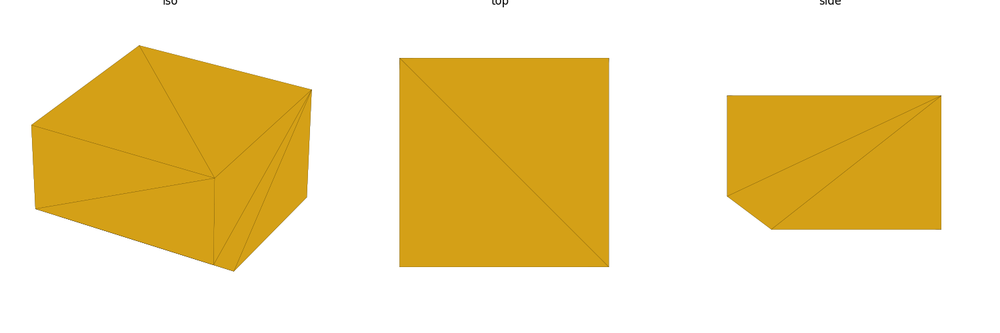
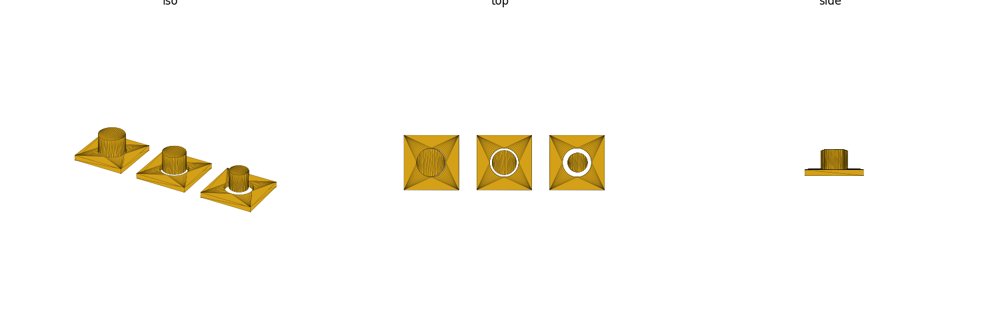

# Clearances, Fits, Hole Sizing, and Elephant's Foot

Picking a fit clearance should never be an arbitrary per-design guess. This
page gives named fit bands and the two systematic FDM print-accuracy effects
(undersized holes, elephant's foot) that make a "correct on paper" clearance
print wrong if you don't compensate for them.

## FDM clearance bands (rule-of-thumb)

These bands are **rule-of-thumb, not vendor-verified** — actual clearance
needed depends on printer calibration, material, and part size, and varies
across the sources that publish numbers here (see below). Treat them as a
starting point and confirm with a test coupon before committing a fit that
matters (this repo's own baseline reasoning on a press-fit lid explicitly
recommended printing a test coupon before trusting a chosen clearance).

| Fit | Per-side clearance | Behavior |
|---|---|---|
| Press / interference | ≈ 0 to −0.1 mm | Permanent or strong-friction join; hole nominally at or slightly under mating OD |
| Slip / close | ≈ 0.1–0.2 mm | Assembles by hand, holds position, separable — e.g. an alignment peg or a close-fitting lid |
| Free / running | ≈ 0.3–0.4 mm | Moves freely — sliding, rotating features |

These bands are broadly corroborated across multiple independent FDM
tolerance guides — [B]
(<https://3dput.com/complete-guide-to-3d-printing-tolerances-and-fit-clearance-for-moving-parts-2/>,
<https://zbotic.in/3d-printing-tolerances-designing-gaps-for-press-fits-threads-and-snap-fits/>,
<https://grandpacad.com/en/tools/tolerance-fit-calculator>) — but none of
them agree to the tenth of a millimeter, and clearance needs typically scale
up for larger features (small <6 mm features want less added clearance than
large >25 mm features per most of these guides). **Don't present a picked
number as exact** — flag it and validate.

**This repo's own precedent for a slip/running fit** is `wall_gap = 0.25 mm`
per side (lid-to-wall clearance, `projects/bpir4-1u-chassis/params.scad`,
mirrored in `house-rules.md`) — inside the slip/close band above, and
already print-validated on this printer/material combination. Prefer
`wall_gap` over picking a fresh number for the same *kind* of fit
(lid-to-body running clearance).

## Holes print undersize — compensate

A hole's printed diameter is consistently smaller than its CAD/nominal
diameter in FDM — extrusion width adds material inward from every side of
the perimeter loop, and the nozzle rounds off sharp direction changes,
pulling filament slightly into the bore. This is a near-universal FDM
finding — [B], multiple independent sources agree on the *direction* and
rough *magnitude* even though the exact number is printer/calibration
dependent
(<https://3dprinterly.com/5-ways-how-to-fix-3d-printed-holes-being-too-small/>,
<https://www.goodprints3d.com/blogs/3d/why-do-3d-printed-holes-come-out-too-small-and-what-should-you-change-first>).

- Rule-of-thumb compensation (add to nominal hole diameter before slicing,
  on top of whatever fit band you picked above): **+0.2–0.4 mm** for small
  to medium holes (roughly <25 mm), up to **+0.5–1.0 mm** for large bores,
  before any slicer-level XY/hole compensation is applied on top. Flag this
  number — it is not vendor-verified and should be confirmed per printer.
- This repo's `board_insert_bore` (3.4 mm) and `lid_insert_bore` (4.2 mm)
  already bake in this compensation for their specific insert ODs — reuse
  those values for the same insert sizes rather than recomputing from a
  nominal insert OD plus a fresh compensation guess (see `house-rules.md`).
- Vertical holes (axis parallel to Z, printed as a stack of full circles)
  are generally more dimensionally accurate than horizontal holes (axis
  parallel to bed, "carved" out of layered material as height builds) —
  reason for hole orientation lives in `overhangs-supports.md`.

## Elephant's foot and the bottom-edge chamfer

The first few printed layers stay warm (close to the heated bed) longer
than later layers, and the weight of the part above them presses them
outward slightly before they solidify — the base of a print ends up
measurably wider than the nominal model, a defect called "elephant's
foot." This is a well-documented, named slicer-level phenomenon — [A],
Prusa's own knowledge base
(<https://help.prusa3d.com/article/elephant-foot-compensation_114487>).

- Slicer-side fix: most slicers (PrusaSlicer, Bambu Studio, Cura) have a
  dedicated "elephant foot compensation" setting that shrinks the first
  layer(s) inward by a set amount. This is a slicer setting, not something
  this skill controls directly — but the CAD-side fix below is
  complementary and works even without slicer tuning.
- **CAD-side fix: a small 45° chamfer on the bottom outer edge**, roughly
  0.5–1 mm tall (Prusa KB's own guidance: keep it to about 1 mm / 2–3
  layers). The chamfer absorbs the outward bulge into itself instead of
  letting it distort the part's true outer dimension — [A], same Prusa KB
  source above.
- This directly targets the "arbitrary fit clearance" failure mode: a
  press/slip fit sized purely from the nominal model, with no accounting
  for elephant's foot at the base, will run tighter than intended right at
  the bottom edge — exactly where a press-fit lid or base commonly engages
  first. Add the base chamfer on any part whose bottom edge participates in
  a fit.

## Fit strategy: short engagement land, not full-depth friction

For a press or slip fit around a perimeter (e.g. a lid engaging a
rectangular tray opening), prefer a short engagement land (a few mm of
actual mating-surface height) over full-depth friction along the whole
wall — a full-height press fit on a rectangular (non-circular) perimeter
tends to bind unpredictably because clearance errors compound differently
on straight runs vs. corners. This is the strategy this skill's own
baseline reasoning converged on for a press-fit lid design (short tongue,
not full-depth friction) and is
consistent with the general engineering practice of minimizing contact
area in a press fit to make the required force predictable.

Image comparing fit types (press / slip / free) and engagement strategy:

## Cross-references

- Repo-precedent clearance values (`wall_gap`, insert bores):
  `house-rules.md`
- Term definitions (counterbore, countersink): `glossary.md`
- Hole orientation to reduce the horizontal-hole accuracy penalty:
  `overhangs-supports.md`
- Per-step fastener access and insertion clearance during assembly:
  `assembly-order.md`
