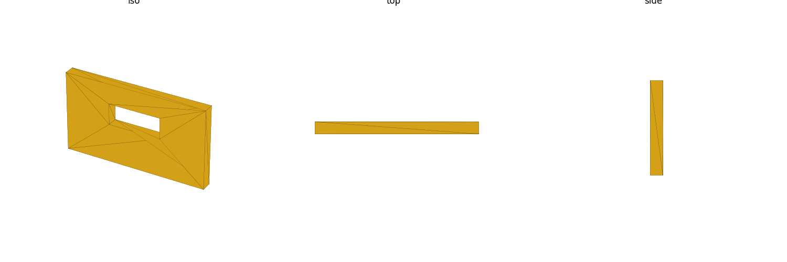
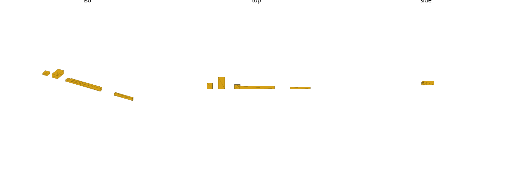

# connectors (library)

Connector body (housing/shell) envelope dimensions for common PC/SBC panel
and slot connectors: USB Type-A / Type-A-stacked / Type-C / Micro-B, RJ45 /
RJ45-stacked, HDMI Type-A / mini / micro, PCIe x1/x4/x8/x16 card-edge slot,
and a 2.54mm-pitch 2x20 GPIO header. Mechanical envelope only (no
electrical/signal data). Units: **mm**.

This library answers one question per connector type: "how big a box (and
which way does it open) do I need to reserve or cut a hole for this part?"
It is a **standalone reference** — it does not model any specific board or
retrofit any existing library's connector rows (see "Coverage / gaps"
below).

## Datum — the canonical connector frame

Every type shares one frame, regardless of physical connector shape: the
**mounting/panel face sits on `Z=0`**, the body is **centered in X**, and it
grows away from the mounting face along its **opening axis**:

- **`+Y`** — panel connectors (USB-A/C, Micro-B, RJ45, HDMI): the mating
  opening faces out of a vertical panel, body extends into `+Y`.
- **`+Z`** — slot/header connectors (PCIe card-edge slot, GPIO pin header):
  the mating opening faces up off a horizontal board, body extends into
  `+Z`.

`connector_size(type)` returns `[w, d, h]` — extents along `[X, Y, Z]` — for
the full housing/shell, not just the mating-face opening. `connector_opening
(type)` returns `"+Y"` or `"+Z"` per the table above.

## Import

```scad
use <connectors/connectors.scad>;
```

Role-1 **data** + role-2 **placeholder** + role-3 **hole-stamp** library —
`use` only (functions, no variables; see gotcha: `use` does not import
top-level variables).

## Usage

### Placing a body (fit-check)

```scad
use <connectors/connectors.scad>;

translate([40, 0, 0]) connector_body("rj45");     // panel connector, opens +Y
translate([0, 30, 0])  connector_body("gpio_2x20"); // header, opens +Z
```

`connector_body(type)` is just the envelope solid in the canonical frame —
translate/rotate it in a consumer assembly to the real board edge or panel
position; the module itself does no board-specific placement.

### Cutting a faceplate opening — the panel + cutout idiom

```scad
use <connectors/connectors.scad>;

difference() {
    translate([-20, 0, -15]) cube([40, 3, 30]); // panel/enclosure wall stock
    connector_cutout("usb_a");                   // punches the +Y opening through it
}
```



`connector_cutout(type, clearance = 0.5, depth = 0)` extrudes the opening
cross-section (grown by `clearance` per side) along the type's opening axis
by `depth` (0 defaults to a generous 20mm through-cut): a W x H window (X x
Z) extruded along Y for `"+Y"` types, or a W x D window (X x Y) extruded
along Z for `"+Z"` types.

### Representative bodies



Left to right: `usb_a`, `rj45`, `hdmi`, `pcie_x16` (the long ~89mm bar),
`gpio_2x20` (the other long, thinner ~50.8mm bar) — `pcie_x16`'s bar is
placed close enough to `hdmi` in this render's chosen spacing that their
footprints touch at one edge in the top view. Both bodies are distinct,
independently-sized volumes; the ~1.75mm edge-touch is purely a layout-spacing
choice in the example script, not a modeled union or geometry defect.

## Reference

| Function | Returns |
|---|---|
| `connector_known_types()` | list of valid type keys |
| `connector_size(type)` | `[w, d, h]` mm housing/shell extents (X/Y/Z) |
| `connector_opening(type)` | `"+Y"` (panel) or `"+Z"` (slot/header) opening axis |

| Module | Produces |
|---|---|
| `connector_body(type)` | envelope solid in the canonical frame (fit-check placeholder) |
| `connector_cutout(type, clearance, depth)` | panel/board opening cutter (subtract from a consumer solid) |

Valid `type` keys (`connector_known_types()`): `usb_a`, `usb_a_stack2`,
`usb_c`, `micro_usb`, `rj45`, `rj45_stack2`, `hdmi`, `mini_hdmi`,
`micro_hdmi`, `pcie_x1`, `pcie_x4`, `pcie_x8`, `pcie_x16`, `gpio_2x20`.

## Sources

Provenance tiers (see `connectors.scad` header / `RESEARCH.md`): **[A]**
fetched + read this pass (vendor datasheet or governing standard), **[B]**
corroborated across >=2 independent peers, **[C]** single-sourced / derived
/ named-standard-cited-but-not-fetched. `//VERIFY` marks a weak value
pending stronger corroboration.

| Source | Tier | Backs |
|---|---|---|
| [Same Sky (CUI) UJ2-AH-4-TH](https://www.cuidevices.com/product/resource/uj2-ah-4-th.pdf) | A | `usb_a` |
| [Same Sky (CUI) UJC-H-G-SMT-P6-TR](https://www.cuidevices.com/product/resource/ujc-h-g-smt-p6-tr.pdf) | A | `usb_c` |
| [Same Sky (CUI) UJ2-MBH-SMT](https://www.cuidevices.com/product/resource/uj2-mbh-smt.pdf) | A | `micro_usb` (width, height; depth axis-ambiguous, see below) |
| [Bel Fuse 0813-1X1T-43-F](https://www.belfuse.com/Data/Datasheets/0813-1X1T-43-F.pdf) | A | `rj45` (gigabit MagJack, integrated magnetics) |
| [Bel Fuse 0810-2H4R-BG-F](https://www.belfuse.com/Data/Datasheets/0810-2H4R-BG-F.pdf) | A (wrong shape) | `rj45_stack2` per-port pitch/depth corroboration only — this part is a 2x4 array, not a clean 2-high stack, so it does not itself confirm the stacked-height value |
| [Same Sky (CUI) HD05-19-TH-TR](https://www.cuidevices.com/product/resource/hd05-19-th-tr.pdf) | A | `hdmi` |
| [Same Sky (CUI) SSK01-MPH-254](https://www.cuidevices.com/product/resource/ssk01-mph-254.pdf) | A | `gpio_2x20` width/depth (2.54mm pitch arithmetic); does NOT back the tall-pin height (see gaps) |
| Molex 87715 series (PCIe x16 card-edge socket) | C, named-not-fetched | `pcie_x1`/`x4`/`x8`/`x16` |
| PCI-SIG PCI Express CEM Spec | C, named-not-fetched (member-paywalled) | `pcie_x1`/`x4`/`x8`/`x16` |
| USB-IF (usb.org) USB 2.0 + Type-C mechanical specs | C, named-not-fetched (login/EULA-gated) | corroborates USB-A/C general form factor, not a specific dimension |

`sbc.scad` and `motherboards.scad` rows (`hdmi`, `usb_c`/`usbc_pwr`,
`gpio`, `rj45*`, `mobo_pcie_ports()`) were read as **read-only
cross-checks**, not sources this table cites — every per-type agreement/
disagreement against those libraries' own rows is logged in `RESEARCH.md`,
not folded into a fetched-source tier here.

## Coverage / gaps

**v1 types (14, all present in `connector_known_types()`):** `usb_a`,
`usb_a_stack2`, `usb_c`, `micro_usb`, `rj45`, `rj45_stack2`, `hdmi`,
`mini_hdmi`, `micro_hdmi`, `pcie_x1`, `pcie_x4`, `pcie_x8`, `pcie_x16`,
`gpio_2x20`.

**Deferred types (not in this library at all):** DB9, DB25, VGA,
DisplayPort, SATA (data + power). No slot exists for these yet — a future
pass, not a silent gap in the v1 set above.

**Every `//VERIFY` value** (see `RESEARCH.md` for the full evidence and
fetch-attempt log behind each):

- **`micro_usb` depth** — the one fetched drawing gives **two** plausible
  readings, 5.48mm (top view + PCB-layout view, self-consistent) vs.
  9.20mm/9.80mm-max (side-profile view, likely includes a bent solder-tail
  overhang past the shell). The table carries **5.48mm**; this is tagged
  `[A] //VERIFY (axis ambiguity)`, not a clean single reading.
- **`micro_usb` height (3.96mm)** — read off the fetched drawing's
  front-face view, but disagrees with both the seed value (3.0mm, -0.96mm)
  and sbc.scad's `microusb_pwr`/`microusb_data` figures (2.8mm) in the same
  direction — possibly includes a small foot below the mounting plane that
  shouldn't count as "above Z=0" in this library's frame; not resolved this
  pass.
- **`mini_hdmi`** (`[10.4, 7.5, 3.2]`) — no independent vendor drawing
  found/reachable this pass (Same Sky/CUI's HDMI catalog has no mini/micro
  variant; other vendors' sites could not be machine-fetched this pass).
  Seed value retained, `[C] //VERIFY (cited-not-fetched)`.
- **`micro_hdmi`** (`[7.5, 4.5, 3.0]`) — same fetch gap as `mini_hdmi`.
  Width/height match the seed; depth (4.5mm) was pulled from `sbc.scad`'s
  own Pi 4B/5 `[A]`-tagged board measurement in preference to the seed's
  5.6mm, since sbc's figure traces to an actual board measurement even
  though this library couldn't independently re-fetch a vendor datasheet.
  Tier `[C] //VERIFY (cited-not-fetched)`.
- **`pcie_x1`/`pcie_x4`/`pcie_x8`/`pcie_x16`** (widths 25.0/39.0/56.0/89.0,
  height 11.25, depth 7.5) — Molex 87715 series / PCI-SIG CEM spec named
  but **not fetched** this pass (Molex's product pages are a JS SPA that
  couldn't be scraped; the CEM spec is member-paywalled). Tier
  `[C] //VERIFY (cited-not-fetched)` for all four — explicitly **NOT**
  `[A]`, see the motherboards flag below.
- **`gpio_2x20` height (8.5mm)** — width/depth (`50.8`/`5.08`) are solid
  `[A]` 2.54mm-pitch arithmetic, further corroborated by a fetched pitch
  table. The only 2.54mm-pitch header datasheet reachable this pass was a
  shorter 6.0mm-total variant, not the tall-pin ~8.5mm HAT-stacking style
  commonly used for GPIO — so height stays the seed value, `[C] //VERIFY`.
- **`usb_a_stack2`** (`[13.66, 14.6, 13.88]`) — derived as a naive 2x
  single-port height (2 x 6.94), not independently fetched for a real
  stacked-shell part. Tier `[C]`.
- **`rj45_stack2`** (`[16.36, 30.48, 27.34]`) — derived the same way (2 x
  13.67); the one stacked-shape datasheet fetched (Bel Fuse
  0810-2H4R-BG-F) turned out to be an 8-port 2x4 array, not a clean 2-high
  stack, so it only corroborates per-port pitch/depth, not the doubled
  height itself. Tier `[C]`.

**Motherboards soft-`[A]` flag:** `libraries/motherboards/motherboards.scad`
(around line 173-174) currently carries a soft `[A]` claim for the exact
same PCIe x16 numbers (Molex 87715: 89.00 x 7.50 x 11.25mm) with no
fetch/URL citation backing it in that library's own `RESEARCH.md`. This
pass could not independently re-verify that claim either (same Molex-SPA/
CEM-paywall blockers apply) — `connectors.scad` carries these values as
`[C] //VERIFY` from the start rather than inheriting the unverified `[A]`.
Recommend downgrading motherboards.scad's comment to `[C] //VERIFY` in a
future pass unless an actual Molex/PCI-SIG fetch succeeds.

**Consumed-by-sbc/motherboards retrofit is DEFERRED.** This library does
not modify, and is not yet consumed by, `sbc.scad` or `motherboards.scad` —
those libraries keep their own independently-sourced connector rows.
Per-type cross-check results between this library's fetched values and
sbc's/motherboards' existing rows (agreements, disagreements, and the
motherboards soft-`[A]` PCIe flag above) are recorded in `RESEARCH.md`, not
applied as edits to either library.
