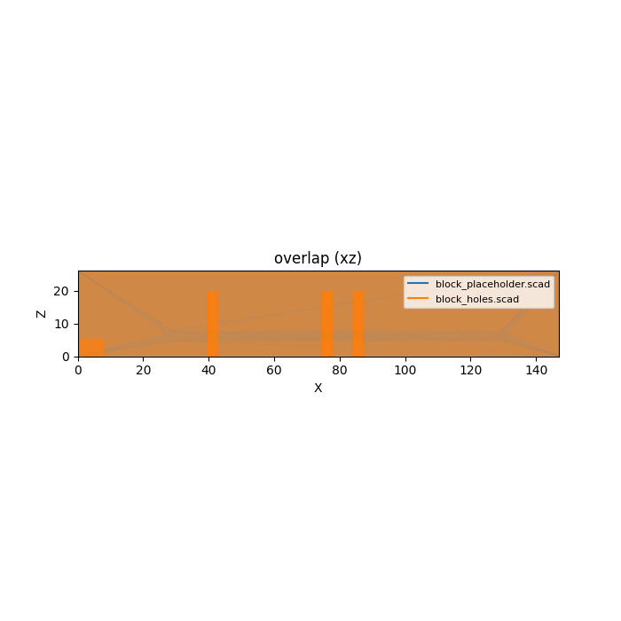
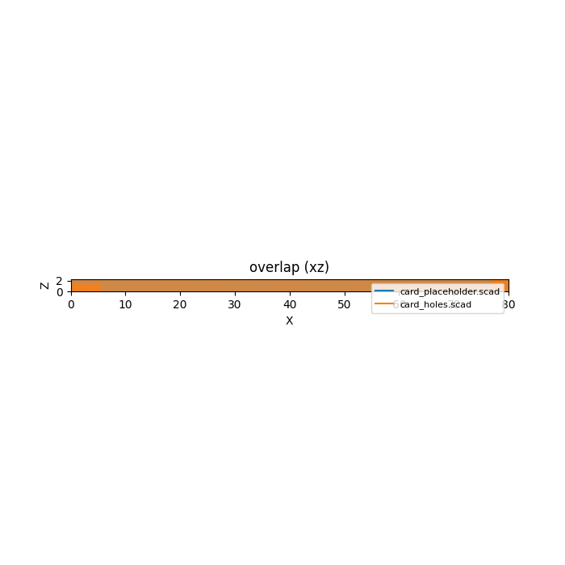

# drives (library)

Storage-drive mechanical reference — envelope, mount-hole, and connector
geometry for 3.5"/2.5"/U.2 block drives and M.2 (2230/2242/2260/2280) cards,
plus hole/cutout stamp modules for building caddies, brackets, and
faceplates. Units: **mm**. Standalone (no dependency on `connectors.scad` or
any other library).

## Datum

Bottom face on `Z=0`, envelope's minimum corner at the origin, growing into
positive octant. `X=0` is fixed at the drive/card's **connector end** (per
`RESEARCH.md`'s "Datum convention" section, chosen to mirror every fetched
SFF drawing's own datum so no transcription-direction error is introduced).

```
        +Z (up)
         |
         |____ +Y (width)
        /
      +X (length, 0 = connector end -> far/free end)

   Z=0 --------------------------------+  <- far/free end (X=max)
       |                               |
       |   drive/card body             |
       |                               |
  X=0->|== connector / card-edge ======|
       +-------------------------------+
       Y=0                          Y=max
```

- `+X` = drive/card **length**, `X=0` at the connector end.
- `+Y` = drive/card **width**, `Y=0` at the edge nearest the smaller
  edge-inset hole column (block family) / arbitrary near edge (card family).
- `+Z` = up, `Z=0` at the bottom face.

## Import

```scad
use <drives/drives.scad>;
```

Role-1 **data** (functions only — `use` does not import top-level
variables) + role-2 **placeholder** + role-3 **holes/cutout/faceplate**
library, dispatching on `drive_family(type)` ("block" or "card").

## Usage

```scad
use <drives/drives.scad>;

difference() {
    my_caddy();                                  // consumer's own solid
    drive_faceplate_cutout("hdd35", "bottom");    // bottom mount holes
    drive_faceplate_cutout("hdd35", "xmin");      // connector opening
}
```

Or compose the lower-level pieces directly:

```scad
use <drives/drives.scad>;

difference() {
    drive_placeholder("m2_2280");        // fit-check envelope
    drive_holes("m2_2280");              // single standoff hole
    drive_connector_cutout("m2_2280");   // card-edge connector opening
}
```

## Reference

`type` is one of `drive_known_types()`: `hdd35`, `ssd25_7`, `ssd25_9`,
`ssd25_15`, `u2` (block family); `m2_2230`, `m2_2242`, `m2_2260`, `m2_2280`
(card family). Every accessor `assert()`s on an unknown `type` and on a
wrong-family call (e.g. `drive_size()` on a card type).

| Function | Returns |
|---|---|
| `drive_known_types()` | list of all valid `type` keys (block + card) |
| `drive_family(type)` | `"block"` or `"card"` |
| `drive_size(type)` | `[x_len, y_width, z_height]` mm envelope — block family only |
| `drive_bottom_holes(type)` | list of `[x,y]` mm bottom mount-hole centers (Z=0 face) — block only |
| `drive_side_holes(type)` | list of `[x,z]` mm side mount-hole centers (stamped on both `Y=0`/`Y=width` walls) — block only |
| `drive_connector(type)` | `[type_str, [x,y,z] pos, [w,d,h] extent]` SATA/SFF-8639 connector record — block only |
| `drive_card_size(type)` | `[width, length, height]` mm envelope — card family only |
| `drive_card_hole(type)` | `[x,y]` mm single mount-hole center on the Z=0 face — card only |
| `drive_card_edge(type)` | `[[x,y,z] pos, [w,d,h] extent, key]` card-edge (gold-finger) connector record — card only |

| Module | Produces |
|---|---|
| `drive_placeholder(type)` | envelope solid in the datum frame (fit-check reference) |
| `drive_holes(type, faces="bottom", dia=3.4, depth=40)` | mount-hole cutters for a consumer `difference()`; `faces`: `"bottom"｜"side"｜"both"` (block family; card family ignores `faces` and always cuts its single Z=0 standoff hole) |
| `drive_connector_cutout(type, clearance=0.5, depth=0)` | connector/card-edge opening cutter, grown by `clearance`, extruded `-X` past the connector-end face (`depth=0` defaults to a generous 20mm through-cut) |
| `drive_faceplate_cutout(type, face)` | convenience: cuts the mount holes/connector opening for one named face in a single call. `face` ∈ `"bottom"｜"xmin"｜"xmax"｜"ymin"｜"ymax"` — see Known Gaps for `"xmax"`'s no-op and `"ymin"`/`"ymax"`'s degenerate-identical behavior |

## Renders

Colored side-profile overlay (blue = bare placeholder envelope, orange =
placeholder with `drive_holes()`/`drive_connector_cutout()` subtracted),
generated headlessly via the `verify-scad-geometry` skill
(`render_stl.py --overlay ... --axis xz`) — a real OpenSCAD→STL render, not a
stub image.



`hdd35` (3.5"). The three tall vertical marks near X=41/76/86 are the
required + two mutually-optional bottom mount-hole rows piercing straight
through in Z; the short low mark near X=0-8 is the SATA connector cutout,
flush against the connector-end (X=0) face. STL bounding-box check
confirms both stay within the 147x101.6x26.1mm envelope (no floating
geometry).



`m2_2280` (M.2 80mm). Because the card is only 2.3mm tall, the vertical
(XZ) projection compresses most detail into a thin strip — cutout placement
was additionally confirmed by direct STL bounding-box inspection: the mount
hole sits at `x=78.55` (near the far/free end, inside `[0,80]`), and the
card-edge connector cutout spans `x=[-20.5, 5.5]` (overlapping the body only
from `x=0` to `5.5`, i.e. cut into the connector end as intended) and
`z=[-0.5, 1.3]` (the lower portion of the card's 2.3mm thickness, since the
connector record's height reuses the 0.8mm PCB-thickness figure, not the
full assembled-card height — see Known Gaps).

## Sources

Full source list + per-value fetch/read notes are in `RESEARCH.md`. Tiers
(see `docs/LIBRARY-AUTHORING.md`): **[A]** governing spec/vendor drawing
fetched + read this pass; **[B]** corroborated across ≥2 independent peers;
**[C]** single-sourced / derived / a named standard cited but not fetched
(`//VERIFY (cited-not-fetched)`). `//VERIFY` alone marks a weaker value
(inferred semantics, unconfirmed extrapolation, or an unsourced estimate)
pending stronger corroboration.

| Type | Dim tier | Hole tier | Connector tier | Source(s) |
|---|---|---|---|---|
| `hdd35` (3.5") | [A] (SFF-8301 Table 3-1) | bottom [A]; side X [A], side Z [B] (number+role), face-orientation `//VERIFY` | position (x,y) [A], z `//VERIFY`; extent (d) [A], (w,h) `//VERIFY` | SFF-8301 Rev 1.9; SFF-8323 Rev 1.6 (connector, bit-identical to SFF-8223); Seagate BarraCuda manual + WD white paper (side-hole Z corroboration/face resolution) |
| `ssd25_7`/`ssd25_9`/`ssd25_15` (2.5") | length [C] (test-mandated 100.0, spec gives 100.20/100.45/101.85 — see RESEARCH.md (a)); width/height [A] | bottom Y [A], X `//VERIFY` (inferred by row-alignment); side X [A], Z number [A]/semantic `//VERIFY` | position (x,y) [A], z `//VERIFY`; extent (d) [A], (w,h) `//VERIFY` | SFF-8201 Rev 3.4; SFF-8223 Rev 2.7 (connector) |
| `u2` | reuses 2.5"-15mm body (same tiers as above) | reuses 2.5" holes | position reused from SATA `//VERIFY`; extent width/height [A] (SFF-TA-8639 Fig 5-1), rest `//VERIFY` | SFF-TA-8639 Rev 2.2; body/holes per SFF-8201 |
| `m2_2280` | [A] (Viking NVMe + SATA datasheets, cross-agree) | position [A] | edge x=0 [C] (layout inference); y/d [A]; h [A] value/`//VERIFY` modeling choice; w `//VERIFY` (unsourced estimate); key [A] | Viking `PSFNP5xxxx5xxx` Rev C (primary) + `PSFEM5xxxxBxxx` Rev A1 (cross-check) |
| `m2_2230`/`m2_2242`/`m2_2260` | length [C] `//VERIFY (cited-not-fetched)` (WWLL naming convention only, no vendor drawing fetched); width/height carried from 2280 | position `//VERIFY` (1.45mm inset extrapolated from 2280, not independently confirmed) | same `M2_EDGE()` record as 2280, i.e. same tiers | none independently fetched — see Known Gaps |

| Source | URL |
|---|---|
| SFF-8301 Rev 1.9 (3.5" Form Factor Drive Dimensions) | https://members.snia.org/document/dl/25862 |
| SFF-8201 Rev 3.4 (2.5" Form Factor Drive Dimensions) | https://members.snia.org/document/dl/25851 |
| SFF-8223 Rev 2.7 (2.5" connector location) | https://members.snia.org/document/dl/25855 |
| SFF-8323 Rev 1.6 (3.5" connector location) | https://members.snia.org/document/dl/25864 |
| SFF-8482 Rev 2.5 (bare SATA connector spec — fetched, contributed no coordinates; confirmed it defers location to the Form Factor specs) | https://members.snia.org/document/dl/25920 |
| SFF-TA-8639 Rev 2.2 (U.2 connector) | https://members.snia.org/document/dl/26489 |
| SFF-TA-1001 Rev 1.1 (fetched, not cited for any value — electrical, no mechanical content) | https://members.snia.org/document/dl/26900 |
| Viking `PSFEM5xxxxBxxx` Rev A1 (M.2 2280 SATA datasheet) | https://www.vikingtechnology.com/wp-content/uploads/2021/03/M2_80mm_SMI_SM2258.pdf |
| Viking `PSFNP5xxxx5xxx` Rev C (M.2 2280 NVMe datasheet, primary source) | https://mm.digikey.com/Volume0/opasdata/d220001/medias/docus/331/PSFNP5xxxx5xxx_C.pdf |
| Seagate BarraCuda SATA Product Manual 210203200 Rev A, March 2025 (independent side-hole Z corroboration) | https://www.seagate.com/content/dam/seagate/migrated-assets/www-content/product-content/barracuda-fam/barracuda-new/en-us/docs/Seagate_BarraCuda_SATA_Product_Manual_210203200.pdf |
| WD white paper "3.5-inch Form Factor Mounting Screw Locations and Depths" Rev A03 (side-hole face-orientation resolution) | https://support.wdc.com/images/kb/2579-771970-A03.pdf |

**Nothing in this library is tier `[A]` by inflation** — every `[A]` tag
means the governing spec or vendor drawing was fetched and read this pass;
gaps and `//VERIFY` items below are recorded honestly rather than silently
filled in.

## Known gaps

Every `//VERIFY` value and every omission below is cross-checked against
`RESEARCH.md`'s "Gaps / disagreements summary" table plus the Task 2/4/5/6
resolution notes that superseded or added to it — not just the task brief's
own (now-stale) seed gap list.

- **3.5" side-hole Z face-orientation** (`SIDE_35()`): number+role (6.35mm,
  a Z-height not an X-offset) is tier **[B]**, corroborated by SFF-8301's
  own Figure 3-1 and Seagate's independently-authored BarraCuda Figure 3.
  Which face (top vs. bottom) it's measured from is **not stated in prose
  anywhere** — resolved by inference from WD's side-mount-hole rendering
  (PCB hugs the bottom face in the side view) — tagged `//VERIFY` on the
  face-orientation semantic only.
- **3.5" connector Z position/extent** (`C35_POS()[2]`, `C35_EXT()[0]`,
  `C35_EXT()[2]`): SFF-8223/SFF-8323 dimension the connector's X-extent
  (`w=4.00`) from a figure's dimension placement, not an explicitly-labeled
  value; Z position (`z=0`) is *assumed* flush to the bottom face; connector
  height (`h=4.90`) is reused from SFF-TA-8639's blade-row height applied to
  the plain-SATA connector too. All three tagged `//VERIFY`.
- **2.5" bottom-hole X (length) position** (`BOTTOM_25()`): inferred from
  the side-hole X positions by visual row-alignment in SFF-8201 Figure 3-1,
  not an independently re-dimensioned Table 3-1 value for the bottom holes.
  `//VERIFY`.
- **2.5" side-hole Z semantic** (`SIDE_25()`): the number (A23=3.00mm) is
  tier [A]; its meaning as "side-hole Z-height above the bottom face" is
  this library's own figure-layout inference, not an explicit spec label.
  `//VERIFY`.
- **2.5" 7mm-class side holes** (`SIDE_25_7()`): reuses `SIDE_25()`
  unchanged — SFF-8201 only states *bottom*-hole optionality at the 7mm
  height class, says nothing about a side-hole difference, so no fabricated
  asymmetry was introduced, but this is a no-difference *assumption*, not a
  confirmed spec statement. `//VERIFY`.
- **2.5"/U.2 SATA connector position** (`C35_POS()`, reused as `U2_POS()`):
  derived via a self-contained reading of SFF-8223 Figure 3-1's own
  axis-rotated sub-view (A7/A13/A5/A3), deliberately avoiding the riskier
  Datum-B (screw-hole-referenced) composition path. Position x/y tier [A];
  z and the U.2 reuse (assumes SFF-8639's compatibility statement carries
  the position over unchanged) tier `//VERIFY`.
- **2.5" envelope length** (`_block_table()`'s `100.0` for all `ssd25_*`/`u2`
  rows): tier **[C]**, test-mandated round number — the spec's own three
  genuine values (100.20mm nominal, 100.45mm new-Max, 101.85mm obsolete-Max)
  are all different from 100.0mm. Consumers needing legacy (101.85mm-class)
  2.5" HDD clearance should add margin; this library's `ssd25_*` length is
  not a tight-fit guarantee for older drives.
- **M.2 2260/2242/2230 lengths** (`_card_table()`'s `60.0`/`42.0`/`30.0`):
  tier **[C] `//VERIFY (cited-not-fetched)`** — only the well-known `WWLL`
  M.2 naming convention backs these; no vendor datasheet for the shorter
  lengths was fetched.
- **M.2 2260/2242/2230 mount-hole X inset** (`M2_HOLE_2260/2242/2230()`):
  extrapolates the 2280 datasheet's 1.45mm far-end inset unchanged across
  lengths — **not independently confirmed** for the shorter modules. Not
  exercised by the library's own test (only `m2_2280`'s hole shape and
  `m2_2242`'s length are asserted). `//VERIFY`. Treat as an educated
  placeholder, not a verified fixture dimension.
- **M.2 card-edge connector X-extent** (`M2_EDGE()`'s `w=5.0`): **entirely
  unsourced this pass** — neither fetched Viking datasheet dimensions the
  gold-finger engagement depth along the insertion axis. Kept (not omitted)
  because the interface requires all three `[w,d,h]` components, but tagged
  `//VERIFY (unsourced estimate)` and called out here explicitly rather than
  presented as confirmed.
- **M.2 card-edge connector height** (`M2_EDGE()`'s `h=0.80`): the *number*
  (PCB thickness) is [A]; *reusing* it as the edge connector's own cutout
  height is this pass's modeling choice, not a datasheet-stated connector
  height — flagged `//VERIFY`. Practical effect (confirmed by this task's
  render/bbox check): `drive_connector_cutout("m2_2280")` only carves the
  lower 1.3mm of the card's 2.3mm total thickness at the connector end, not
  a full-height slot — a consumer modeling a real M.2 socket keepout should
  check whether that partial height is sufficient for their use case.
- **M.2 card-edge connector x=0 placement**: tier **[C]**, this pass's own
  layout inference (corroborated only by the mount hole sitting near the
  *far* end of the card, not a directly re-stated spec value for the
  connector's own position).
- **M.2 key-notch physical mm offset**: not derived at all — only the
  pin-index range (59-66) was read from the NVMe pinout table, never
  translated to a millimeter offset along the card edge. `key` is carried as
  a categorical string only (`"m"` for all `m2_*` types here); no `"b"`/`"bm"`
  variants are populated. Gap, not fabricated.
- **M.2 double-sided module height**: not covered — both fetched Viking
  datasheets are single-sided-only variants (component height 1.35mm on one
  face). A double-sided module's bottom-face clearance is a gap.
- **3.5" connector position under SFF-8301 alone**: SFF-8301 itself defines
  only the bottom/side envelope, not connector position (closed this pass by
  fetching SFF-8323 instead, not a residual gap, but noted so the SFF-8301
  citation alone isn't read as also covering the connector).
- **Imperial 6-32 UNC clearance-hole diameter** (3.5"/2.5" fastener):
  SFF-8301/8201 specify the *tapped* thread (6-32 UNC / M3), not a
  clearance-fit diameter. `drive_holes()`'s `dia` default (3.4mm) is an M3
  clearance figure; a 6-32 (imperial) clearance constant does not exist in
  this repo's `hardware.scad` (metric-only currently) — noted as a
  `hardware`-library gap, not fabricated into `drives`.
- **`drive_faceplate_cutout(type, "xmax")`**: intentional **no-op** — the
  far X wall (opposite the connector) has no distinct hole/cutout data in
  the current data model for either family. Calling it compiles and cuts
  nothing; this is documented behavior, not a silent bug.
- **`drive_faceplate_cutout(type, "ymin")` / `"ymax"`**: both faces resolve
  to the *same* `drive_holes(type, "side")` call — the side-hole data model
  stamps both `Y=0` and `Y=width` walls in one shot (per `drive_holes`),
  so it cannot distinguish a near-wall-only vs. far-wall-only cut. A
  `"ymin"` call and a `"ymax"` call are geometrically identical (both cut
  both walls) — degenerate, not a bug, but a modeling limitation a consumer
  should know about before relying on per-wall selectivity.
- **Card family under `drive_faceplate_cutout(..., "bottom")`**: works (the
  card's single standoff hole lives on the Z=0 face), but card types have no
  `"ymin"`/`"ymax"` side-hole data at all — those faces are no-ops for any
  `m2_*` type (not separately special-cased/asserted; falls out of
  `drive_side_holes` not existing for the card family).
