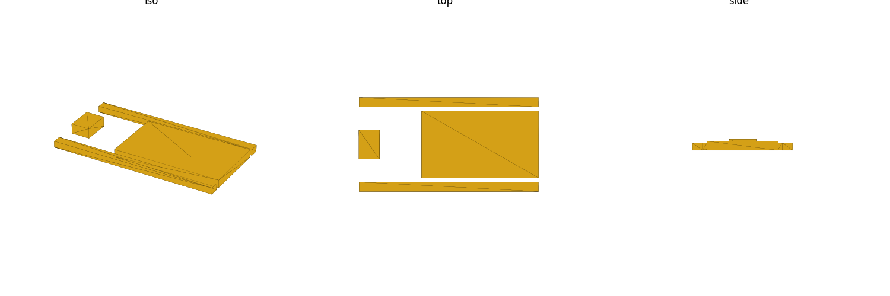

# embedded (library)

Mechanical reference for five common Espressif / ESP8266 microcontroller
development boards: board outline, corner radius, PCB thickness,
mounting-hole coordinates (or their documented absence), RF-module +
antenna keep-out, and USB/pin-header connector footprints. Mechanical
mounting/clearance geometry only (no electrical/signal data). Units: **mm**.

Datum: **bottom-left PCB corner** at the origin, component/top side up, PCB
bottom on `Z=0`. `+X` = board **long** edge, `+Y` = board **short** edge.
Connector exit edges are named `"xmin"` / `"xmax"` / `"ymin"` / `"ymax"`
(**lateral** — the opening faces out that board edge) or `"top"` (the
opening faces `+Z`, up off the PCB's top face — used for pin headers and
on-board modules/keep-outs, which touch no lateral edge). Same convention
as the `sbc` library.

A **connector record** is `[name, [x,y,z], [w,d,h], edge]`:
`[x,y,z]` is the box's **minimum** corner, `[w,d,h]` are its extents along
X/Y/Z (`z` is always the board's `embedded_thickness()`, since every
connector sits on the PCB top face), and `edge` is one of the five exit
values above.

Every board here is a "stick" board (per `RESEARCH.md`'s adopted
convention): one USB connector at `xmin`, the RF module + PCB-antenna
keep-out at `xmax`, and two single-row 2.54mm pin headers running the two
long edges, both `edge="top"`.



## Import

```scad
use <embedded/embedded.scad>;
```

Role-1 **data** + role-2 **placeholder** + role-3 **hole-stamp/cutout**
library — `use` only (functions, no variables; see gotcha: `use` does not
import top-level variables).

## Boards covered

`"esp32_devkitc"`, `"esp8266_nodemcu"`, `"wemos_d1_mini"`,
`"esp32_c3_devkitm"`, `"esp32_s3_devkitc"` (string keys — see
`embedded_known_boards()`).

| board | outline L×W (mm) | corner_r | thickness | mounting holes | USB | RF module |
|---|---|---|---|---|---|---|
| `esp32_devkitc` | 48.26 × 27.94 [A] | ~0 square [A]//VERIFY | 1.6 [C]//VERIFY | **none** [A] | 1× micro-USB, `xmin` [A] | ESP-WROOM-32, 25.40×18.00mm can + 6.04mm antenna keep-out [A] |
| `esp8266_nodemcu` | 49 × 26 [B]//VERIFY | ~0.75 [C]//VERIFY | 1.6 [C]//VERIFY | **none** [B] | 1× micro-USB, `xmin` [B] | ESP-12E, ~16×24mm can (not modeled, no Z dim) [B] |
| `wemos_d1_mini` | 34.3 × 25.4 [A] | ~4.0 [C]//VERIFY | 1.0 [C]//VERIFY | **2**, Ø2.0mm, `structural-mount` [A] | 1× USB-C, `xmin` [A] | ESP8266EX on-board, PCB antenna (not modeled, no dims) [A] |
| `esp32_c3_devkitm` | 38.91 × 25.40 [A] | ~2 rounded [B]//VERIFY | 1.6 [C]//VERIFY | **none** [A] | 1× micro-USB, `xmin` [A] | ESP32-C3-MINI-1, 13.2×16.6×2.4mm [A] |
| `esp32_s3_devkitc` | 62.74 × 25.40 [A] | ~0 square [A]//VERIFY | 1.6 [C]//VERIFY | **none** [A] | **2×** micro-USB (UART + USB/OTG), `xmin` [A] | ESP32-S3-WROOM-1, 25.5×18.0×3.1mm [A] |

Every board also carries two single-row 2.54mm pin headers (`header_l` /
`header_r`, `edge="top"`) down its long edges: 19/19 pins (DevKitC), 15/15
(NodeMCU), 8/8 (D1 mini), 15/15 (C3-DevKitM-1), 22/22 (S3-DevKitC-1). These
do **not** map to the `connectors` library's `gpio_2x20` type (a single
2-row×20-column HAT-style block) — they're modeled literally as per-board
single-row header bodies. See `RESEARCH.md`'s "Pin headers" note.

**Variant/consolidation decisions** (see `RESEARCH.md` for the full
reasoning): `esp32_devkitc` = DevKitC **V4** with the WROOM-32 (38-pin)
module; `esp8266_nodemcu` = NodeMCU **v1.0 (ESP-12E)**, the Amica/"narrow"
0.9″-row variant (the LoLin "wide" 58×32mm variant is a distinct board, not
this key); `wemos_d1_mini` = LOLIN D1 mini **V4.0.0**, the USB-C revision
that — unlike every earlier D1 mini — added two mounting holes. The C3 and
S3 DevKits were **not** consolidated into one row: they have separate
official dimension drawings with materially different outlines (38.91mm vs
62.74mm long) and are kept as two independent boards.

## Hole roles

Every mounting hole is stored as `[x, y, role, dia]` (parity with `sbc`'s
hole-role tagging — see `embedded_known_hole_roles()`,
`embedded_hole_role(b, i)`, `embedded_holes(b, role=undef)`).

**Four of the five boards — `esp32_devkitc`, `esp8266_nodemcu`,
`esp32_c3_devkitm`, `esp32_s3_devkitc` — have an empty hole list.** This is
a confirmed finding, not an omission: all four are breadboard/pin-header
dev boards with no mounting holes anywhere on their official drawings (or,
for the community-sourced `esp8266_nodemcu`, the universal description
across every peer source). `embedded_placeholder`/`embedded_mount_holes`
correctly stamp nothing for these boards — a `difference()` over zero
holes is a no-op, not a bug. **Never invent mounts for these four boards.**

Only `wemos_d1_mini` (the D1 mini **V4.0.0** revision specifically) has
mounting holes: **2**, both `structural-mount`, Ø2.0mm, at
`y = {2.5, 22.9}` — a directly-dimensioned drawing callout `[A]`. Earlier
D1 mini revisions (micro-USB, pre-V4.0.0) were hole-less; only this
revision is modeled.

## RF module + antenna keep-out — a modeling caveat

Every board's RF module (WROOM-32, ESP-12E, C3-MINI-1, S3-WROOM-1) sits at
the `xmax` end with a PCB/keep-out antenna beyond it. Where the source
drawings give a dimensioned module outline, it's modeled as a board-unique
`edge="top"` connector-style box (not mapped to any `connectors`-library
type — these are one-off board features, not standard connector
footprints):

- `esp32_devkitc` — the ESP-WROOM-32 module (25.40×18.00mm [A]) **and** a
  separate `antenna_keepout` box (6.04mm [A] deep, the drawing's own "RF
  Antenna" keep-out rectangle) are both present as connector-table rows.
- `esp32_c3_devkitm` / `esp32_s3_devkitc` — the module body is present
  (datasheet-dimensioned [A]); the antenna keep-out itself is **omitted**
  (the drawings show it graphically but print no dimension for it — not
  fabricated).
- `esp8266_nodemcu` / `wemos_d1_mini` — the module/antenna is **omitted
  entirely**: no source gives any dimension for the ESP-12E can or the D1
  mini's on-board PCB-trace antenna.

**Honest caveat**: a "keep-out" is conceptually a region to *avoid*, but
`embedded_placeholder(b)` renders every connector-table entry — including
`antenna_keepout` — as a **solid raised body**, identical treatment to a
real connector. This mirrors `sbc`'s "render every connector as a cube"
idiom verbatim (see `sbc.scad`) rather than inventing a different, hollow
representation for keep-outs. If you're using `esp32_devkitc`'s placeholder
for enclosure clearance checks, treat the `antenna_keepout` box the same as
any other solid obstruction to avoid, not as an "empty" zone — it does not
render as one.

## Connectors — sourced from the `connectors` library

USB connector **bodies** (micro-USB and USB-C) are not duplicated
literals — they're pulled from the `connectors` library's own dimensioned
table via `connector_size("micro_usb")` / `connector_size("usb_c")`
(`use <connectors/connectors.scad>;`), width/depth swapped from that
library's canonical "+Y opening" frame into this board's "opens along X"
(`xmin`/`xmax`) frame. USB connector **positions** (the X/Y offset of each
port on its board) are **not** dimensioned in any source `RESEARCH.md`
found — every position is this library's own placement estimate
(centered-in-Y for a single port, evenly split for `esp32_s3_devkitc`'s two
ports), tagged `[C]//VERIFY`. Only the connector **body** extents are
sourced `[A]` (via the `connectors` library); positions are estimates.

## Reference

| Function | Returns |
|---|---|
| `embedded_known_boards()` | list of valid board keys |
| `embedded_size(b)` | `[width_X, depth_Y]` mm board outline |
| `embedded_corner_radius(b)` | PCB corner radius, mm |
| `embedded_thickness(b)` | PCB thickness, mm |
| `embedded_known_hole_roles()` | the 4 canonical role strings |
| `embedded_holes(b, role=undef)` | full `[x,y,role,dia]` hole tuples, filtered by role |
| `embedded_holes_xy(b, role=undef)` | `[x,y]`-only coords, filtered by role |
| `embedded_hole_role(b, i)` | role string of the `i`-th hole in the board's full hole list |
| `embedded_connectors(b)` | list of all connector records for the board |
| `embedded_connector(b, name)` | single connector record by name |

`role` accepts a canonical role string (only matching holes), `"all"`
(every hole, no warning), or is left `undef`/omitted — every hole, but see
the `sbc`-parity debug warning below for boards whose holes span more than
one role (no `embedded` board currently does; the mechanism is kept for
parity and future boards).

| Module | Produces |
|---|---|
| `embedded_placeholder(b)` | PCB envelope solid (rounded corners) + connector bodies, mounting holes cut out |
| `embedded_mount_holes(b, depth, role=undef, dia=-1)` | mounting clearance holes (subtract from a consumer `difference()`) |
| `embedded_standoffs(b, height, role=undef, dia=-1, bore=-1)` | positive standoff posts with pilot bore |
| `embedded_port_cutout(b, name, depth)` | one connector's panel opening, extruded outward along its exit edge |
| `embedded_faceplate_cutouts(b, edge, depth)` | every connector opening on one edge in one call (an enclosure faceplate) |

### `embedded_faceplate_cutouts` usage

```scad
use <embedded/embedded.scad>;

module wemos_d1_mini_case_wall() {
    difference() {
        translate([-2, -5, -2]) cube([2, 25.4 + 10, 8]); // enclosure xmin wall stock
        embedded_faceplate_cutouts("wemos_d1_mini", "xmin", depth = 10); // USB-C opening
    }
}
```

See `renders/wemos-d1-mini-faceplate-xmin.png` for the rendered result.

The same call handles `esp32_s3_devkitc`'s two side-by-side micro-USB ports
in one `xmin` cutout call, or `embedded_faceplate_cutouts(b, "top", depth)`
for every up-facing pin header/module opening on a lid instead of a side
wall.

## Design-for-print

These boards are typically enclosed support-free (top-down standoff
columns, no bridging over the PCB). See the `design-for-print` skill —
particularly its
[house rules](../../.claude/skills/design-for-print/reference/house-rules.md)
— for the repo's general print-design conventions (boss/standoff sizing,
support-free orientation) before designing a case around `embedded_placeholder`.

## Sources

| Source | Tier | Backs |
|---|---|---|
| [ESP32-DevKitC V4 dimensions](https://dl.espressif.com/dl/schematics/esp32_devkitc_v4_dimensions.pdf) | A | esp32_devkitc outline, corner treatment, mounting-hole absence, module + antenna keep-out |
| [ESP32-DevKitC V4 user guide](https://docs.espressif.com/projects/esp-dev-kits/en/latest/esp32/esp32-devkitc/user_guide.html) | — | esp32_devkitc connector-type text |
| [ESP-WROOM-32 datasheet](https://www.espressif.com/sites/default/files/documentation/esp32-wroom-32_datasheet_en.pdf) | A | esp32_devkitc module dimensions |
| [ESP32-S3-DevKitC-1 v1.1 dimension DXF](https://dl.espressif.com/dl/schematics/esp_idf/DXF_ESP32-S3-DevKitC-1_V1.1_20220429.pdf) | A | esp32_s3_devkitc outline, corner treatment, mounting-hole absence, module inset |
| [ESP32-S3-DevKitC-1 v1.1 user guide](https://docs.espressif.com/projects/esp-dev-kits/en/latest/esp32s3/esp32-s3-devkitc-1/user_guide_v1.1.html) | — | esp32_s3_devkitc connector-type text (2× micro-USB) |
| [ESP32-S3-WROOM-1 datasheet](https://www.espressif.com/sites/default/files/documentation/esp32-s3-wroom-1_wroom-1u_datasheet_en.pdf) | A | esp32_s3_devkitc module dimensions |
| [ESP32-C3-DevKitM-1 dimension PDF](https://dl.espressif.com/dl/schematics/DIMENSION_ESP32-C3-DEVKITM-1_V1_20200915AA.pdf) | A | esp32_c3_devkitm outline, mounting-hole absence, antenna keep-out label |
| [ESP32-C3-DevKitM-1 user guide](https://docs.espressif.com/projects/esp-dev-kits/en/latest/esp32c3/esp32-c3-devkitm-1/user_guide.html) | — | esp32_c3_devkitm connector-type text |
| [ESP32-C3-MINI-1 datasheet](https://www.espressif.com/sites/default/files/documentation/esp32-c3-mini-1_datasheet_en.pdf) | A | esp32_c3_devkitm module dimensions |
| [LOLIN D1 mini V4.0.0 dimension drawing](https://www.wemos.cc/en/latest/_static/files/dim_d1_mini_v4.0.0.pdf) | A | wemos_d1_mini outline, mounting-hole diameter + Y-positions, row pitch |
| [LOLIN D1 mini docs](https://www.wemos.cc/en/latest/d1/d1_mini.html) | — | wemos_d1_mini USB-C confirmation, outline corroboration |
| [NodeMCU ESP8266 pinout/specs (etechnophiles)](https://www.etechnophiles.com/nodemcu-esp8266-pinout-specs-board-layout/) | B | esp8266_nodemcu outline (Amica 49×26mm), mounting-hole absence |
| [NodeMCU ESP8266 pinout/datasheet (components101)](https://components101.com/development-boards/nodemcu-esp8266-pinout-features-and-datasheet) | B | esp8266_nodemcu outline corroboration |
| [NodeMCU DevKit v1.0 open-hardware repo](https://github.com/nodemcu/nodemcu-devkit-v1.0) | B | esp8266_nodemcu reference-design corroboration |

Provenance tiers (also tagged inline in `embedded.scad` / `RESEARCH.md`):
**[A]** vendor official mechanical drawing/datasheet (dl.espressif.com,
espressif.com, wemos.cc), **[B]** multi-peer community corroboration (≥2
independent sources agree), **[C]** single community source or derived
estimate. `//VERIFY` marks a value that is weak/unconfirmed even within its
tier — re-check against a physical board before trusting it for a
tight-tolerance fit. Full chained-dimension reconstruction and per-value
tier breakdown: `RESEARCH.md`.

## Coverage & verification notes

**Boards covered now**: `esp32_devkitc`, `esp8266_nodemcu`, `wemos_d1_mini`,
`esp32_c3_devkitm`, `esp32_s3_devkitc`. **Deferred** — not in this library
yet: the NodeMCU "LoLin"/wide (58×32mm) variant, other ESP32 DevKit
revisions (WROVER-fitted DevKitC, DevKitM-1 for plain ESP32), and any
ESP32-C6/H2/P4 family boards.

**Carried `//VERIFY` items** — confirm before a tight-tolerance print:

- **PCB thickness — all five boards.** No source dimensions bare-PCB
  thickness on any board; `1.6mm` (`1.0mm` for `wemos_d1_mini`) are nominal
  `[C]//VERIFY` 2-layer-stock estimates.
- **`esp8266_nodemcu` outline (49 × 26mm) — `[B]//VERIFY`.** Community
  multi-peer, ~1mm clone-to-clone variance expected; no single-vendor
  mechanical drawing exists for this reference design.
- **`wemos_d1_mini` corner_r (~4.0mm) and hole X-from-end (~3.2mm) —
  `[C]//VERIFY`.** Vector-reconstructed off the drawing, not printed
  callouts. (Hole Y-positions, spacing, and Ø **are** printed callouts —
  `[A]`.)
- **`esp32_c3_devkitm` corner radius (~2mm) — `[B]//VERIFY`.** Visibly
  rounded on the drawing but not dimensioned.
- **`esp32_s3_devkitc` USB receptacle type.** Micro-USB per the v1.1
  drawing; some later production batches / third-party clones reportedly
  ship USB-C in the same two positions — `//VERIFY` if targeting a specific
  board revision.
- **All USB and pin-header in-plane X/Y positions** are this library's own
  placement estimates (`[C]//VERIFY`) — topology, pin counts, pitch, and
  exit edges are drawing-sourced (`[A]`/`[B]`), but no source dimensions
  the exact on-board X/Y offset of any connector.

**General connector-body caveat**: USB connector bodies are sourced from
the `connectors` library's own dimensioned table (see "Connectors" above),
so their `[w,d,h]` extents carry that library's own tier, not a fresh
`embedded`-specific measurement.

**Placeholder bodies stop at the PCB edge**: same convention as `sbc` — a
lateral connector's box in `embedded_placeholder(b)` has its outer face
flush with the board edge; it does not model real-world overhang past the
bare PCB edge. Add your own margin if checking tight clearance against an
enclosure wall.
