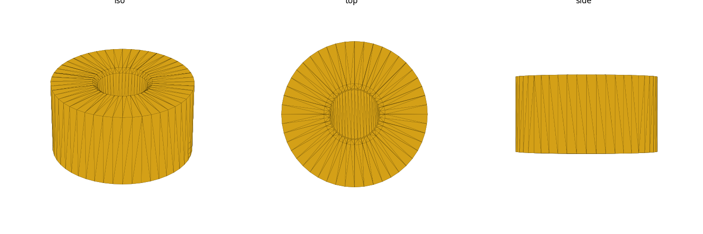
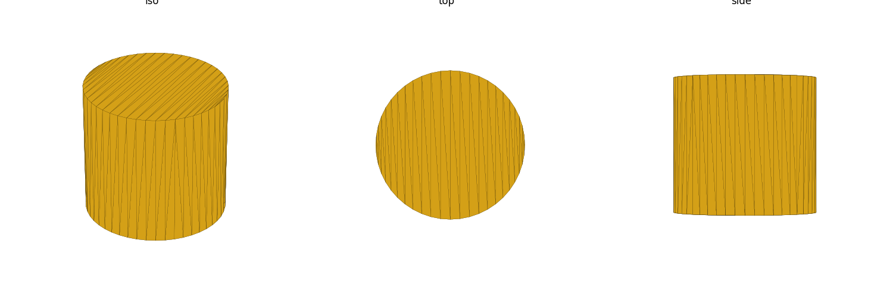

# heatset (library)

Dimension data + geometry for brass heat-set threaded inserts (soldering-
iron/heat-installed, knurled/barbed body — the common 3D-printing style).
A heat-set insert is a brass sleeve with internal machine threads and a
knurled/barbed outer surface; a heated tip (soldering iron, dedicated
insert tool, or a hot hex driver) presses it into a slightly-undersized
printed pilot hole, melting a thin shell of surrounding plastic that flows
into the knurl/barbs and re-solidifies around it on cooling. The result is
a permanent, reusable machine-thread anchor in a printed part — much
stronger and more re-insertion-tolerant than threading a screw directly
into plastic. Sizes **M2, M2.5, M3, M4, M5, M6**, "standard" (not "short")
length variant. Units: **mm**.

## Datum — the canonical insert frame

Every function/module in this library shares one frame: the **install
face sits on `Z=0`**, and everything — insert body, pilot bore, boss
column — is **centered in X/Y** and **grows down into `-Z`** from there.
This matches the top-down, support-free vertical-column convention used
throughout the repo (see the `design-for-print` skill's
[house rules](../../.claude/skills/design-for-print/reference/house-rules.md)):
a consumer places the boss/pocket pair with the install face flush with
the part's top surface and everything else is a `translate([0,0,-…])`
column beneath it.

## Import

```scad
use <heatset/heatset.scad>;
```

Role-1 **data** + role-2 **placeholder** + role-3 **hole-stamp** library —
`use` only (functions, no variables; see gotcha: `use` does not import
top-level variables).

## Install technique

This is general installation guidance, not a sourced hardware dimension —
treat the numbers below as practical ranges, not precise specs.

- **Tip temperature.** Aim roughly 20-40°C above the filament's normal
  print temperature — enough to melt a thin shell of surrounding plastic
  without scorching it. Commonly-cited starting ranges: **PLA ~195-215°C**,
  **PETG ~220-240°C**, **ABS ~230-250°C**. Start at the low end and creep
  up if the insert isn't sinking smoothly; every printer/filament
  combination varies enough that these are starting points, not targets to
  hit exactly.
- **Alignment.** Insert perpendicular to the hole axis — off-axis entry is
  the most common cause of a crooked or cross-threaded insert. A drill
  press, 3D-printer gantry (Z-axis lowered by hand, motors off), or a
  bench vise/right-angle jig all work as a perpendicular guide; a
  freehand iron is workable for shallow/forgiving parts but riskier for
  a tight, load-bearing boss.
- **Press depth: flush vs. slightly proud.** Seating the insert flush
  with (or a hair below) the install face gives the cleanest look and
  guarantees full thread engagement; leaving it slightly proud (raised
  above the face) is sometimes done deliberately so a mating part's screw
  boss self-centers onto the insert tip, but a proud insert can crack a
  thin boss wall as it's pushed past-flush later, and a below-flush
  insert can trap melted plastic on top that blocks the screw. Flush is
  the safer default; use proud only when a fixture design specifically
  wants the self-centering behavior.
- **Tips:**
  - Let the insert cool for a few seconds under light pressure (or after
    briefly removing the iron with the part held still) before releasing
    it — pulling the iron away too early lets residual melt push the
    insert back out or tilt it.
  - Don't overheat — melting more plastic than necessary weakens the
    boss's grip on the insert and can visibly deform the print's outer
    surface if the boss wall is thin.
  - If an insert starts going in crooked, stop and back it out while
    still hot rather than forcing it — a crooked insert rarely
    self-corrects and often splits the boss.

See the `design-for-print` skill for general print-design language (boss/
rib conventions, support-free orientation, fit/clearance types) — not
duplicated here.

## Design usage

The standard idiom is a `union()` boss cut by a `difference()` with the
matching pocket — the boss provides the plastic to melt into, the pocket
carves the pilot bore, lead-in chamfer, and melt-relief cavity:

```scad
use <heatset/heatset.scad>;

difference() {
    heatset_boss("M3", 8);   // solid column, default boss_od
    heatset_pocket("M3");    // pilot bore + lead-in + melt-relief cutter
}
```

- **Boss OD.** `heatset_boss(size, height)` defaults its outer diameter to
  the data table's `boss_od(size)` (SPIROL's optimum-wall-thickness rule,
  ~2.5x `insert_od` — see Sources below). Pass `wall` to instead derive
  the OD from a known pocket wall thickness: `heatset_boss(size, height,
  wall = 2)` sizes the boss to `pilot_dia(size) + 2*wall`.
- **Pilot-hole melt-grip rule.** `heatset_pilot_dia(size)` is always
  smaller than `heatset_insert_od(size)` for every size in the table —
  that's what gives the knurl/barbs plastic to melt into and grip. Don't
  drill/print a pilot hole at or above `insert_od`; the insert will spin
  freely with nothing to bite into.
- **Fit-check without a boss.** `heatset_placeholder(size)` alone renders
  just the insert envelope (a plain cylinder at `insert_od`/
  `insert_length`) for interference/fit visualization against a design —
  it cuts nothing and adds no material itself.

## Reference

| Function | Returns |
|---|---|
| `heatset_known_sizes()` | list of valid size keys (`"M2"`…`"M6"`) |
| `heatset_insert_od(size)` | insert outer diameter over the knurl/barb, mm |
| `heatset_insert_length(size)` | standard-length insert body length, mm |
| `heatset_pilot_dia(size)` | recommended pilot/installation hole diameter, mm |
| `heatset_boss_od(size)` | recommended boss outer diameter, mm |
| `heatset_lead_in(size)` | hole-mouth chamfer depth, mm (chamfer always cut at 45°) |

| Module | Produces |
|---|---|
| `heatset_placeholder(size)` | insert envelope solid, install face at `Z=0`, grows `-Z` (fit-check) |
| `heatset_pocket(size, melt_relief = true)` | pilot-bore + lead-in-chamfer + optional melt-relief cutter (subtract from a consumer solid) |
| `heatset_boss(size, height, wall = -1)` | support-free boss column; `wall < 0` (default) uses `boss_od(size)`, `wall >= 0` derives OD as `pilot_dia(size) + 2*wall` |

Valid `size` keys (`heatset_known_sizes()`): `M2`, `M2.5`, `M3`, `M4`,
`M5`, `M6`.

## Renders



The bored-boss idiom above: `difference(){ heatset_boss("M3", 8);
heatset_pocket("M3"); }` — the axial bore, lead-in chamfer at the top
mouth, and melt-relief step below the pilot bore are all visible cut into
the boss column.



`heatset_placeholder("M3")` — the plain insert-envelope cylinder used for
fit/interference checks, install face at `Z=0`.

## Sources

Provenance tiers (see `heatset.scad` header / `RESEARCH.md`): **[A]**
fetched + read this pass (vendor datasheet or governing standard), **[B]**
corroborated across >=2 independent peers, **[C]** single-sourced /
derived / named-standard-cited-but-not-fetched. `//VERIFY` marks a weak
value pending stronger corroboration.

| Source | Tier | Backs |
|---|---|---|
| [PennEngineering (PEM) "SI Inserts For Plastics" datasheet, p. SI-6](https://www.pemnet.com/wp-content/uploads/sites/2/2022/06/sidata.pdf) | A | `insert_od`, `insert_length`, `pilot_dia` for all 6 sizes — the only source this pass covering M2-M6 on one consistent scale |
| [CNC Kitchen, "Tips & Tricks for Heat-Set Inserts"](https://www.cnckitchen.com/blog/tipps-amp-tricks-fr-gewindeeinstze-im-3d-druck-3awey) | A | corroborates `insert_od`, `insert_length`, `pilot_dia` for M3/M4/M5 only (no M2/M2.5/M6 rows); also gives min-wall-thickness figures recorded in RESEARCH.md as an alternative boss-sizing cross-check |
| [ruthex CAD data page](https://www.ruthex.de/en/pages/cad-daten) | corroborating (length only) | `insert_length` naming/values via per-size STEP filenames (`M2x4`, `M2.5x5.7`, `M3x5.7`, `M4x8.1`, `M5x9.5`, `M6x12.7`) — does not expose OD/hole numbers in fetchable text |
| [insertguide.com, "Heat Set Insert Hole Size Guide"](https://insertguide.com/guides/heat-set-insert-hole-size/) | C | `pilot_dia` corroboration for all 6 sizes (community source, not a manufacturer datasheet); fills the M2/M2.5/M6 gap CNC Kitchen leaves |
| [SPIROL, "How to Design the Proper Hole for Heat / Ultrasonic Inserts"](https://www.spirol.com/assets/files/ins-wp-how-to-design-the-proper-hole-for-heat-ultrasonic-inserts-us.pdf) | A (rule) / C (derived numbers) | the "2-3x insert diameter" boss-wall multiplier rule is `[A]` fetched+read; the per-size `boss_od` numbers derived from it (flat 2.5x midpoint) are `[C]` |

Full evidence log, per-source fetch notes, and the sanity-check tables
(`pilot_dia < insert_od`, `boss_od` vs. `2x`/`2.5x insert_od`) are in
`RESEARCH.md`.

### Every `//VERIFY` value (carried forward honestly, not laundered)

- **`boss_od`** — no source found this pass gives a numeric per-size boss
  OD table. Every size's value is **derived**, not measured: SPIROL's
  general 2-3x-insert-diameter rule, applied as a flat **2.5x insert_od**
  (the range midpoint). `[C] //VERIFY` on all 6 sizes. A future pass could
  taper the multiplier (higher at M2, lower at M6) per SPIROL's stated
  trend instead of a flat 2.5x.
- **`lead_in`** — no vendor/manufacturer source this pass gives a numeric
  chamfer value for heat-set insert holes specifically (SPIROL's paper
  discusses hole *taper angle* for a different, tapered-body insert
  style, not a mouth chamfer for a straight hole). The 0.4mm @ 45° figure
  is carried from this repo's general 45°-chamfer convention, not a
  fetched primary source. `[C] //VERIFY` on all 6 sizes — the weakest
  value in the table.
- **M5 `pilot_dia` outlier** — insertguide.com's M5 figure (6.8mm)
  disagrees with PEM (6.43) and CNC Kitchen (6.4), which tightly agree
  with each other. The table carries PEM's 6.43 as canonical; insertguide's
  6.8 is flagged `//VERIFY` and treated as the weaker outlier, not
  averaged in.
- **M2, M2.5, M6 `insert_od`** — PEM is the *only* source this pass that
  covers these three sizes at all (CNC Kitchen's table stops at M3-M5,
  1/4"-20). These values are effectively single-sourced (`[A]`, but from
  one vendor only) rather than cross-corroborated like M3-M5's `[B]`
  rows — a second manufacturer's M2/M2.5/M6 numbers would strengthen
  them.
- **Short-length variants** exist in real products (PEM, ruthex) but are
  out of scope — only the "standard" length is tabulated. Don't assume
  `insert_length(size)` is the only length on the market for that size.

See `RESEARCH.md`'s "Gaps" section for the full fetch-attempt log behind
each of the above.
