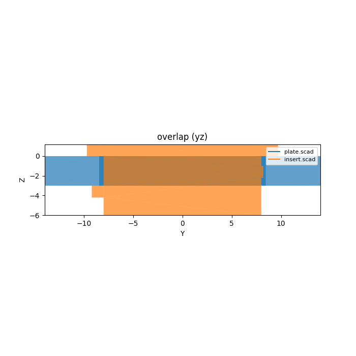
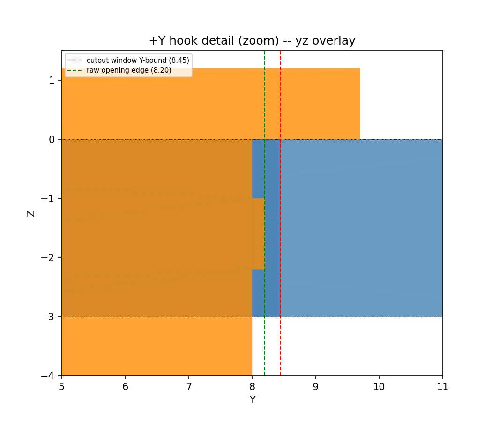

# keystone (library)

Reference data for the de-facto **keystone-jack snap footprint** — the
single, near-universal rectangular snap profile used by network-jack
(RJ45/RJ45A, coax, fiber, HDMI, etc.) modules and the wall plates / patch
panels / equipment-tray faceplates that host them. "Keystone" isn't one
manufacturer's part; it's an interchangeable footprint any compliant
jack/plate shares, so this library's job is to be the **single source of
truth** for that footprint's opening, body keep-out, plate-thickness range,
port pitch, minimum printable wall, and retention-tab geometry — every
consumer library/project reads these accessors rather than copying numbers.
Units: **mm**.

## Datum

Panel-mount default orientation: the panel **front face sits on `Z=0`**,
**centered in X/Y**. The jack **body grows into `-Z`** (behind the panel),
and the opening / show-face faces **+Z**. `keystone_opening(style)` is the X
width x Y height of the plate window a consumer cuts; `keystone_body()` is
the X, Y extents x Z depth of the jack envelope behind the panel (a
keep-out volume, not print geometry). Consumers rotate the whole port to
match their own panel orientation (e.g. `rotate([-90,0,0])` for a vertical
1U faceplate) rather than this library baking in a rack/panel-specific
orientation.

## Retention styles (Task #28)

The library now supports two retention styles — **pass `style=` to
`keystone_opening()` and `keystone_cutout()` to choose**:

- **`"face"` (face-grip)** — `[14.70, 16.40]` mm. Retention by front/rear
  plate-thickness squeeze. Original Samm Teknoloji suggested panel cutout
  [A]. Use for face-plate panels where the latch mechanism relies on plate
  clamping.
- **`"lip"` (rotate-and-snap, **default**)** — `[14.8, 20.3]` mm. Retention
  by bottom-lip fulcrum + top-clip snap; taller opening allows the jack to
  rotate into the window until a rigid bottom lip catches, then flex at the
  top. Use for 3D-printed plastic plates where the snap mechanism (rather
  than plate thickness) drives retention.

**Backward-compatibility note:** Pre-#28 code called `keystone_opening()`
with no arguments and got `[14.70, 16.40]` (the face-grip window). As of
#28, the **default has changed to `"lip"`** (`[14.8, 20.3]`). If your
design relies on the original behavior, pass `style="face"` explicitly to
`keystone_opening()` and `keystone_cutout()`.

## Import

```scad
use <keystone/keystone.scad>;
```

Ships all four roles: **data** (functions — `use` doesn't import
variables), **placeholder** (`keystone_placeholder()`, a jack-envelope
keep-out solid for interference viz), **hole-stamp**
(`keystone_cutout()`/`keystone_insert()`, a consumer `difference()` window
and a geometric mate-reference body), and **fit-check**
(`keystone_pitch()`/`keystone_min_pitch()`/`keystone_pitch_ok()`/
`keystone_layout_ok()`/`keystone_pitch_assert()`, a single-source
port-spacing guard).

`keystone_insert()` is a geometric mate-reference only — **not
print-tuned** (a print-ready flexing-latch insert is out of scope for
v1); it exists so a consumer can drop it into `keystone_cutout()` for a
virtual mate-check (see Verification below), not to print as a
functional jack.

## Usage

```scad
use <keystone/keystone.scad>;

// Basic data
f = keystone_face();             // [14.5, 16.0] invariant jack face
o = keystone_opening("lip");     // [14.8, 20.3] lip (rotate-and-snap, default)
o = keystone_opening("face");    // [14.70, 16.40] face-grip (original)
b = keystone_body();             // [17.5, 19.5, 28.60]
pt = keystone_plate_thickness(); // [1.5, 3.0]

// Port-spacing fit check before laying out N ports across a faceplate:
xs = [for (i = [0:3]) i * keystone_pitch()];
assert(keystone_layout_ok(xs), "ports too close together");
keystone_pitch_assert(keystone_pitch()); // hard-fail at render if too tight

// A faceplate with lip-style windows (default):
difference() {
    translate([-30, -20, -3]) cube([60, 40, 3]);
    keystone_cutout(plate_thickness = 3.0);  // default style="lip"
}
color("orange") keystone_placeholder();

// Face-grip style (original, if needed):
difference() {
    translate([-30, -20, -3]) cube([60, 40, 3]);
    keystone_cutout(plate_thickness = 3.0, style = "face");
}

// Virtual mate-check: drop the insert into the cutout (see renders/ below).
keystone_insert(plate_thickness = 3.0);
```

## Reference

| Function/module | Returns / does |
|---|---|
| `keystone_known_styles()` | `["lip", "face"]` — list of supported retention styles |
| `keystone_face()` | `[14.5, 16.0]` — invariant jack face / plug cross-section, mm |
| `keystone_opening(style="lip")` | `[ow, oh]` — plate window (X width, Y height) per retention style, mm |
| `keystone_body()` | `[bw, bh, bd]` — jack envelope keep-out (X, Y, Z-depth behind panel), mm |
| `keystone_plate_thickness()` | `[tmin, tmax]` — accepted faceplate thickness range, mm |
| `keystone_pitch()` | nominal center-to-center port spacing in a strip, mm |
| `keystone_min_wall()` | minimum printable material wall between adjacent openings, mm |
| `keystone_tab(style="lip")` | `[hook_ledge_z, tab_thickness, hook_edge, latch_edge]` — retention-tab geometry per retention style; `hook_edge`/`latch_edge` are `"+Y"`/`"-Y"` naming the two long edges. `"face"`: fixed hook (`+Y`) + flexing latch (`-Y`) grip the plate's front/rear faces. `"lip"`: fulcrum (`-Y`) + flex clip (`+Y`) grip the opening's bottom/top lips instead of the plate faces |
| `keystone_min_pitch()` | `keystone_opening()[0] + keystone_min_wall()` — minimum center-to-center that still leaves a printable wall |
| `keystone_pitch_ok(pitch)` | true if `pitch >= keystone_min_pitch()` |
| `keystone_layout_ok(xs)` | true if every adjacent gap in ascending X-center list `xs` clears `keystone_min_pitch()` |
| `keystone_pitch_assert(pitch)` | module; hard-fails render (stderr assert) if `pitch` is below `keystone_min_pitch()` |
| `keystone_placeholder()` | module; jack envelope solid (`keystone_body()`), flange face at `Z=0`, body into `-Z` — fit/interference viz only |
| `keystone_cutout(plate_thickness=3.0, clearance=0.25, style="lip")` | module; plain rectangular through-hole for a consumer `difference()`, sized `keystone_opening(style)` + `2*clearance` per side, overcut 1mm above/below the plate |
| `keystone_insert(plate_thickness=3.0, fit=0.2, style="lip")` | module; geometric mate-reference body (flange + through-plug + two retention tabs), narrowed by `fit` per side so it threads `keystone_cutout(style)`'s window. `"face"`: `+Y` hook + `-Y` latch bump grip the plate's front/rear faces (plate-thickness squeeze). `"lip"` (default): `-Y` fulcrum + `+Y` flex clip grip the opening's bottom/top lips (rotate-and-snap) |

## Verification

`keystone_insert()` dropped into a plate with `keystone_cutout()` removed
(both at default params) is the library's virtual mate-check — the plug
should fill the window, the flange should stop flush at the front face
(`Z=0`), the latch should clear the plate rear, and the `+Y` hook should
sit inside the cutout window without touching solid frame material.





The hook detail render overlays the cutout window's Y-bound (`o[1]/2 +
clearance`, red) and the raw opening edge (`o[1]/2`, green) against the
hook body (orange): the hook's Y-extent is clamped to end exactly at the
raw opening edge, so it never reaches — let alone crosses — the window
bound, for any `clearance >= 0` a consumer chooses.

## Sources

Provenance tiers (see `keystone.scad` header / `RESEARCH.md` for the full
evidence log): **[A]** vendor datasheet / governing drawing, **[B]**
corroborated across >=2 independent peers, **[C]** reverse-engineered from a
public STL/SCAD mesh (cite the artifact URL). `//VERIFY` marks a weak/
unsourced value — never a tier it didn't earn (a single, non-decomposed
drawing reading or a single secondary source does NOT qualify as `[C]`/`[B]`).

| Source | Tier | Backs |
|---|---|---|
| [Samm Teknoloji A.Ş., "Unshielded ISO/IEC Keystone Jack" mechanical drawing](https://telecom.samm.com/Data/EditorFiles/Datasheets/9-copper-network-products/Unshielded-ISO-IEC-Keystone-Jack-Drawing-Samm-Teknoloji.pdf) | A | `keystone_opening("face")` (Plastic suggested panel cutout), `keystone_plate_thickness()[0]` (tmin); also the sole reading behind `keystone_body()[2]` (bd, `//VERIFY`) |
| [Wikipedia, "Keystone module"](https://en.wikipedia.org/wiki/Keystone_module) | B | `keystone_face()` (invariant jack face / plug cross-section); also corroborates `keystone_opening("face")`; also the sole secondary source behind the qualitative fixed-hook/flexing-latch asymmetry behind `keystone_tab()` (`//VERIFY`) |
| [Monoprice keystone jack patch-panel listings](https://www.monoprice.com/category/networking/patch-panels/keystone-jack-panel) | B | `keystone_pitch()` (3/4in / 19.05mm de-facto port spacing) |
| Community keystone-panel dimension references (uncited specific source; see `RESEARCH.md` #16) | B//VERIFY | `keystone_opening("lip")` — width `[B]` corroborated across community sources, height `20.3` `//VERIFY` (single community source, caliper-upgradeable) — this is the **default** style's provenance |

### Coverage / not yet covered

- Sourced + tiered: `keystone_opening("face")` [A] (Samm)/[B] (Wikipedia
  corroboration), `keystone_face()` [B] (Wikipedia), `keystone_opening("lip")`
  width [B] (community-corroborated), `keystone_pitch()` [B],
  `keystone_plate_thickness()[0]` (tmin) [A].
- Still `//VERIFY` (flagged for a future research pass, not invented):
  `keystone_opening("lip")` height (20.3 — single community source,
  caliper-upgradeable; **this is the default retention style's opening**,
  so the default's provenance is weaker than the original face-grip
  cutout's), `keystone_body()[0]`/`[1]` (bw, bh — axis-mapping from the
  vendor drawing unresolved), `keystone_body()[2]` (bd — single,
  non-decomposed drawing reading, not corroborated by a second source),
  `keystone_plate_thickness()[1]` (tmax — no accepted-upper-bound source
  found), `keystone_min_wall()` (no source at all — repo print-process
  convention, not a keystone-specific spec), `keystone_tab()[0]`/`[1]`
  (hook_ledge_z, tab_thickness — no numeric latch source found; both
  carried unchanged from the task seed), and `keystone_tab()[2]`/`[3]`
  (hook_edge, latch_edge — asymmetric-mechanism claim backed by exactly
  one secondary source, not the >=2 independent sources `[B]` requires).
  See `RESEARCH.md`'s `//VERIFY` census before treating these as
  load-bearing for a tight-fit design — in particular, `keystone_insert()`
  is a geometric mate-reference built on the `//VERIFY` tab numerics,
  **not** print-tuned, so it should not be printed as a functional latch
  without a real jack/drawing measurement first.
- All four roles are implemented: data, `keystone_placeholder()`,
  `keystone_cutout()`/`keystone_insert()`, and the fit-check family
  (`keystone_pitch_assert()` included). The insert's `+Y` hook Y-extent is
  clamped to `fit` (not the full `tab_thickness`) specifically so it can
  never protrude past the cutout window for any non-negative `clearance` —
  see the overlay mate-check render above.
