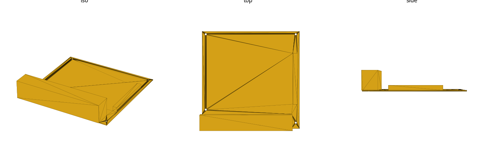
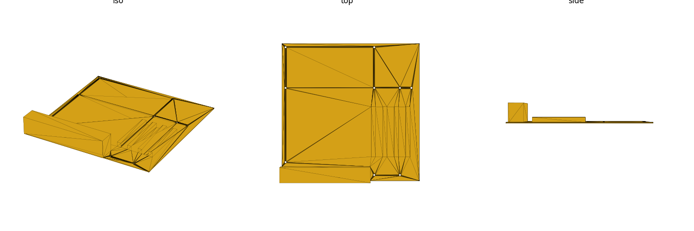
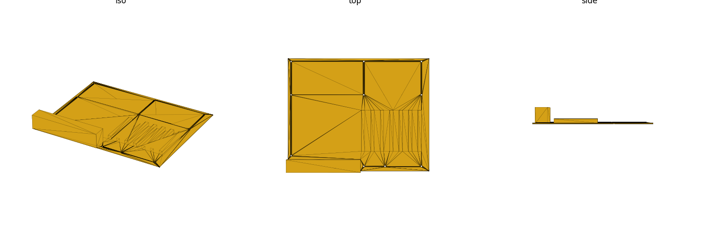

# motherboards (library)

PC motherboard mechanical mounting reference — board sizes, standoff hole
coordinates, rear I/O window, and PCIe slot data for mini-ITX / microATX / ATX.
Mechanical mounting geometry only (no electrical/signal data). Units: **mm**.

Datum: board **REAR-LEFT corner** at the origin, board extends in **+X/+Y**,
PCB bottom on `Z=0`. `+X` = board width (runs along the rear I/O edge), `+Y` =
board depth (rear → front). The rear I/O edge is at `Y=0`.

ATX is 304.80mm (12.0″) wide along the rear edge × 243.84mm (9.6″) deep; the
rear edge carries both the I/O panel and the PCIe/expansion slots.

## Rear-edge layout (component-side-up frame)

On the rear (`Y=0`) edge, the **rear I/O window sits at the LOW-X (origin-corner)
end** and the **PCIe/expansion slots sit at the HIGH-X end** — side by side,
non-overlapping, both anchored to `Y=0`. This matches a real board held
**component-side up** with the rear I/O edge away from you: the I/O cluster is at
the origin-corner end, PCIe fills toward the far corner.

```
 X=0 (rear-left corner)                                          X=width (rear-right corner)
  |                                                                          |
  |==== REAR I/O WINDOW ====|        gap        |==== PCIe / expansion slots ====|
  |  low-X end, may extend   |                    |  high-X end, stepped by pitch  |
  |  ~2.4mm past the board's  |                    |  from mobo_pcie_first_xy(ff)   |
  |  origin-corner edge       |                    |                                 |
  |  (chassis I/O-shield      |                    |                                 |
  |   overhang, real)         |                    |                                 |
  +---------------------------------------------------------------------------+
   Y=0 (rear edge)
```

**Mirror / handedness:** the ATX / microATX / mini-ITX spec drawings are
mirror-handed relative to this component-side-up frame (their datum-to-corner
convention flips X). The data table in `motherboards.scad` stores every
coordinate exactly as chained from the drawing, and the public accessors apply
one documented X-flip (`x → width − x`) so callers receive component-up coords.
This handedness was corrected against physical hardware — the raw drawing chains
close cleanly but reproduce a *mirror image* of a real board.

The I/O window's low-X edge can sit slightly **past** the board's own origin-corner
edge — this is real: the chassis I/O shield overhangs the PCB by ~2.44mm on ATX
(→ `x_off = −2.44`) and microATX (also −2.44), ~2.62mm on mini-ITX. The io near-edge
sits **156.31mm from the right edge on all three**, so the I/O shields **co-locate
in a chassis** (right-corner aligned). See `RESEARCH.md` Task 10.

**Chassis interoperability (the governing constraint):** because an ATX, microATX,
or mini-ITX board all mount in the same ATX chassis on the same standoffs, their
mounting holes, I/O shield, **and** expansion slots must all sit at one consistent
position relative to those shared standoffs. This library is built to satisfy that:
right-corner aligned, the shared standoffs (ATX columns 3 & 4) have **identical**
coordinates in the component frame across all three, the io near-edges coincide,
and each smaller board's slots are a co-located subset of ATX's. (An earlier
apparent 16.51mm io-vs-hole discrepancy turned out to be a dimension-chaining
error — rows/columns chained from row-1/col-1 instead of the board edge; see the
data-breaking note below and `RESEARCH.md` Task 10.)

## Renders

`mobo_placeholder(ff)` envelopes — PCB outline + standoff holes + the raised
**rear I/O block (low-X, origin corner)** and **PCIe slot bars (high-X, one per
slot)** so the corrected side-by-side rear layout is visible in the 3D views
(clearest in *iso*: the I/O block at the origin-corner end, the row of parallel
PCIe bars filling toward the far corner). The ATX rear-edge elevation below shows
the same, disjoint, as a 2D section — supplementary reference (headless
`verify-scad-geometry` output):

| mini-ITX | microATX | ATX |
|---|---|---|
|  |  |  |


## Import

```scad
use <motherboards/motherboards.scad>;
```

Role-1 **data** library — `use` only (functions, no variables; see gotcha:
`use` does not import variables).

## Reference

Form-factor key: `"itx"` / `"matx"` / `"atx"` (see `mobo_known_ff()`).

| Function | Returns |
|---|---|
| `mobo_known_ff()` | list of valid form-factor keys |
| `mobo_size(ff)` | `[width_X, depth_Y]` mm board outline |
| `mobo_thickness()` | PCB thickness, mm (0.062″ nominal) |
| `mobo_hole_dia()` | standoff clearance hole diameter, mm |
| `mobo_pcie_pitch()` | PCIe slot-to-slot pitch, mm |
| `mobo_standoff_xy(ff)` | list of `[x,y]` standoff hole coords |
| `mobo_io_cutout(ff)` | `[x_off, width, height]` rear I/O window |
| `mobo_pcie_first_xy(ff)` | `[x,y]` of the first (rearmost) PCIe slot |
| `mobo_pcie_count(ff)` | number of PCIe slots for the form factor |

| Module | Produces |
|---|---|
| `mobo_placeholder(ff)` | PCB envelope + standoff holes cut + raised rear I/O block (low-X) & PCIe slot bars (high-X) — fit checks / visual reference |
| `mobo_io_ports(ff, depth, protrude)` | representative rear I/O-port cluster block over the 158.75×44.45 window (low-X); envelope, not per-port |
| `mobo_pcie_ports(ff, slots, length, height, width)` | representative PCIe/expansion slot bars (high-X), one per slot, running +Y into the board |
| `mobo_standoff_holes(ff, depth, dia)` | standoff clearance holes (subtract from a consumer solid) |
| `mobo_standoffs(ff, height, dia, bore)` | positive standoff posts with pilot bore (print a tray directly) |
| `mobo_io_cutout_stamp(ff, depth)` | rear I/O window as a subtraction solid at `Y=0` |
| `mobo_pcie_cutout(ff, slots, depth)` | PCIe slot openings stepped from the first slot by pitch |

## Sources

| Source | Tier | Backs |
|---|---|---|
| [ATX Specification 2.01](https://www.bitsavers.org/pdf/intel/ATX/ATX_Specification_2.01_199702.PDF) (Intel, 1997) | A | Board size, standoff hole grid, rear I/O window + PCIe position (ATX) |
| [microATX Interface Spec 1.2](https://xdevs.com/doc/_PC_HW/Form_factors/matxspe1.2.pdf) (Intel, 2004) | A | Board size, standoff hole grid, rear I/O window (microATX) |
| [ATX Specification 2.2](https://web.archive.org/web/20180417122513/http://www.formfactors.org:80/developer/specs/atx2_2.pdf) (via Wayback) | A | Cross-confirms ATX 2.01's hole grid + rear-edge chain on a cleaner render |
| [Mini-ITX Addendum 1.1 to microATX](https://web.archive.org/web/20160306163046id_/http://formfactors.org/developer/specs/mini_itx_spec_v1_1.pdf) (VIA/formfactors, via Wayback) | A | mini-ITX board size, standoff holes (C,F,H,J), rear I/O window x_off/width |
| [Protocase enclosure design guide](https://www.protocase.com/resources/how-to-design-for-motherboards/How-to-Design-Enclosures-for-Motherboard.pdf) | C | Corroborating enclosure-design reference (superseded for mini-ITX holes by the Addendum) |
| [Wikipedia: Mini-ITX](https://en.wikipedia.org/wiki/Mini-ITX) | B | mini-ITX chassis compatibility (4 holes align with ATX; slot/backplate match) |

Provenance tiers (also tagged inline in `motherboards.scad` / `RESEARCH.md`):
**[A]** direct from an Intel/formfactors.org spec dimensioned drawing, **[B]**
corroborated across ≥2 independent peers, **[C]** reverse-engineered /
best-available reproduction (primary drawing unreachable or chain unclosed).

**mini-ITX is now `[A]`** — the VIA/formfactors *Mini-ITX Addendum 1.1* (Table 3
hole letters + dimension-labelled Figure 3, datum = hole C) was recovered via
Wayback and chained directly: holes **C,F,H,J** and the rear I/O window x_off
(hole C + 0.300″) are `[A]`; the single-slot count is `[A]` (form-factor
definition). Only the I/O panel **height** (`[B]`, standard microATX panel) and
the expansion-slot **X** (`[C]`, undimensioned — the Addendum defers connector
placement to microATX 1.2) remain non-`[A]`. Protocase and Wikipedia now serve
only as corroboration; every ATX/microATX/mini-ITX hole coordinate is `[A]`.

Full chained-dimension reconstruction and closure proofs: `RESEARCH.md`.

## Coverage & verification notes

**Not covered** (no data — using these keys asserts):
- E-ATX
- DTX / Mini-DTX
- ITX micro-variants (Nano-ITX, Pico-ITX, Mini-ITX "Flex")

**Data-breaking correction (this pass, v0.2.0):** a geometry re-verification
found the previous release's standoff holes, rear I/O window, and PCIe slot
position were all wrong — holes had scrambled letter/coordinate assignments, the
I/O window and PCIe slots overlapped in X, and the PCIe stamp sat at the wrong Y
(front-row depth instead of the rear edge). All three are now re-derived from the
spec drawings' own printed dimension chains. **Two further corrections in the
same pass:** (1) the spec drawings are **mirror-handed** vs a real board viewed
component-side-up — the accessors now apply an `x → width − x` flip so the I/O
window lands at the **low-X (origin-corner)** end and PCIe at **high-X**, matching
physical hardware (previously reversed); (2) mini-ITX holes were corrected from a
`[B]` guess (A/C/G/H) to the drawing-`[A]` **C, F, H, J** off the recovered
Mini-ITX Addendum; (3) mirror-handedness; and finally **(4) a full measurement-based
rebuild (RESEARCH.md Task 10)** that found the deepest error: the hole grids were
**chained from row-1 / column-1 instead of the board edge**, so every row-2/row-3 was
~10mm off and the right hole columns ~16.5mm off, on all three form factors. The
figures were then measured directly (calibrated pixel geometry) and reconciled to one
right-corner-aligned chassis model: rows are now **10.16 / 165.10 / 237.49**, ATX has
**10 holes** (columns 16.51 / 95.25 / 140.97 / 298.45), and the shared standoffs +
io + slots co-locate across all three. **Consumers pinned to the old coordinates must
re-check fit** — data-breaking release (`lib.json` `0.1.0` → `0.2.0`).

**Carried `//VERIFY` items** — confirm before a fit-critical print:

- **PCIe slot model is `[C]`//VERIFY (uniform-pitch)** — the library steps slots at
  a uniform `0.800″[20.32]` pitch, with the **I/O-nearest slot anchored to the
  measured position** (`io_near − slot_w`) so it and the shared subset co-locate
  across form factors. Counts are `[A]` bracket maxima (ATX 7 / microATX 4 /
  mini-ITX 1). The io-side slots reproduce the measured centerlines; the *outermost*
  slot differs from a real board's irregular ISA/PCI spacing (a model simplification),
  and mini-ITX's single slot necessarily shares the cramped high-X strip with mounting
  hole C. Don't treat individual slot X as fit-critical without checking your board.
- **mini-ITX I/O panel height `44.45` is `[B]`** — the standard microATX I/O
  panel; the Addendum defers panel detail to microATX 1.2 and does not draw
  it. The window x_off (13.87) and width (158.75) **are** `[A]`.
- **Rightmost-hole-to-right-edge = 0.250″ (measured)** — the largest single
  correction vs the old grid (which had it at 0.900″). Calibration is solid, but a
  caliper reading on a real board's rightmost standoff would nail the absolute
  anchor; if it's actually 0.900″ the right columns shift −16.51mm uniformly.
- **`mobo_hole_dia()`** (#6-32 / Ø.156″ = 3.96mm) — confirm against your actual
  standoff hardware (M3 vs #6-32) before drilling to fit.

**Shared-standoff / corner note**: all three form factors are **right-corner
aligned** and share ATX standoff columns 3 & 4. In this library's **component frame**
(X measured from the shared right edge) those shared holes have **identical
coordinates** across ATX / microATX / mini-ITX — the test asserts it. The own-frame
(rear-left) coordinates differ by the board-width difference (microATX +60.96mm,
mini-ITX +134.8mm into the ATX frame), so don't compare raw own-frame X across form
factors without that offset. The rear I/O window and the expansion slots co-locate
under the same alignment. (An earlier revision claimed a +44.45mm offset and a real
16.51mm io discrepancy — both were artifacts of the chain-reference grid error, now
fixed; see the data-breaking note and `RESEARCH.md` Task 10.)
