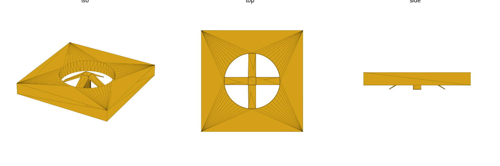
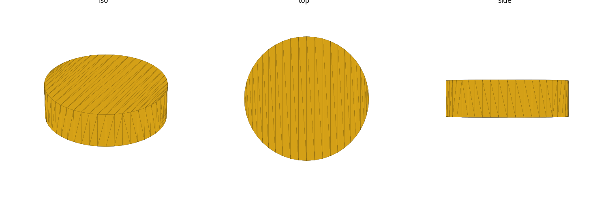

# multibuild (library)

Grid math + connector geometry for building parts in the **MultiBuild**
ecosystem: the **MultiBoard** pegboard-style mounting wall (25mm "MU" grid)
and the **MultiBin** storage-container system (50mm "CU" grid). MultiBoard is
a wall/panel of square Tiles on a repeating hole grid; parts snap onto it via
connector features that plug into the Tile's holes. This library gives you the
grid pitch/spacing math, a modeled **positive** connector feature
(`multibuild_mount`) and matching **negative** board-hole cutter
(`multibuild_hole`) for the "snap" mount, MultiBin container envelope/cavity
accessors (`multibin_*`), and the accessory-side **Fix-Point** slide-on
negatives (`multibuild_hole("multipoint")` / `"multipoint_rail"`). Units:
**mm**. See [`ECOSYSTEM.md`](ECOSYSTEM.md) for the full type/relation map and
how the families chain together.

## Datum — the canonical mount/grid frame

Every function/module in this library shares one frame (see the header
comment in `multibuild.scad`):

- **Mount-feature axis = Z.** The board's mount surface sits on `Z=0`; the
  mount feature (`multibuild_mount`/`multibuild_hole`) grows into `-Z` (into/
  through the board); a consumer part's own body sits at `+Z`, above the
  mount surface.
- **Grid `[x, y]` lies in the `Z=0` plane, centered in X/Y.**
  `multibuild_grid_points(cols, rows)` returns coordinates centered on the
  origin, not anchored to a corner.

This matches the top-down, support-free vertical-column convention used
throughout the repo — see the `design-for-print` skill's
[house rules](../../.claude/skills/design-for-print/reference/house-rules.md)
for the general boss/pocket/orientation language; it isn't duplicated here.

## Import

```scad
use <multibuild/multibuild.scad>;
```

Role-1 **data** (grid pitch/math + mount / MultiBin / Fix-Point tables) +
role-2 **placeholder** (mount, bin envelope, Fix-Point dovetail) + role-3
**positive** (mount) + role-4 **negative** (board hole, bin cavity, Fix-Point
pocket) library — `use` only (functions, no variables; see gotcha: `use` does
not import top-level variables).

## Usage

### Mode (a): fit mounts to an object — walk the grid

Place a mount at every point of an N x M hole lattice, e.g. to attach a
custom bracket at four grid points:

```scad
use <multibuild/multibuild.scad>;

cols = 2; rows = 2;
for (pt = multibuild_grid_points(cols, rows))
    translate([pt[0], pt[1], 0])
        multibuild_mount("snap");
```

`multibuild_grid_points(cols, rows)` returns `cols * rows` `[x, y]`
coordinates at `multibuild_grid_pitch()` (25mm) spacing, centered on the
origin — the same lattice a MultiBoard Tile's holes sit on.

### Mode (b): scale an object to the grid — snap a dimension

Size a part's own dimension to land on whole grid squares instead of an
arbitrary length, e.g. so a shelf's width lines up with the board's hole
columns:

```scad
use <multibuild/multibuild.scad>;

raw_width = 143;                          // mm, driven by some other constraint
width = multibuild_grid_snap(raw_width);  // -> 150 (6 x 25mm, nearest whole pitch)
cube([width, 40, 3], center = true);
```

`multibuild_grid_count(length)` (floor) and `multibuild_grid_snap(length)`
(round-to-nearest) both divide by `multibuild_grid_pitch()`; use `_count` when
you need "how many whole grid cells fit" and `_snap` when you need "the
nearest grid-aligned length."

### The mount idiom — positive feature + matching negative cutter

The board side gets `multibuild_hole(type)` cut into it; the consumer part
carries `multibuild_mount(type)` as a feature that plugs `-Z` through that
hole. Board mount face and mount-feature base share the same `Z=0` datum, so
the two line up without any extra offset math:

```scad
use <multibuild/multibuild.scad>;

type = "snap";
h = multibuild_hole_depth(type);

// Board/Tile side: the matching hole cut into a slab (Tile mount face at Z=0).
difference() {
    translate([-20, -20, -h]) cube([40, 40, h]);
    multibuild_hole(type);
}

// Consumer part: the mount feature plugs -Z through the hole; the part's
// own body continues upward from Z=0 (union() in a real design).
multibuild_mount(type);
```



`multibuild_mount_placeholder(type)` alone (no arms/shaft detail, just the
tip-flare-diameter x engagement-length envelope) is available for cheaper
fit/interference checks before committing to the full arm geometry:



## Reference

| Function | Returns |
|---|---|
| `multibuild_grid_pitch()` | grid repeat distance, 25mm (`[A]`, the MultiBoard "MU" unit) |
| `multibuild_grid_count(length)` | `floor(length / pitch)` — whole grid cells that fit in `length` |
| `multibuild_grid_snap(length)` | `length` rounded to the nearest whole multiple of the pitch |
| `multibuild_grid_points(cols, rows)` | list of `[x, y]` grid coords, `cols * rows` points, centered on the origin |
| `multibuild_known_mounts()` | list of valid mount `type` keys |
| `multibuild_hole_dia(type)` | board-hole cutter diameter, mm |
| `multibuild_hole_depth(type)` | board-hole cutter depth (= Tile thickness), mm |
| `multibuild_mount_engagement(type)` | mount feature's total `-Z` length (deliberately taller than `hole_depth` — the tip pokes past the hole's far face to retain) |
| `multibuild_mount_arm_count(type)` | number of compliant snap arms |
| `multibuild_mount_arm_width(type)` | tangential width of each arm, mm |
| `multibuild_mount_tip_flare(type)` | arm-tip flare radius, mm (tip-to-tip span = `2 x` this) |

| Module | Produces |
|---|---|
| `multibuild_mount_placeholder(type)` | envelope solid only (tip-flare diameter x engagement length), mount face at `Z=0`, grows `-Z` (cheap fit-check) |
| `multibuild_mount(type)` | the real positive connector feature: central shaft + `arm_count` tapered/flared arms, mount face at `Z=0`, grows `-Z` |
| `multibuild_hole(type)` | negative board-hole cutter (subtract from a consumer solid): a straight cylinder at `hole_dia(type)`, `Z=0` down through `hole_depth(type)` |

Valid `type` keys (`multibuild_known_mounts()`): **`snap`** — the only mount
type modeled in v1 (see "Which mount types this models" below).

## MultiBin containers (CU grid)

MultiBin is the storage-container half of MultiBuild, on a **separate 50mm
"CU" grid** — distinct from the 25mm "MU" board grid above (`2×2 MU = 1×1
CU`). The two live in separate accessor namespaces (`multibin_*` vs
`multibuild_grid_*`) exactly so the 25-vs-50 distinction can't be lost: **do
not size CU bin geometry off `multibuild_grid_pitch()`**.

Modeled: the Simple Walls (standard-depth) Shell family — external envelope,
internal cavity, and the shared CU constants. `size` is `[Nx, Ny, Hz]` in CU
cells. Datum differs from the mount features': a bin's floor sits at `Z=0`,
its opening faces `+Z`, footprint centered on XY.

| Function | Returns |
|---|---|
| `multibin_cu()` | CU cell size, 50mm (`[A]`) |
| `multibin_panel_pitch()` | Panel / Base Plate pitch, 50mm (`[A]`, derived from CU) |
| `multibin_tolerance()` | official design tolerance, 0.25mm (`[A]`) |
| `multibin_floor()` | base floor thickness, mm (`[C]`) |
| `multibin_footprint(size)` | external `[W, D]` = `50·[Nx, Ny]`, mm |
| `multibin_cavity(size)` | internal `[W, D, H]` (walls/rim), mm |
| `multibin_wall(size)` | rim wall thickness, mm |
| `multibin_height(size)` | external height = `50·Hz + floor`, mm |

Valid `size` keys are the `[Nx, Ny, Hz]` rows of the Shell table (see
`RESEARCH.md`); an unknown size asserts.

| Module | Produces |
|---|---|
| `multibin_placeholder(size)` | external envelope solid (reference/viz + fit checks), floor at `Z=0`, opening `+Z` |
| `multibin_cavity_cutout(size)` | internal cavity negative (reference for insert/divider design), floor at `Z=multibin_floor()` |

Bins **stack** via the CU-height pitch (`50·Hz`; the base floor is only on the
bottom-most shell). Micro (shallow-tray) sub-family and additional sizes are
deferred — see `RESEARCH.md`.

## Fix-Point — accessory-side slide-on negatives

A **Fix-Point** (formerly "Multipoint") gives an accessory a **slide-on**
attachment that bridges a Tile/board to a MultiBin Shell. This library models
the **accessory side only**: the dovetail pocket/channel an accessory cuts
into its own face to receive a Fix-Point. The Fix-Point part's own board-side
thread/bolt engagement is **out of scope** (it belongs to the official part).

These are **negative-only** types — a Fix-Point has no positive
arms/flare/mount body — so they live in a table **parallel** to the mounts
and are keyed by `multibuild_known_holes()`, not `multibuild_known_mounts()`.
`multibuild_hole(type, length=undef)` dispatches them; `length` sets the
pocket length along the `+X` slide axis (ignored by the board-hole cutter).

| `type` (`multibuild_known_holes()`) | Mates | Via |
|---|---|---|
| `"multipoint"` | Regular Fix-Point | a Multipoint Hole |
| `"multipoint_rail"` | Lite variant (1mm thinner) | a Rail Negative |

| Module | Produces |
|---|---|
| `multibuild_hole("multipoint" \| "multipoint_rail", length=undef)` | accessory-side dovetail pocket, face at `Z=0`, undercut (wider at depth) so a seated Fix-Point can only enter/leave by the `+X` slide |
| `multibuild_fixpoint_placeholder(type)` | the mating positive dovetail, fit-viz reference geometry only |

**Fit-check honesty.** These negatives prove **slide-on clearance only** —
that a mating dovetail has `+X` room to slide into the pocket — **not
retention or engagement**. Nothing here proves the seated part actually holds;
that's a physical property of the printed dovetail's flank fit and material,
the same rigid-static caveat as the Snap mount below. Treat the emitted
geometry as a starting point to test-fit and tune. All Fix-Point negative
dimensions are `[C]`//VERIFY (single STL-mesh sample), caliper-upgradeable
(backlog #16).

See [`ECOSYSTEM.md`](ECOSYSTEM.md) for how Tiles, MultiBin Shells, Snaps, and
Fix-Points chain into a complete hang-off-board container.

## Which mount types this models — and how honestly

MultiBoard officially offers several distinct connector families (Snaps in
three weight-bearing variants, Threads, Peg Click, DS Snaps — see
`RESEARCH.md`'s "Mechanism" section for the full taxonomy). This library
models exactly **one**: the **Regular Snap plugging into a Large Hole** — the
symmetric, straight `-Z`-insertion variant, chosen because it's genuinely a
clean 2-piece positive/negative pair (no third part, no angled insertion
motion), unlike the angled Weight-Bearing Snap variants or the official
3-part accessory chain (Tile -> Snap -> Locking Bolt -> Insert).

**This is a rigid static approximation of a real compliant part.** The actual
Snap connector is a 4-arm cantilever snap-fit — the arms flex inward to pass
through the hole's narrow waist, then spring back out to retain against the
far face. `multibuild_mount("snap")` models the arms' *shape* (shaft + 4
tapered arms flaring to the measured tip radius) as a single rigid solid; it
does **not** simulate flex, so nothing about this geometry proves the printed
part will actually compress and snap in the way the real connector does —
that's a physical property of the arm's cross-section/material, not something
a rigid CAD solid can capture. Treat the printed dimensions as a starting
point to test-fit and tune, not a guaranteed-correct connector.

## Provenance — single community source, mostly `[C]//VERIFY`

This is the most important honesty note in this README: **every mount
geometry number in `_multibuild_table()` comes from mesh-measuring two
community Printables models** (a "MultiConnect" generic connector remix and
an "8x8 Tiles" repackaging of the official geometry), **not from an official
MultiBoard/MultiBuild specification or a fetched CAD/dimension drawing**. No
official numeric hole/connector dimension was reachable this pass (see
"Gaps" in `RESEARCH.md` — the parts-library site and community forum are
client-rendered SPAs that a static fetch can't read).

Concretely, per `multibuild.scad`'s provenance legend:

- **`multibuild_grid_pitch()` = 25mm is `[A]`** — fetched and read directly
  from `docs.multibuild.io`'s own core-parts documentation, independently
  corroborated by a second community source and by the Tile mesh's own
  hole-center spacing. This is the one solid, official-sourced number in the
  library.
- **Every other value in `_multibuild_table()` — `hole_dia`, `hole_depth`,
  `mount_engagement`, `mount_arm_count`, `mount_arm_width`,
  `mount_tip_flare` — is `[C]//VERIFY`**: single-sourced, STL/3MF
  mesh-measured from community models, not from official multiboard.io CAD
  data. The two independently-authored measurements (connector STL vs. Tile
  3MF) do cross-validate each other closely (the connector's ~11.05mm
  relaxed tip-flare radius sits almost exactly at the Tile's ~11.1mm
  measured hole-waist radius — consistent with a snug snap-fit), which is
  reassuring, but it is corroboration between two community sources, not
  confirmation against an official spec. Treat these numbers as a good-faith
  approximation to test-fit and tune, not a guaranteed-correct spec value.

See `RESEARCH.md` for the full evidence log: the Task 1 checkpoint (which
confirmed the 2-piece positive/negative API shape fits the real mechanism
before any geometry was written), the STL mesh-measurement method for the
connector (Task 1b) and the Tile/hole (Task 1c), and the complete list of
gaps that were left unresolved rather than fabricated (Small-Hole dimensions,
thread pitch/profile, the exact Small-vs-Large hole grid offset).

## v1 non-goals

This library does **not** model, and has no near-term plan to add:

- **Full Tile geometry** — no Tile/panel shape, edge profile, or
  inter-tile joining features (Dual Snaps, Offset Pillars) are modeled. Only
  the hole cutter (`multibuild_hole`) exists, for cutting into a consumer's
  own panel.
- **Cord channels** — MultiBoard's cable-routing features are not modeled.
- **A vendor parts catalog** — this library does not attempt to reproduce
  the multiboard.io parts library (Threads, Peg Click, DS Snaps, Locking
  Bolts, Inserts). One mount type (`"snap"`) is modeled; `multibuild_known_
  mounts()` is designed to grow if a future pass resolves the sourcing gaps
  for another type (see `RESEARCH.md`'s Checkpoint findings for what would
  be needed to add Threads or Peg Click).

## Sources

Provenance tiers (see `multibuild.scad` header / `RESEARCH.md`): **[A]**
fetched + read this pass (official docs), **[B]** corroborated across >=2
independent peers, **[C]** single-sourced / derived / mesh-measured from a
named community model. `//VERIFY` marks a weak value pending stronger
corroboration.

| Source | Tier | Backs |
|---|---|---|
| [multiboard.io/multiboard](https://multiboard.io/multiboard) | A | 25mm grid pitch (marketing/FAQ statement) |
| [docs.multibuild.io — core-parts-documentation](https://docs.multibuild.io/beginner-section/core-parts-documentation) | A | 25mm grid pitch (authoritative), hole-type/mount-mechanism taxonomy (Snaps/Threads/Peg Click) |
| [docs.multibuild.io — tile-mounting-guide](https://docs.multibuild.io/beginner-section/tile-mounting-guide) | A | Tile-to-Tile joining context (Dual Snaps, Offset Pillars) — not modeled, background only |
| [docs.multibuild.io — printing-guidelines](https://docs.multibuild.io/beginner-section/printing-guidelines) | A | print/material context (0.25mm tolerance, ~45 deg max overhang, no supports) — corroborates this repo's support-free constraint, not a geometry value |
| ["Multiboard Common Connections" diagram](https://docs.multibuild.io/assets/images/multiboard_common-connections-4b433970f396897c7f5d5432da71b3f1.png) | A | visual confirmation of the official Snap/Locking-Bolt/Insert accessory chain (out of v1 scope) |
| [Printables 716558, "MultiConnect — generic connector for multiboard"](https://www.printables.com/model/716558-multiconnect-generic-connector-for-multiboard) | C //VERIFY | `mount_engagement`, `mount_arm_count`, `mount_arm_width`, `mount_tip_flare` — STL mesh-measured, single community source |
| [Printables 767851, "MultiBolt — Multiboard Bolt Connector System"](https://www.printables.com/model/767851-multibolt-multiboard-bolt-connector-system) | C, pitch corroboration only | independent 25mm pitch confirmation; its own bolt/nut mechanism is a non-official community workaround, not modeled |
| [Printables 1277707, "Multiboard 8x8 Tiles - Corner, Core, Side"](https://www.printables.com/model/1277707-multiboard-8x8-tiles-corner-core-side) | C //VERIFY | `hole_dia`, `hole_depth` — 3MF mesh-measured (self-reported repackaging of official multiboard.io Tile geometry, not fetched directly from multiboard.io) |

Full evidence log, measurement/analysis notes (3MF/STL mesh-measurement
technique), and the complete Gaps list are in `RESEARCH.md`.
