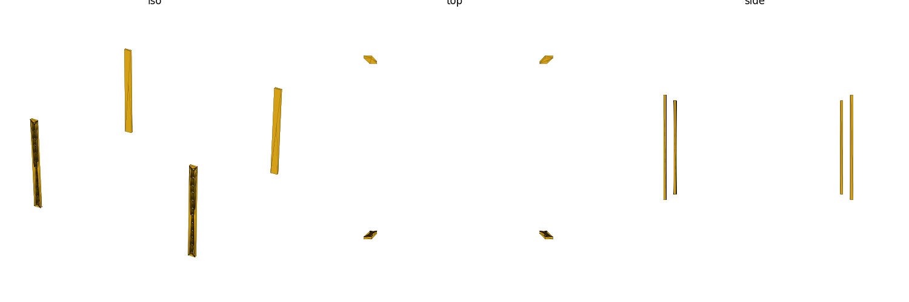
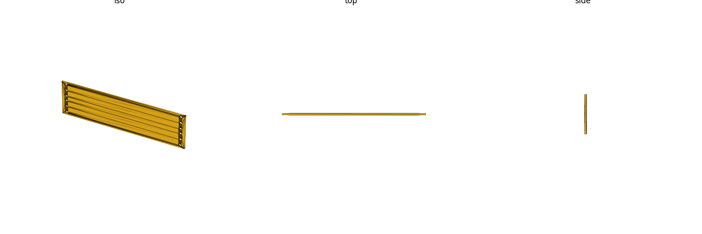

# rack10 (library)

10-inch mini-rack mechanical reference, **vendor-keyed** — ships three
vendors: **LabRax** (Michael Klements' 3D-printable 10-inch mini-rack
system), **DeskPi RackMate** (T0/T1/T1-Plus/T2), and **TecMojo** (4U/6U/9U/
12U 10-inch network rack). Panel/clear widths, horizontal hole
center-to-center span, per-U mounting-hole pattern (round/M6/#10-32/square),
a rail-flange placeholder envelope, and a plain faceplate blank. Mechanical
mounting geometry only (no electrical/thermal data). Units: **mm**.

DeskPi and TecMojo share LabRax's hole geometry — the same 236.525mm
horizontal hole span and 44.45mm U pitch — since all three converge on the
same de facto 10-inch mini-rack convention (see `RESEARCH.md`). `depth_ftf`
and hole type (round-tapped for DeskPi, combo tapped/square cage-nut for
TecMojo) are per-vendor/per-call choices, not shared.

Datum: **X centered** on the rack width (`X=0` at the rack centerline),
`Z=0` at the bottom of the U-stack (`+Z` = upward, stacking U-by-U), `Y=0`
at the **front post face** (`+Y` = rearward, into the rack).

**Nothing in this library is tier `[A]`, and that ceiling is structural, not
a research shortfall.** Unlike `rack19` (governed by a real, if paywalled,
standard — EIA-310-D), **there is no governing standard for 10-inch
mini-racks at all** — LabRax's own designer says so explicitly: *"There is
no strict standard for 10-inch racks, but Lab Rax follows the most commonly
accepted dimensions."* So `[A]` is not reachable for anything in this
library; the ceiling is `[B]`. See `RESEARCH.md` for the full evidence log
and fetch-attempt history.

See [`ECOSYSTEM.md`](ECOSYSTEM.md) for the item-type / interconnection /
compose map — how the panel, holes, placeholders, and consumers chain
together, and how rack10 relates to `rack19`.



## Import

```scad
use <rack10/rack10.scad>;
```

Role-1 **data** + role-2 **placeholder** + role-3 **hole-stamp** library —
`use` only (functions, no variables; see gotcha: `use` does not import
top-level variables). Every geometry function/module takes a `standard`
key (see `rack10_known_standards()`) — `"labrax"`, `"deskpi"`, or
`"tecmojo"`.

## Usage

### Making a mounting panel — the panel + holes idiom

Same idiom as `rack19`: **no dedicated `_panel_holes(standard, u)` combo
helper** — `rack10_panel()` + `rack10_holes()` composed via a `difference()`
instead (DRY — the hole-stamp module already needs to serve both the panel
and the placeholder's front rail flanges, so a second panel-specific helper
would just duplicate it). **This idiom is THE way to make a real mounting
panel/faceplate with this library:**

```scad
use <rack10/rack10.scad>;

difference() {
    rack10_panel("labrax", 2);            // 2U faceplate blank, 3mm thick
    rack10_holes("labrax", 2, "m6");       // M6 clearance holes, both rail columns
}
```



Other hole types on the same panel:

```scad
rack10_holes("labrax", 2, "10-32");        // clearance hole sized for a #10-32 screw
rack10_holes("labrax", 2, "round", 5.0);   // explicit numeric clearance dia
rack10_holes("labrax", 2, "square");       // cage-nut square (not used by LabRax; carried for future vendors)
rack10_holes("labrax", 2, hole_type="slot", dia=rack10_screw_clearance("m6"));
                                            // horizontal obround (elongated ±2mm along X), post-spacing tolerance
```

### Fit-check placeholder

```scad
use <rack10/rack10.scad>;

rack10_placeholder("labrax", 4, rack10_depth_preset("labrax"));
```

`rack10_placeholder(standard, u, depth_ftf, hole_type)` builds the four
vertical rail flanges (front + rear, left + right) over `u` units at the
vendor's hole center-to-center, with the hole strip stamped through the
**front** flanges only (rear flanges are plain, same reasoning as `rack19`:
real rail mounting faces are typically only front-holed). A `%`-background
usable-equipment keep-out volume (`clear_width` wide × `depth_ftf` deep ×
`u*pitch` tall) is also drawn for a GUI fit-check — this is an OpenSCAD
"background" (`%`) modifier, so it is **excluded from STL/CSG export**
(including the PNG above, rendered from an exported STL) — open the `.scad`
directly in the OpenSCAD GUI to see it. Flanges are centered on the hole
column (reference-envelope simplification, not post-accurate) — this is a
**non-print-ready fit-check aid**, not a printable LabRax post.

`rack10_rackpost_context(standard, device_u, pad_u, depth_ftf, hole_type)`
wraps `rack10_placeholder()` into a "device framed in a padded rack context"
envelope: `pad_u` empty U below AND above a `device_u`-tall device band,
datum device-bottom-at-`Z=0` (place your device at `Z=0` and call this
alongside it for rack context) — the caller applies `%` for a background
fit-check preview; `device_u`/`pad_u` are integer U only (fractional/0.5U
is a future enhancement, not supported here).

See [`ECOSYSTEM.md`](ECOSYSTEM.md) for how the panel + holes idiom and the
fit-check placeholders compose into a real 1U faceplate (the keystone-faceplate
and bpir4 chains), and for the keystone-meets-rack10-only-at-the-project-layer
note.

## Reference

| Function | Returns |
|---|---|
| `rack10_u()` | 1U pitch, mm |
| `rack10_stack_gap()` | stacking gap subtracted from a device's exterior height, mm |
| `rack10_device_height(u)` | device exterior height for a `u`-unit device (`u*rack10_u() - rack10_stack_gap()`, gap subtracted once, not per-U), mm |
| `rack10_known_standards()` | valid `standard` keys (`["labrax", "deskpi", "tecmojo"]`) |
| `rack10_panel_width(standard)` | full front-panel width, mm |
| `rack10_hole_h_span(standard)` | horizontal hole center-to-center span, mm |
| `rack10_hole_h_centers(standard)` | `[left_x, right_x]` rail hole X centers (X-centered datum) |
| `rack10_clear_width(standard)` | usable equipment opening width (between posts), mm |
| `rack10_depth_preset(standard)` | illustrative post face-to-face mounting depth, mm |
| `rack10_u_hole_offsets()` | the 3 per-U hole Z-offsets from a U's lower edge |
| `rack10_hole_z(u)` | every hole-center Z (ascending) for a `u`-unit stack |
| `rack10_square_size()` | cage-nut square hole side, mm (not used by LabRax) |
| `rack10_known_hole_types()` | valid `rack10_holes()` `hole_type` values |
| `rack10_screw_clearance(fastener)` | clearance-hole dia for `"m6"`/`"10-32"`, mm |
| `rack10_flange_width()` | placeholder rail flange width, mm (illustrative, unsourced) |
| `rack10_flange_thickness()` | placeholder rail flange thickness, mm (illustrative, unsourced) |

| Module | Produces |
|---|---|
| `rack10_holes(standard, u, hole_type, dia, depth, slot_travel)` | mounting-hole cutter, both rail columns, `u` units (subtract from a consumer solid) |
| `rack10_slot_profile(dia, slot_travel)` | horizontal obround cross-section (used by `rack10_holes()`'s `"slot"` branch; extrude it directly for a standalone profile) |
| `rack10_placeholder(standard, u, depth_ftf, hole_type)` | 4-flange rail envelope + front hole strip + `%` keep-out volume (fit-check reference) |
| `rack10_rackpost_context(standard, device_u, pad_u, depth_ftf, hole_type)` | `rack10_placeholder()` sized to `device_u + 2*pad_u` U and shifted so the device band's bottom sits at `Z=0` — padded rack context around a device (integer U only) |
| `rack10_panel(standard, u, thickness)` | plain faceplate blank, `u` units tall — subtract `rack10_holes()` to mount it |

`hole_type` is `"round"` (pass a numeric clearance dia in `dia`), `"m6"` /
`"10-32"` (dia resolved via `rack10_screw_clearance()`), `"square"`
(cage-nut, `dia` ignored — `rack10_square_size()`, not used by LabRax
itself), or `"slot"` (horizontal obround/elongated hole — width from `dia`,
e.g. `rack10_screw_clearance("m6")` or `"10-32"`; `dia` is required, `dia=0`
asserts). `rack10_holes()`'s `depth` must exceed the target's
thickness/flange depth — the default (40mm, centered on the front-post
plane Y=0, spanning Y∈[-20,+20]) covers realistic panels (≲20mm) and rail
flanges, but a smaller caller-supplied `depth` can under-cut a thicker
target. `slot_travel` (default `4`, illustrative `//VERIFY` — not sourced
from any LabRax spec) is the elongation distance along X for `"slot"` only,
i.e. ≈±2mm of horizontal rackpost-spacing tolerance; ignored for every other
`hole_type`.

## Sources

| Source | Tier | Backs |
|---|---|---|
| [The DIY Life: Introducing Lab Rax](https://the-diy-life.com/introducing-lab-rax-a-3d-printable-modular-10-rack-system/) — designer Michael Klements' own article | B | 1U pitch (44.45mm, explicit), hole h center-to-center (236.525mm, explicit), clear width (222mm, explicit), M6/#10-32 fastener choice, per-U BOM hole count ("6 M6 inserts per U") |
| [MakerWorld: Lab Rax 10" Server Rack 5U](https://makerworld.com/en/models/1294480-lab-rax-10-server-rack-5u) (model id 1294480) | — | Canonical model page/id; file manifest confirms part set; **STL mesh itself could not be downloaded** (see Coverage/gaps) |
| [MakerWorld: Lab Rax 10" Server Rack — Bolted Version 5U](https://makerworld.com/en/models/1464819-lab-rax-10-server-rack-bolted-version-5u) (sibling design, id 1464819) | — | One real CDN thumbnail JPEG of `5U Vertical Post.stl` — qualitative shape check only (L-profile rail with round holes), no dimension extractable from an unscaled image |
| [Wikimedia Commons: 19-inch vs 10-inch rack dimensions.svg](https://commons.wikimedia.org/wiki/File:19_inch_vs_10_inch_rack_dimensions.svg) — independent to-scale vector diagram | B | Panel outer width (254.00mm), clear width cross-check (222.25mm vs LabRax's 222mm), per-U hole gaps (15.9/15.9/12.7mm, exact SVG coordinate extraction) — **not LabRax-specific**, documents the general 10in-rack convention LabRax says it follows |
| [Printables: 8-Bay 10" 3U Serverrack Mount for 3.5" HDD - Lab Rax](https://www.printables.com/model/1499547-8-bay-10-inch-3u-serverrack-mount-for-3-5-hdd-lab-rax) (remix 1499547) | C `//VERIFY` | Mounting depth (240mm) — third-party remixer's description text, not the designer, not a caliper/mesh measurement; links the same MakerWorld id 1294480 so it is genuinely LabRax-targeted, but is the **weakest-sourced number in this library** |
| `rack19`'s own `RESEARCH.md` (Wikipedia `Rack_unit` + Micropolis rack-mounting FAQ, exact match) — borrowed by analogy, not re-fetched this pass | C `//VERIFY` | Stacking gap / device height (0.79mm / 43.66mm) — no LabRax-specific or 10in-specific source exists; see RESEARCH.md "Device height / stacking gap (Task 1 follow-up)" |
| ISO 273 (metric clearance holes, medium fit) — named standard, not fetched this pass | B | M6 screw clearance (6.6mm) |
| ANSI B18.2 (machine-screw close-fit clearance drill) — named standard, repo `rack19` precedent, cited from memory, not fetched this pass | C `//VERIFY` | #10-32 screw clearance (5.0mm) |
| [Wikipedia: Cage nut](https://en.wikipedia.org/wiki/Cage_nut) — repo `rack19` precedent, not re-verified this pass | B `//VERIFY` | Cage-nut square hole side (9.5mm) — carried for a future non-LabRax vendor; **LabRax itself does not use cage nuts** (M6 brass threaded inserts instead) |
| [DeskPi RackMate T0 product page](https://deskpi.com/products/deskpi-rackmate-t1-rackmount-10-inch-4u-server-cabinet-for-network-servers-audio-and-video-equipment) | B | `"deskpi"` panel width (281mm) + clear width (212mm) + depth preset (200mm), verbatim "External dimensions: 281mm\*200mm\*274mm" / "Internal dimensions: 212mm\*200mm\*241mm" / "maximum installation depth of this 10-inch rack is 20cm" |
| [DeskPi RackMate accessory screw listing](https://deskpi.com/products/deskpi-rackmate-accessories-10-32-5-16-black-screws-for-10-inch-server-cabinets) + [ServeTHome T0 review](https://servethehome.com/deskpi-rackmate-t0-4u-10in-rack-mini-review/) | B | DeskPi hole type: round, tapped #10-32 threaded holes (not cage-nut) — documentation only, not a geom field |
| [Tecmojo 6U/10in Network Rack Instruction Manual](https://manuals.plus/asin/B0F4JZ9YJW) | B | `"tecmojo"` panel width (280mm) + depth preset (200mm), verbatim spec-table "Width: 10 inches (280mm)" / "Depth: 7.87 inches (200mm)"; clear width (210mm) from the manual's own diagram callout "8.27\" (210mm)" (`//VERIFY` position-inferred, not a captioned "clear width" label); hole type combo tapped/square, verbatim "pre-numbered tapped/square holes" |
| [mini-rack.jeffgeerling.com](https://mini-rack.jeffgeerling.com/) + [ComputingForGeeks 10-inch mini rack build](https://computingforgeeks.com/build-10-inch-mini-rack-homelab/) — community-consensus, not vendor-authored | B `//VERIFY` | `hole_h_span` (236.525mm) for **both** `"deskpi"` and `"tecmojo"` rows — neither vendor states this figure in its own fetched materials; carried at the same tier as LabRax's own diagram-corroborated span, shared/universal across all three vendor rows per the locked design decision |

Full fetch-attempt log, closure checks, and per-value reasoning:
`RESEARCH.md`.

## Coverage / gaps

**Scope: LabRax, DeskPi, and TecMojo.** Other 10-inch mini-rack designs
are deferred — adding one later is an additive row in `_rack10_geom()`
plus a `rack10_known_standards()` entry, not a rework of this library's
shape.

**DeskPi/TecMojo `hole_h_span` (236.525mm) is not either vendor's own
literal wording** — neither vendor's fetched materials state this figure
directly (DeskPi's own wiki/product pages have no numeric hole-spacing
text; TecMojo's manual diagram labels only the vertical 44.45mm U-pitch).
It is carried at tier `[B]` via the same community-consensus mechanism
(`mini-rack.jeffgeerling.com` + `computingforgeeks.com`, independently
naming DeskPi/GeeekPi RackMate and TecMojo as built to this spacing) per
the locked design decision that hole geometry is shared/universal across
all three vendor rows, not independently re-derived per row. A future
caliper or mesh measurement of a physical DeskPi or TecMojo unit should
supersede this if it becomes available.

**Depth is stored as a single nominal preset per vendor; both vendors
actually ship a per-model range.** DeskPi T0/T1 ship 200mm (shipped
preset); T1-Plus/T2 ship 260mm. TecMojo 4U/6U/9U ship 200mm (shipped
preset); the 12U model ships 260mm. See `RESEARCH.md`'s "Vendor rows —
DeskPi + TecMojo (#10)" section for the full per-model breakdown,
including an unresolved DeskPi source discrepancy (a DeskPi blog post
states both T1 and T2 share a "16 inch" depth, conflicting with the
260mm/10.23in figure the same T2 product carries on its own retail
listing — flagged `//VERIFY`, not resolved this pass).

**TecMojo `clear_width` (210mm) is diagram-position-inferred**, not a
captioned "clear width" label in the manual's own words — the 8.27in/
210mm callout sits across the equipment-bay opening in the manual's
dimensioned diagram, tier `[B]` `//VERIFY`.

**Hole type is a per-call param, not a geom-row field, for both new
vendors:** DeskPi uses round, tapped #10-32 threaded holes (not
cage-nut) — confirmed by two independent sources (DeskPi's own #10-32
accessory-screw listing + ServeTheHome's independent hands-on review
stating explicitly it is "not a cage nut-based rack"). TecMojo uses
combo tapped/square holes — each pre-numbered position accepts either a
direct 10-32 tapped screw or a 10-32 cage nut, per the manual's own
verbatim spec/assembly text.

**The single biggest gap: the LabRax STL/3MF mesh was never obtained.**
MakerWorld's file delivery is behind a signed/authenticated flow, so the
actual part geometry was not available this pass. This means **no value in
this library has been cross-checked against the actual printed part** —
every number below is either the designer's own stated
text or an independent (but not LabRax-specific) to-scale diagram.

Every `//VERIFY` value, honestly, per the tier it actually carries in
`RESEARCH.md` (not the original task-plan seed table, which undershot two of
these and overstated the flange numbers' tier):

- **Clear/usable width — ships 222mm, tier `[B]` `//VERIFY`.** LabRax's own
  article states "222mm between posts" explicitly. The independent
  Wikimedia diagram gives **222.25mm** for the same dimension — a 0.25mm
  discrepancy this pass could not resolve (would need a mesh/caliper
  measurement of the actual printed part). Shipped LabRax's own stated
  figure as authoritative for LabRax specifically.
- **Panel outer width — 254mm, tier `[B]` `//VERIFY`, diagram-only.**
  **Not stated anywhere by LabRax's designer** — checked, no "254" or
  "outer width" text in the fetched article. Sourced only from the
  independent Wikimedia diagram (closure-checked against its own
  222.25 + 2×15.875 = 254.00 exactly). If LabRax's own 222mm clear width is
  used instead of the diagram's 222.25mm with the same post-width
  assumption, the implied panel width would be 253.75mm, not 254.00 — a
  0.25mm knock-on from the same clear-width discrepancy above.
- **Per-U hole offsets — `[6.35, 22.225, 38.1]`, tier `[B]` `//VERIFY`,
  inferred by EIA-pattern analogy, not LabRax-specific.** LabRax's own BOM
  confirms the *hole count* (6 M6 inserts per U = 3 per rail per U), and the
  independent Wikimedia diagram confirms the same 3-hole *gap* pattern
  (15.9/15.9/12.7mm, matching 19-inch EIA convention) by exact SVG
  coordinate extraction — but **neither source states LabRax's own discrete
  offset numbers**. The shipped values are the arithmetic-exact EIA form
  (6.35 + 15.875 = 22.225, + 15.875 = 38.1), adopted by analogy to the
  general convention LabRax's article says it follows, not read off a
  LabRax-specific drawing or mesh.
- **Mounting depth — ships 240mm, tier `[C]` `//VERIFY`, third-party
  corroboration only — weaker than everything else in this library.** This
  number has **zero support from the designer's own article/page text or
  the Wikimedia diagram** (front-view hole pattern only, no depth
  dimension). It comes from a follow-up research pass that found a
  Printables remix (model 1499547, an unaffiliated third party, NOT the
  LabRax designer) whose own description states "240mm depth" twice and
  links the same canonical MakerWorld model id — genuinely LabRax-targeted,
  but not a caliper/mesh measurement, and plausibly the remixer repeating a
  commonly-assumed figure rather than measuring it themselves. Treat as an
  illustrative default only, not load-bearing for a real build.
- **Stacking gap (0.79mm) / device height — tier `[C]` `//VERIFY`, borrowed by
  analogy from `rack19`, one step weaker than `rack19`'s own `[B]`.** No
  LabRax-specific or 10in-mini-rack-specific source states a device max
  height or panel-height relief tolerance at all — the LabRax article, the
  Wikimedia comparison diagram (front-hole-pattern only), and a general web
  search all came up empty. The shipped value is `rack19`'s own `[B]`-tiered
  EIA-310 figure (43.66mm max 1U device height / 0.79mm gap, Wikipedia
  `Rack_unit` + Micropolis FAQ) reused here because LabRax's article already
  states it borrows the 44.45mm EIA-310 pitch and the 3-hole-per-U
  sub-pattern — borrowing the same panel-height relief is the most
  consistent assumption, but it is an inference by analogy, not a
  LabRax-stated or 10in-specific fact. Same non-per-U-multiplication note as
  `rack19`: `rack10_device_height(u)` is `u*44.45 - 0.79`, not scaled per-U.
  See `RESEARCH.md`'s "Device height / stacking gap (Task 1 follow-up)".
- **Rail flange width (10mm) / thickness (3mm) — NO tier at all.** These
  are **not `//VERIFY`-tagged sourced values** — they are illustrative
  placeholders with **zero source**, full stop. The mesh measurement they
  were supposed to come from (see the STL-never-obtained gap above) could
  not be attempted because the STL was never reachable. The one piece of
  non-numeric evidence obtained (a real CDN thumbnail JPEG of the bolted
  variant's vertical post) confirms only a qualitative shape family
  (L-profile extruded rail with round through-holes) — a JPEG render has no
  scale reference, so no mm figure could be extracted from it. Do not treat
  these two numbers as verifiable against any source; they need a real
  mesh or caliper measurement before they mean anything dimensionally.
- **#10-32 screw clearance (5.0mm) — tier `[C]` `//VERIFY`.** ANSI B18.2,
  cited from memory of the standard's published close-fit clearance-drill
  series (same situation `rack19` documented for its own #10-32 value),
  not fetched/read from a live table this pass. LabRax's article confirms
  #10-32 as a real, designer-supported alternative fastener (it ships an
  official "Bolt Together Version (M6 and #10-32 Compatible)" variant), so
  the *use case* is real even though the clearance figure itself is
  unverified against a live standard.
- **Cage-nut square side (9.5mm) — tier `[B]` `//VERIFY`, carried from
  `rack19`, not used by LabRax at all.** LabRax uses M6 brass threaded
  inserts melted into printed posts, not cage nuts or a square-hole rail.
  Carried only so a future non-LabRax vendor that does use cage nuts (e.g.
  a commercial 10in rack) can be added without re-deriving the value; not
  re-verified against a second source this pass (still single-sourced to
  Wikipedia's Cage nut article, same as `rack19`).

Everything else (1U pitch 44.45mm, hole h center-to-center 236.525mm, M6
clearance 6.6mm) is tier `[B]` with **no** open `//VERIFY` — either
corroborated across two independent sources (pitch, hole span) or carried
from ISO 273 (named standard, not fetched) directly (M6 clearance), and
directly confirmed as LabRax's actual chosen fastener by the designer's own
article.
