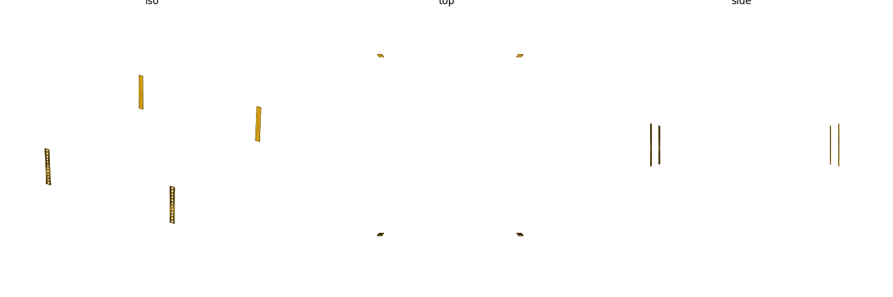
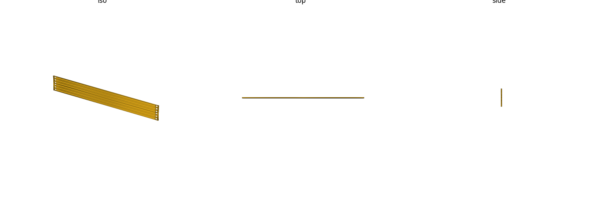

# rack19 (library)

19-inch EIA-310-D rack mechanical reference: panel/opening widths, per-U
mounting-hole pattern (square cage-nut, tapped, round clearance, and
horizontal-slot obround hole types), rail-flange placeholder envelope, and a
plain faceplate blank.
Mechanical mounting geometry only (no electrical/thermal data). Units: **mm**.

Datum: **X centered** on the rack width (`X=0` at the rack centerline), `Z=0`
at the bottom of the U-stack (`+Z` = upward, stacking U-by-U), `Y=0` at the
**front post face** (`+Y` = rearward, into the rack).

**Nothing in this library is tier `[A]`.** EIA-310-D itself is a paid
standard and was not fetched this pass (confirmed paywalled — direct fetch
attempts could not retrieve it; see `RESEARCH.md`). Every value here is corroborated
across public secondary/vendor sources instead — see the Sources table below
and `RESEARCH.md` for the full evidence log.



## Import

```scad
use <rack19/rack19.scad>;
```

Role-1 **data** + role-2 **placeholder** + role-3 **hole-stamp** library —
`use` only (functions, no variables; see gotcha: `use` does not import
top-level variables).

## Usage

### Making a mounting panel — the panel + holes idiom

The spec draft originally called for a dedicated `_panel_holes(u)` helper;
this was **intentionally folded into `rack19_panel()` + `rack19_holes()`**
via a `difference()` instead (DRY — one hole-stamp module already needs to
serve both the panel and the placeholder's rail flanges, so a second
panel-specific hole helper would just duplicate it). **This idiom is THE way
to make a real mounting panel/faceplate with this library:**

```scad
use <rack19/rack19.scad>;

difference() {
    rack19_panel(2);       // 2U faceplate blank, 3mm thick
    rack19_holes(2, "square");  // cage-nut square holes, both rail columns
}
```



Other hole types on the same panel:

```scad
rack19_holes(2, "tapped", "M6");     // round hole sized for an M6 clearance fit
rack19_holes(2, "round", 5.0);       // explicit numeric clearance dia
rack19_holes(2, hole_type="slot", dia=rack19_screw_clearance("M6"));  // horizontal obround
```

### Fit-check placeholder

```scad
use <rack19/rack19.scad>;

rack19_placeholder(4, rack19_depth_preset("std-600"));
```

`rack19_placeholder(u, depth_ftf, hole_type)` builds the four vertical rail
flanges (front + rear, left + right) over `u` units, with the hole strip
stamped through the **front** flanges only (rear flanges are plain — real
rack rails are usually only front-tapped/holed at the mounting face; the rear
posts in this envelope are structural only). A `%`-background usable-equipment
keep-out volume is also drawn between the rails for a GUI fit-check — note
this is an OpenSCAD "background" (`%`) modifier, so it is **excluded from
STL/CSG export** (including the PNG above, which is rendered from an
exported STL) — open the `.scad` directly in the OpenSCAD GUI to see it.

## Reference

| Function | Returns |
|---|---|
| `rack19_u()` | 1U pitch, mm |
| `rack19_stack_gap()` | stacking gap subtracted from a device's exterior height, mm |
| `rack19_device_height(u)` | device exterior height for a `u`-unit device (`u*rack19_u() - rack19_stack_gap()`, gap subtracted once, not per-U), mm |
| `rack19_panel_width()` | full 19in front-panel width, mm |
| `rack19_opening_width()` | usable equipment opening width (between rails), mm |
| `rack19_hole_h_span()` | horizontal hole center-to-center span, mm |
| `rack19_hole_h_centers()` | `[left_x, right_x]` rail hole X centers (X-centered datum) |
| `rack19_u_hole_offsets()` | the 3 per-U hole Z-offsets from a U's lower edge |
| `rack19_hole_z(u)` | every hole-center Z (ascending) for a `u`-unit stack |
| `rack19_square_size()` | cage-nut square hole side, mm |
| `rack19_known_threads()` | valid `rack19_screw_clearance()` thread keys |
| `rack19_screw_clearance(thread)` | clearance-hole dia for a rail thread, mm |
| `rack19_flange_width()` | rail post/flange width, mm |
| `rack19_flange_thickness()` | rail flange sheet-metal thickness (informational default), mm |
| `rack19_known_depths()` | valid `rack19_depth_preset()` names |
| `rack19_depth_preset(name)` | illustrative post face-to-face mounting depth, mm |

| Module | Produces |
|---|---|
| `rack19_holes(u, hole_type, dia, depth, slot_travel)` | mounting-hole cutter, both rail columns, `u` units (subtract from a consumer solid) |
| `rack19_slot_profile(dia, slot_travel)` | horizontal obround cross-section (used by `rack19_holes()`'s `"slot"` branch; extrude it directly for a standalone profile) |
| `rack19_placeholder(u, depth_ftf, hole_type)` | 4-flange rail envelope + front hole strip + `%` keep-out volume (fit-check reference) |
| `rack19_panel(u, thickness)` | plain 19in faceplate blank, `u` units tall — subtract `rack19_holes()` to mount it |

`hole_type` is `"square"` (cage-nut, `dia` ignored), `"tapped"` (pass a
thread string in `dia`, resolved via `rack19_screw_clearance()`), `"round"`
(pass a numeric clearance dia directly in `dia`), or `"slot"` (horizontal
obround, width from `dia` — typically `rack19_screw_clearance("M6")` — and
elongated `slot_travel` mm along X; `slot_travel` defaults to 4mm,
`//VERIFY`, illustrative — no sourced rackpost drilling-tolerance figure
backs this default).
`rack19_holes()`'s `depth` must exceed the target's thickness/flange depth —
the default (40mm, spanning Y∈[-20,+20] centered on the front-post plane)
covers realistic panels (≲20mm) and rail flanges, but a smaller
caller-supplied `depth` can under-cut a thicker target.

## Sources

| Source | Tier | Backs |
|---|---|---|
| [Wikipedia: 19-inch rack](https://en.wikipedia.org/wiki/19-inch_rack) | B | 1U pitch, panel width, opening width, per-U hole gaps, rail post width, first-hole offset (prose only) |
| [Wikipedia: Rack unit](https://en.wikipedia.org/wiki/Rack_unit) | B | Stacking gap / device height formula (h = 44.45n - 0.79mm), corroborated by Micropolis below |
| [Micropolis: Rack-mounting FAQ](https://www.micropolis.com/support/kb/rack-mounting-faq) | B | Stacking gap / device height formula, independent vendor source, exact match with Wikipedia |
| [Wikipedia: Cage nut](https://en.wikipedia.org/wiki/Cage_nut) | B | Cage-nut square hole size (9.5mm), single-source this pass |
| [IBM N series — Rack specifications](https://www.ibm.com/docs/en/n-series?topic=specifications-requirements) | B | Opening width, hole h center-to-center (band 464.2–465.8mm), per-U hole gaps, round rack-hole diameter (bonus) — a real vendor *installation spec* citing EIA-310-D, not the standard itself |
| ISO 273 close-fit clearance series (named standard, repo `hardware` lib precedent, not fetched this pass) | B | M6 screw clearance (6.6mm) |
| ANSI B18.2 close-fit clearance-drill series (named standard, cited from memory of the published series, not fetched this pass) | C `//VERIFY` | 10-32 (5.0mm) / 12-24 (5.6mm) screw clearance |

EIA-310-D itself (the governing standard) was confirmed paywalled
by direct fetch attempt (ANSI webstore, Techstreet, IHS — all 403) and was
**not** obtained this pass; every value above is corroborated across public
secondary/vendor sources instead. Provenance tiers (see `rack19.scad` header
/ `RESEARCH.md`): **[A]** direct EIA-310-D drawing/table (none obtained this
pass), **[B]** corroborated across ≥2 independent peer sources, **[C]**
single-sourced / reverse-engineered / named-standard-not-fetched. Full
fetch-attempt log and closure checks: `RESEARCH.md`.

## Coverage / gaps

Every `//VERIFY` value below is a genuine single-source or unclosed gap, not
a placeholder — see `RESEARCH.md` for the full fetch-attempt log:

- **Hole h center-to-center (465.1mm)** — the only fetched source (IBM) gives
  a **tolerance band** (464.2–465.8mm), not a discrete nominal; 465.1mm is
  the band's midpoint (a commonly-published figure), not a drawing-labelled
  point value. Wikipedia's matching sentence cites the same IBM page, so this
  is one primary source, not two independent ones.
- **Per-U first-hole offset (6.35mm from a U's lower edge)** — Wikipedia
  prose only, not read off a to-scale drawing. (The per-U *gaps*
  15.875/15.875/12.7mm ARE two-source corroborated; only the anchor offset
  itself is single-sourced. Note the shipped 22.225mm second-hole value is
  the exact arithmetic sum 6.35+15.875, not Wikipedia's own rounding-chain
  artifact 22.25mm — see `RESEARCH.md`'s self-review catch.)
- **Cage-nut square size (9.5mm)** — single-sourced to Wikipedia's Cage nut
  article; no independent second vendor source was found this pass (see
  `RESEARCH.md`).
- **Rail post/flange width (15.875mm)** — single-sourced to Wikipedia; not in
  the original seed table, needed for the panel-width closure check.
- **Screw clearance 10-32 (5.0mm) / 12-24 (5.6mm)** — tier `[C]`. No live,
  unpaywalled ANSI B18.2 clearance-hole table was found (multiple dead/404
  URLs and blocked domains, logged in `RESEARCH.md`); the values are cited
  from memory of that standard's published close-fit clearance-drill series,
  **not read off a fetched table this pass**. Flag for a caliper or
  live-table verification pass before cutting real hardware to these
  numbers. M6 (6.6mm) is tier `[B]`, following this repo's own
  `libraries/hardware` ISO 273 precedent (M3/M4/M5 already shipped the same
  way).
- **Depth presets (400/600/800mm)** — illustrative common 19in mounting
  depths, **not EIA-310-D-fixed** (the standard governs the front
  panel/hole pattern only, not cabinet depth) and **vendor-dependent**; no
  single authoritative source fixes these three numbers, and no
  independent-peer corroboration was attempted. Corrected from an
  unsupported `[B]` to `[C] //VERIFY` this pass — see `RESEARCH.md`'s "Depth
  presets" section.
- **Rail flange thickness (2.0mm default)** — informational only, explicitly
  **not** an EIA-310-D value (sheet-metal gauge is a fabricator's choice).
- **Stacking gap (0.79mm)** — tier `[B]`, two independent sources (Wikipedia's
  `Rack_unit` article + Micropolis's rack-mounting FAQ) exact match on the
  formula `h = 44.45n - 0.79mm`. Flagged `//VERIFY` because the "subtracted
  once total, not per-U" framing baked into `rack19_device_height(u)` is this
  pass's own arithmetic reading of that formula, not a direct quote from
  either source — see `RESEARCH.md`'s "Stacking gap" section.

Everything else (1U pitch, panel width, opening width, per-U hole gaps) is
tier `[B]`, corroborated across two independent public sources
(Wikipedia + IBM) — see `RESEARCH.md` for the full closure-checked derivation.
