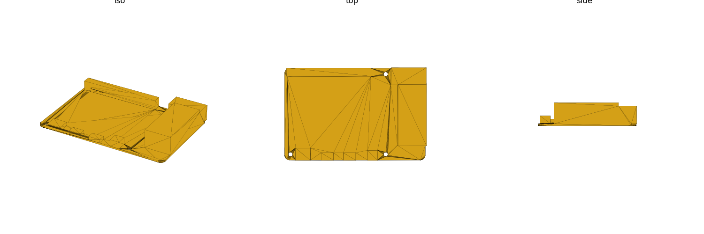

# sbc (library)

Single-board-computer mechanical reference: board outline, corner radius, PCB
thickness, mounting-hole coordinates, and connector footprints, for the
Raspberry Pi "Model B" family. Mechanical mounting/clearance geometry only (no
electrical/signal data). Units: **mm**.

Datum: **bottom-left PCB corner** at the origin, component/top side up, PCB
bottom on `Z=0`. `+X` = board **long** edge, `+Y` = board **short** edge. Board
exit edges are named `"xmin"` / `"xmax"` / `"ymin"` / `"ymax"` (the board edge
a connector's opening faces).

A **connector record** is `[name, [x,y,z], [w,d,h], edge]`:
`[x,y,z]` is the box's **minimum** corner, `[w,d,h]` are its extents along
X/Y/Z (`z` is always the board's `sbc_thickness()`, since every connector sits
on the PCB top face), and `edge` is one of the four exit edges above.



## Import

```scad
use <sbc/sbc.scad>;
```

Role-1 **data** + role-2 **placeholder** + role-3 **hole-stamp/cutout**
library — `use` only (functions, no variables; see gotcha: `use` does not
import top-level variables).

## Boards covered

`"pi3b"`, `"pi3bplus"`, `"pi4b"`, `"pi5"` (string keys — see
`sbc_known_boards()`). All four share the Raspberry Pi Model-B footprint:
85.6 × 56mm outline, 58 × 49mm 4-hole mounting rectangle. Holes sit at
x∈{3.5, 61.5}, y∈{3.5, 52.5} — inset 3.5mm from the xmin/ymin edges and the ymax
edge, but **not centered in X**: the far column is 85.6−61.5 = 24.1mm from the
xmax edge. (Design off `sbc_holes_xy(b)`, not a symmetric inset.)

## Reference

| Function | Returns |
|---|---|
| `sbc_known_boards()` | list of valid board keys |
| `sbc_size(b)` | `[width_X, depth_Y]` mm board outline |
| `sbc_corner_radius(b)` | PCB corner radius, mm |
| `sbc_thickness(b)` | PCB thickness, mm |
| `sbc_hole_dia()` | mounting clearance hole diameter, mm |
| `sbc_holes_xy(b)` | list of `[x,y]` mounting-hole coords |
| `sbc_connectors(b)` | list of all connector records for the board |
| `sbc_connector(b, name)` | single connector record by name |

| Module | Produces |
|---|---|
| `sbc_placeholder(b)` | PCB envelope solid (rounded corners) + connector bodies, holes cut out (fit checks) |
| `sbc_mount_holes(b, depth, dia)` | mounting clearance holes (subtract from a consumer solid) |
| `sbc_standoffs(b, height, dia, bore)` | positive standoff posts with pilot bore (print a tray directly) |
| `sbc_port_cutout(b, name, depth)` | one connector's panel opening, extruded outward along its exit edge |
| `sbc_faceplate_cutouts(b, edge, depth)` | every connector opening on one edge in one call (a router/enclosure faceplate) |

### `sbc_faceplate_cutouts` usage

The library's headline feature — cut every port opening on one edge of an
enclosure wall in one call:

```scad
use <sbc/sbc.scad>;

module pi4b_case_wall() {
    difference() {
        translate([-5, -5, -2]) cube([85.6 + 10, 56 + 10, 2]); // enclosure floor/wall stock
        sbc_faceplate_cutouts("pi4b", "xmax", depth = 10); // right-edge USB2/USB3/RJ45 openings
    }
}
```

## Sources

| Source | Tier | Backs |
|---|---|---|
| [Pi 3 Model B mechanical drawing](https://datasheets.raspberrypi.com/rpi3/raspberry-pi-3-b-mechanical-drawing.pdf) | A | pi3b outline, holes, corner radius, hole dia, connector map |
| [Pi 3 Model B+ mechanical drawing](https://datasheets.raspberrypi.com/rpi3/raspberry-pi-3-b-plus-mechanical-drawing.pdf) | A | pi3bplus outline, holes, corner radius, hole dia, connector map |
| [Pi 4 Model B mechanical drawing](https://datasheets.raspberrypi.com/rpi4/raspberry-pi-4-mechanical-drawing.pdf) | A | pi4b outline, holes, corner radius, hole dia, connector map |
| [Pi 5 mechanical drawing](https://datasheets.raspberrypi.com/rpi5/raspberry-pi-5-mechanical-drawing.pdf) | A | pi5 outline, holes, hole dia, connector map (corner radius NOT labelled on this sheet — see below) |

Provenance tiers (also tagged inline in `sbc.scad` / `RESEARCH.md`): **[A]**
raspberrypi.com official mechanical drawing/STEP, **[B]** multi-peer
community corroboration (≥2 independent sources agree), **[C]** single
community STL/reverse-engineered or estimated. Full chained-dimension
reconstruction: `RESEARCH.md`.

## Coverage & verification notes

**Boards covered now**: the Model-B family (`pi3b`, `pi3bplus`, `pi4b`,
`pi5`) only. **Deferred to later plans** — not in this library yet:

- BananaPi BPI-R4 (2×SFP+ / 4×RJ45) — the driving need for this library,
  scheduled for **Plan 2**.
- Other BPI-R4 variants (lite / pro / 1×SFP+ / 5×RJ45 configs) — later.
- Raspberry Pi Zero family — **Plan 3**.
- Pi A+/3A+, Compute Module carrier boards, Pi 400 — not yet scheduled.

**Carried `//VERIFY` items** — confirm before a tight-tolerance print:

- **X outline (85.6mm) — [B]**. All four official drawings print the outline
  as whole-mm `"85"`; `85.6` is the widely multi-peer-corroborated classic
  figure, not read directly off any drawing. Y outline (56mm) is `[A]`.
- **Pi 5 corner radius (3.0mm) — [B]**. Unlike pi3b/pi3bplus/pi4b (each has
  an explicit `"CORNER RADIUS = 3.0mm"` callout), the Pi 5 sheet has no
  equivalent label; the family value is carried forward.
- **PCB thickness (1.4mm, all boards) — [C]**. No Model-B drawing dimensions
  bare-PCB thickness; community calliper threads report 1.4–1.6mm depending
  on model/batch. Re-measure your specific board before a tight Z stack-up.
- **Standoff post/bore defaults in `sbc_standoffs()` (OD 6.0mm / bore
  2.2mm) — [C]**, generic self-tap sizing, not a specific hardware standoff.
- **pi5 `pcie_fpc`** position and extents — `[C]`, fully estimated; no
  dimension text found on the drawing at all.
- **pi5 `csi_dsi_1`/`csi_dsi_2`** extents (`w`/`d`/`h`) — `[C]`; near-edge Y
  offsets are drawing-read (`[A]`) but body length/width are estimated.
- **pi5 `rj45`/`usb2`** — represented as one shared "combo" footprint; the
  drawing does not dimension an internal Ethernet/USB2 split within the
  single molded shell.
- **pi3b/pi3bplus `microusb_pwr` body** (`w`/`d`/`h`) — `[C]`, no Z-height
  callout captured for this connector.
- **pi4b `av_jack` X position** — `[C]`, assigned by analogy to pi3b's mounting
  -hole offset; not independently isolated on the pi4b drawing.

**General connector caveat**: many connector Y-position / edge assignments
are `[A]` read directly off each drawing's own dimension chain, but body
**depths and heights are frequently `[B]`/`[C]` standard-body estimates**
(the drawings give position/Z-height but rarely a top-view X-depth). This is
fine for faceplate/cutout openings (`sbc_port_cutout`,
`sbc_faceplate_cutouts`), which only need position + opening size — confirm
the specific connector's tier in `sbc.scad`/`RESEARCH.md` before relying on
it for tight internal clearance.
