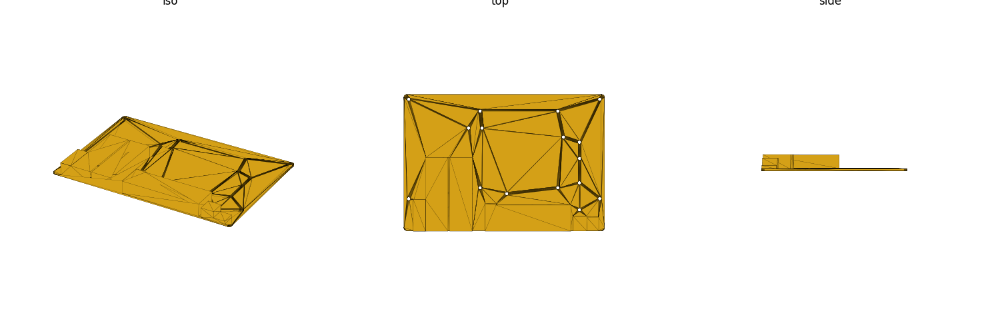
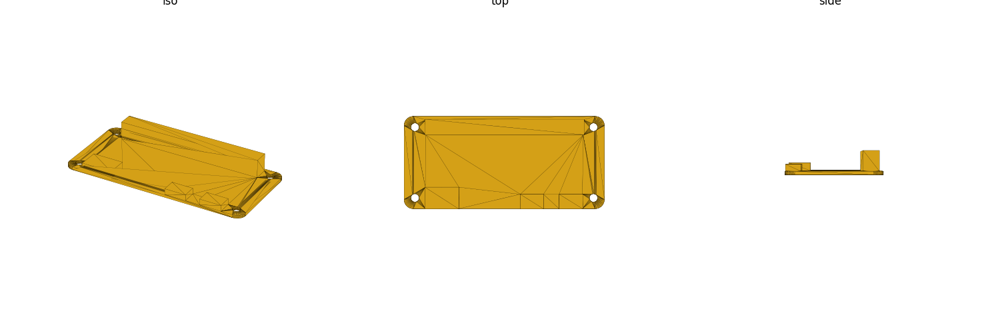

# sbc (library)

Single-board-computer mechanical reference: board outline, corner radius, PCB
thickness, mounting-hole coordinates, and connector footprints, for the
Raspberry Pi "Model B" family, the Raspberry Pi Zero family, and the
BananaPi BPI-R4. Mechanical mounting/clearance geometry only (no
electrical/signal data). Units: **mm**.

Datum: **bottom-left PCB corner** at the origin, component/top side up, PCB
bottom on `Z=0`. `+X` = board **long** edge, `+Y` = board **short** edge.
Connector exit edges are named `"xmin"` / `"xmax"` / `"ymin"` / `"ymax"`
(**lateral** — the opening faces out that board edge) or `"top"` (the
opening faces `+Z`, up off the PCB's top face, with no lateral edge touched
— e.g. the GPIO header).

A **connector record** is `[name, [x,y,z], [w,d,h], edge]`:
`[x,y,z]` is the box's **minimum** corner, `[w,d,h]` are its extents along
X/Y/Z (`z` is always the board's `sbc_thickness()`, since every connector sits
on the PCB top face), and `edge` is one of the five exit values above.


## Import

```scad
use <sbc/sbc.scad>;
```

Role-1 **data** + role-2 **placeholder** + role-3 **hole-stamp/cutout**
library — `use` only (functions, no variables; see gotcha: `use` does not
import top-level variables).

## Boards covered

`"pi3b"`, `"pi3bplus"`, `"pi4b"`, `"pi5"` (string keys — see
`sbc_known_boards()`). All four share the Raspberry Pi Model-B footprint:
85.6 × 56mm outline, 58 × 49mm 4-hole mounting rectangle. Holes sit at
x∈{3.5, 61.5}, y∈{3.5, 52.5} — inset 3.5mm from the xmin/ymin edges and the ymax
edge, but **not centered in X**: the far column is 85.6−61.5 = 24.1mm from the
xmax edge. (Design off `sbc_holes_xy(b)`, not a symmetric inset.)

**Connector layout is NOT shared across the family** — only the outline + hole
pattern are. Notably the `xmax`-edge port stack differs between generations: on
`pi4b` the RJ45 Ethernet jack is at the **GPIO-corner end** (near `y≈46`) with
the USB stack below it, whereas `pi5` **swaps** them — Ethernet moves to the
**power-corner end** (near `y≈10`) and the USB stack moves up. `pi3b`/`pi3bplus`
differ again (USB2 stack over Ethernet, plus a `ymin` HDMI/AV cluster). Always
read `sbc_connectors(b)` for the specific board rather than assuming Pi-family
uniformity.

`"bpir4"` — the **BananaPi BPI-R4**, specifically the **2×SFP + 4×RJ45**
variant (MediaTek MT7988A Filogic 880; `SFP1 WAN` + `SFP2 LAN` cages, `WAN
X1` + `LAN X3` = 4 RJ45 ports). 148.0 × 100.5mm outline, 16 mounting holes
(an asymmetric, component-driven layout — not a simple 4-corner rectangle).
All front-panel connectors (USB, 2×SFP, WAN RJ45, 3×LAN RJ45, DC-in, USB-C
PD) sit on the **`ymin`** edge. Other BPI-R4 configurations — `lite`/`pro`/
1×SFP+/5×RJ45 variants — remain **deferred** (not this key); the 4G/8G RAM
option is electrical-only and mechanically irrelevant either way.



`"pizero"` (Raspberry Pi Zero / Zero W / Zero WH — one shared mechanical
design per Raspberry Pi Ltd) and `"pizero2w"` (Zero 2 W) — both 65 × 30mm
outline, 58 × 23mm 4-hole mounting rectangle, holes at x∈{3.5, 61.5},
y∈{3.5, 26.5} (inset 3.5mm from **all four** edges). The front connector
cluster — mini-HDMI + 2 micro-USB (data, then power nearest the corner) —
sits on the **`ymin`** edge on both boards. Both also carry the 40-pin GPIO
header footprint (`"top"` edge; unpopulated pin slot on the base `pizero`,
Pi-HAT-compatible either way). `pizero2w` additionally has a CSI camera FPC
cutout on the **`xmax`** edge (added in HW rev 1.3, after `pizero`'s v1.2
drawing was drawn — genuinely absent on that board, not an omission).



## Reference

| Function | Returns |
|---|---|
| `sbc_known_boards()` | list of valid board keys |
| `sbc_size(b)` | `[width_X, depth_Y]` mm board outline |
| `sbc_corner_radius(b)` | PCB corner radius, mm |
| `sbc_thickness(b)` | PCB thickness, mm |
| `sbc_hole_dia()` | mounting clearance hole diameter, mm |
| `sbc_holes_xy(b, role)` | list of `[x,y]` mounting-hole coords |
| `sbc_connectors(b)` | list of all connector records for the board |
| `sbc_connector(b, name)` | single connector record by name |

| Module | Produces |
|---|---|
| `sbc_placeholder(b)` | PCB envelope solid (rounded corners) + connector bodies, holes cut out (fit checks) |
| `sbc_mount_holes(b, depth, role, dia)` | mounting clearance holes (subtract from a consumer solid) |
| `sbc_standoffs(b, height, role, dia, bore)` | positive standoff posts with pilot bore (print a tray directly) |
| `sbc_port_cutout(b, name, depth)` | one connector's panel opening, extruded outward along its exit edge |
| `sbc_faceplate_cutouts(b, edge, depth)` | every connector opening on one edge in one call (a router/enclosure faceplate) |

### `sbc_faceplate_cutouts` usage

The library's headline feature — cut every port opening on one edge of an
enclosure wall in one call:

```scad
use <sbc/sbc.scad>;

module pi4b_case_wall() {
    difference() {
        translate([-5, -5, -2]) cube([85.6 + 10, 56 + 10, 2]); // enclosure floor/wall stock
        sbc_faceplate_cutouts("pi4b", "xmax", depth = 10); // right-edge USB2/USB3/RJ45 openings
    }
}
```

`sbc_faceplate_cutouts(b, "top", depth)` works the same way for every
up-facing connector (currently just `gpio`) — cuts a lid/standoff-tray
opening above the header instead of a side-wall opening:

```scad
sbc_faceplate_cutouts("pi4b", "top", depth = 10); // GPIO header clearance through a lid
```

The same call handles a much busier edge without change: BPI-R4's entire
router front panel — 2×SFP cages, 4×RJ45, USB, DC-in, and USB-C PD — in one
`ymin` cutout call:

```scad
use <sbc/sbc.scad>;

module bpir4_case_wall() {
    difference() {
        translate([-5, -2, -2]) cube([148.0 + 10, 2, 16]); // enclosure front wall stock
        sbc_faceplate_cutouts("bpir4", "ymin", depth = 10); // 2xSFP + 4xRJ45 + USB/DC/USB-C-PD openings
    }
}
```

See `renders/bpir4-faceplate-front.png` for the rendered result.

The same call also handles the Pi Zero's compact front edge — mini-HDMI +
2× micro-USB in one `ymin` cutout call:

```scad
use <sbc/sbc.scad>;

module pizero_case_wall() {
    difference() {
        translate([-5, -2, -2]) cube([65 + 10, 2, 8]); // enclosure front wall stock
        sbc_faceplate_cutouts("pizero", "ymin", depth = 10); // mini-HDMI + 2x micro-USB openings
    }
}
```

See `renders/pizero-faceplate-front.png` for the rendered result.

## Hole roles

Every mounting hole is stored as `[x, y, role, dia]`, not just `[x, y]` — each
hole now carries **what it's for** and **its own diameter** (no more single
global hole size across a board: `sbc_placeholder`/`sbc_mount_holes` cut each
hole at its own `dia`, which matters on `bpir4`, where 14 holes are 3.0mm and
2 are ~3.32/3.31mm).

Four canonical roles, from `sbc_known_hole_roles()`:

| Role | Meaning |
|---|---|
| `structural-mount` | Case/enclosure screws into this hole — safe to load-bear (standoff, screw boss). |
| `component-mount` | Holds a component (M.2 standoff, connector shield, etc.) rather than the case — don't rely on it to carry enclosure load. |
| `keep-out` | Not a fastener point at all — avoid, don't stamp a screw/standoff here. |
| `alignment` | Locates a part (dowel/pin) but isn't itself a threaded fastener point. |

Accessors:

| Function | Returns |
|---|---|
| `sbc_known_hole_roles()` | the 4 canonical role strings, in table order |
| `sbc_hole_role(b, i)` | role string of the `i`-th hole in the board's full hole list |
| `sbc_holes(b, role=undef)` | full `[x,y,role,dia]` tuples, filtered by `role` |
| `sbc_holes_xy(b, role=undef)` | `[x,y]`-only coords, filtered by `role` (backward-compatible signature — `sbc_holes_xy(b)` still returns every hole, unchanged from before role-tagging) |

`role` accepts a canonical role string (only matching holes), `"all"` (every
hole, no warning), or is left `undef`/omitted (every hole — but see the
warning below). An unrecognized role string (anything not in
`sbc_known_hole_roles()` and not `"all"`) is an `assert` failure, not a
silent empty list.

**Debug warning — unfiltered access on a multi-role board.** If you call
`sbc_holes(b)` / `sbc_holes_xy(b)` (or anything that forwards `role=undef`,
including `sbc_standoffs`/`sbc_mount_holes` with no `role` argument) on a
board whose holes span **more than one role**, you get an `echo()` warning
at render time:

```
WARNING: sbc 'bpir4' holes span 2 role categories ["structural-mount", "component-mount"]; no role filter selected — returning all. Pass a role (e.g. "structural-mount") or "all" to silence.
```

This is a breadcrumb, not an error — it still returns every hole (identical
to the pre-role-tagging behavior), so nothing breaks. It fires only when a
board's holes are genuinely heterogeneous (all four Pi/Zero families are
single-role, `structural-mount` only, so calling them unfiltered is silent);
`bpir4`'s 16 holes are 4 `structural-mount` + 12 `component-mount`, so any
unfiltered call against `bpir4` prints it. **Silence it** by passing an
explicit role (`sbc_standoffs("bpir4", height, role = "structural-mount")`
to mount only the case-bearing holes) or `role = "all"` if you deliberately
want every hole and don't want the reminder.

`role` params on the hole-stamp modules (both default to `undef` — same "all
holes" behavior as before role-tagging; role filtering is opt-in):

| Module | `role` behavior |
|---|---|
| `sbc_mount_holes(b, depth, role=undef, dia=-1)` | cuts only the selected role's holes; `dia=-1` (default) uses each hole's own stored diameter, or pass a positive `dia` to override every cut hole to one size |
| `sbc_standoffs(b, height, role=undef, dia=-1, bore=-1)` | same role filter; standoff OD/bore still default to the fixed `6.0`/`2.2` regardless of per-hole `dia` (a post is sized for the fastener class, not the clearance-hole diameter) |

Example — mount only `bpir4`'s case-bearing holes, silencing the warning:

```scad
use <sbc/sbc.scad>;
sbc_standoffs("bpir4", height = 5, role = "structural-mount");
```

**Not done here**: extending this same `[x,y,role,dia]` pattern to the
`drives`/`motherboards` libraries' own hole tables is a tracked follow-on,
not part of this change — `sbc` is the only library with role-tagged holes
today.

## Sources

| Source | Tier | Backs |
|---|---|---|
| [Pi 3 Model B mechanical drawing](https://datasheets.raspberrypi.com/rpi3/raspberry-pi-3-b-mechanical-drawing.pdf) | A | pi3b outline, holes, corner radius, hole dia, connector map |
| [Pi 3 Model B+ mechanical drawing](https://datasheets.raspberrypi.com/rpi3/raspberry-pi-3-b-plus-mechanical-drawing.pdf) | A | pi3bplus outline, holes, corner radius, hole dia, connector map |
| [Pi 4 Model B mechanical drawing](https://datasheets.raspberrypi.com/rpi4/raspberry-pi-4-mechanical-drawing.pdf) | A | pi4b outline, holes, corner radius, hole dia, connector map |
| [Pi 5 mechanical drawing](https://datasheets.raspberrypi.com/rpi5/raspberry-pi-5-mechanical-drawing.pdf) | A | pi5 outline, holes, hole dia, connector map (corner radius NOT labelled on this sheet — see below) |
| [BananaPi BPI-R4 docs page](https://docs.banana-pi.org/en/BPI-R4/BananaPi_BPI-R4) | — | links to the mechanical DXF + assembly drawing below |
| [BPI-R4-Main-V11 mechanical DXF](https://drive.google.com/file/d/1FMqHSZnug-IebvTIhkSwmWhDAPyWxr6A/view) (TOP+BOT, vendor CAD export) | A | bpir4 outline, all 16 hole coords/diameters, corner chamfer geometry |
| [BPI-R4 product page](https://www.banana-pi.org/en/bananapi-router/155.html) | B | bpir4 outline corroboration ("100.5x148mm" text) |
| [Pi Zero mechanical drawing](https://datasheets.raspberrypi.com/rpizero/raspberry-pi-zero-mechanical-drawing.pdf) (RPI-ZERO-V1_2, 23/09/2015) | A | pizero outline, holes, corner radius, hole dia |
| [Pi Zero 2 W mechanical drawing](https://datasheets.raspberrypi.com/rpizero2/raspberry-pi-zero-2-w-mechanical-drawing.pdf) ("Zero 2 Mechanical drawing", 2021-10-28) | A | pizero2w outline, holes |

Note on the Zero 2 W URL: the intuitively-named `rpizero2w/` path **404s**;
the working path is `rpizero2/` (it resolves through to
`pip.raspberrypi.com/documents/RP-008358-DS-raspberry-pi-zero-2-w-mechanical-drawing.pdf`).
Both Pi Zero connector clusters (mini-HDMI + 2× micro-USB, and `pizero2w`'s
CSI notch) are tier **[B]/[C]**, similar treatment to BPI-R4 below: the
three bottom-edge (`ymin`) connectors' X-centres are effectively drawing-
dimensioned (both sheets print a "3.5 / 12.4 / 41.4 / 54" chain that lands
within ~0.1mm of the shipped centres), but neither drawing dimensions
connector body widths/depths or prints a Z-height/thickness callout, so
those extents are pixel-measured off each board's own hole-grid-calibrated
render and heights are generic-part estimates — see `RESEARCH.md` for the
full method.

BPI-R4 connector **positions** (SFP/RJ45/USB/power on the `ymin` edge) are
tier **[B]/[C]**, not the DXF: the DXF has no refdes/component-name text at
all, so every connector box was pixel-measured off the vendor's separate
assembly drawing (rendered PNG, calibrated against the DXF's own outline)
rather than read off a dimensioned CAD source — see `RESEARCH.md` for the
per-connector breakdown and detection method.

Provenance tiers (also tagged inline in `sbc.scad` / `RESEARCH.md`): **[A]**
raspberrypi.com official mechanical drawing/STEP, **[B]** multi-peer
community corroboration (≥2 independent sources agree), **[C]** single
community STL/reverse-engineered or estimated. Full chained-dimension
reconstruction: `RESEARCH.md`.

## Coverage & verification notes

**Boards covered now**: the Model-B family (`pi3b`, `pi3bplus`, `pi4b`,
`pi5`), the BananaPi **`bpir4`** (2×SFP + 4×RJ45 variant), and the
Raspberry Pi Zero family (`pizero`, `pizero2w`). **Deferred to later
plans** — not in this library yet:

- Other BPI-R4 variants — `lite` / `pro` / 1×SFP+ / 5×RJ45 configs — different
  boards, not covered by the `bpir4` key.
- Pi A+/3A+, Compute Module carrier boards, Pi 400 — not yet scheduled.

**Carried `//VERIFY` items** — confirm before a tight-tolerance print:

- **X outline (85.6mm) — [B]**. All four official drawings print the outline
  as whole-mm `"85"`; `85.6` is the widely multi-peer-corroborated classic
  figure, not read directly off any drawing. Y outline (56mm) is `[A]`.
- **Pi 5 corner radius (3.0mm) — [B]**. Unlike pi3b/pi3bplus/pi4b (each has
  an explicit `"CORNER RADIUS = 3.0mm"` callout), the Pi 5 sheet has no
  equivalent label; the family value is carried forward.
- **PCB thickness (1.4mm, all boards) — [C]**. No Model-B drawing dimensions
  bare-PCB thickness; community calliper threads report 1.4–1.6mm depending
  on model/batch. Re-measure your specific board before a tight Z stack-up.
- **Standoff post/bore defaults in `sbc_standoffs()` (OD 6.0mm / bore
  2.2mm) — [C]**, generic self-tap sizing, not a specific hardware standoff.
- **pi5 `pcie_fpc`** position and extents — `[C]`, fully estimated; no
  dimension text found on the drawing at all.
- **pi5 `csi_dsi_1`/`csi_dsi_2`** extents (`w`/`d`/`h`) — `[C]`; near-edge Y
  offsets are drawing-read (`[A]`) but body length/width are estimated.
- **pi5 `rj45`/`usb2`** — represented as one shared "combo" footprint; the
  drawing does not dimension an internal Ethernet/USB2 split within the
  single molded shell.
- **pi3b/pi3bplus `microusb_pwr` body** (`w`/`d`/`h`) — `[C]`, no Z-height
  callout captured for this connector.
- **pi4b `av_jack` X position** — `[C]`, assigned by analogy to pi3b's mounting
  -hole offset; not independently isolated on the pi4b drawing.

**Pi Zero-specific `//VERIFY` items**:

- **Corner radius (3.0mm) — [A] on `pizero`, [B] //VERIFY carried-forward on
  `pizero2w`**. The `pizero` sheet has an explicit "CORNER RADIUS = 3.0mm"
  callout; the `pizero2w` sheet has no equivalent label anywhere on the
  page, so its value is the family figure carried forward, not independently
  read.
- **Thickness (1.4mm, both boards) — [C] //VERIFY**, unsourced. Neither Pi
  Zero drawing has a side view or any thickness dimension; `1.4` reuses the
  same generic estimate as the Model-B family.
- **Connector positions (minihdmi/microusb_data/microusb_pwr, both boards)
  — [B]**: the X-centres are effectively drawing-dimensioned (both sheets'
  own "3.5 / 12.4 / 41.4 / 54" chain lands within ~0.1mm of the shipped
  values), but body widths/depths (and the exact Y positions) are not
  text-dimensioned, so every box was pixel-measured off the board's own
  hole-grid-calibrated render. **Connector heights are [C] //VERIFY**
  generic-part figures (no Z-height text on either sheet) — same lower-tier
  caveat as the general connector note below.
- **`gpio` (2×20 THT footprint, both boards) — [B]**, pixel-measured but
  genuinely present: cross-validated against the Model-B family's
  independently-sourced `_sbc_gpio()` figures (close agreement), unlike
  `bpir4`, which has no GPIO header at all.
- **`microsd` is omitted on both boards** — a documented gap, not a guess:
  the `pizero` sheet actually DOES dimension the microSD opening (a box
  protruding ~2mm past the xmin/left edge, with Y-dims "16.9"/"6" on the
  left margin), but the card **holder body** is underside-mounted
  (opposite face from the header/SoC, z<0 in this file's datum), which is
  out of scope for a top-side-only connector model, and its Z extent
  isn't derivable from either top-view sheet. `pizero2w`'s own sheet shows
  no equivalent dimensioned protrusion at all.
- **`pizero2w` `csi` — [B]/[C] //VERIFY, the weakest-sourced record in
  either Pi Zero row**. Position/shape are pixel-measured off a real notch
  cut into the board outline (absent on `pizero`'s earlier v1.2 sheet), but
  neither drawing has a refdes or label confirming the notch is the CSI
  connector rather than some other mechanical/antenna keep-out feature;
  included per its strong positional/shape match to the known family CSI
  location, not a refdes-confirmed reading. `h=1.5` is a generic low-profile
  FPC estimate `[C]`.

**BPI-R4-specific `//VERIFY` items** — this board's provenance is generally
lower-fidelity than the Pi family (no official mechanical drawing was found,
only a vendor DXF + a separate assembly PNG):

- **Corner radius (2.0mm) — [C] //VERIFY**. The DXF outline is actually an
  8-point polygon with **2×2mm 45° chamfers**, not a radiused fillet;
  `sbc_corner_radius()`'s fillet-only geometry can't express a chamfer, so
  `2.0` is the closest visual approximation the shared row schema supports —
  not a faithful reproduction of the real corner profile.
- **Thickness (1.6mm) — [C] //VERIFY**, unsourced. No dimension exists in the
  DXF, the product page, or the docs page; `1.6` is a generic multilayer-PCB
  estimate (deliberately not reused from the RPi family's 1.4mm — a heavier,
  denser router board is a different weight class).
- **Mounting holes — [A]** from the DXF (`PG_ASSEMBLY_HOLE_DIAM` layer, all
  16 centers exact), but 14 measure **~3.0mm** dia and 2 measure **~3.3mm**
  — a real design difference the shared `sbc_holes_xy(b)`/`sbc_hole_dia()`
  schema can't encode (one global diameter, no per-hole field). All 16 are
  clearance-drilled uniformly by `sbc_mount_holes()`/`sbc_standoffs()` at the
  single `sbc_hole_dia()` value; noted here rather than silently dropped.
- **Connector positions — `[B]`/`[C]` //VERIFY across the board**. The DXF
  has **no connector refdes text at all** (only a handful of silkscreen
  labels), so every SFP/RJ45/USB/power box was read from the DXF footprint
  geometry plus the separate vendor assembly-drawing silhouette (pixel-
  measured off a calibrated render), not from dimensioned CAD text. Body
  depths/heights are frequently estimated from generic connector datasheets.
  The **3-gang LAN RJ45 (CN21)** is split into 3 **equal** ports (`rj45_2`/
  `rj45_3`/`rj45_4`) — the overall envelope is `[B]` pixel-detected, but no
  internal divider is dimensioned anywhere, so the even trisection itself is
  `[C]` //VERIFY.
- **No Pi-style `"gpio"` header is modeled for `bpir4`.** The DXF's
  `PIN_TOP` layer shows no 2×20/2.54mm THT grid anywhere on the board — any
  GPIO/pin header is undimensioned in available sources, and is a
  documented gap (omitted rather than invented). The "exactly one gpio"
  invariant in the test suite is scoped to the Pi Model-B boards only —
  BPI-R4 is exempt.
- **M.2 sockets (CN12/14/16/18, BOT side) are omitted** — a documented gap,
  not front-panel-relevant, and several sit on the PCB underside
  (incompatible with this library's top-face-only connector convention).

**General connector caveat**: many connector Y-position / edge assignments
are `[A]` read directly off each drawing's own dimension chain, but body
**depths and heights are frequently `[B]`/`[C]` standard-body estimates**
(the drawings give position/Z-height but rarely a top-view X-depth). This is
fine for faceplate/cutout openings (`sbc_port_cutout`,
`sbc_faceplate_cutouts`), which only need position + opening size — confirm
the specific connector's tier in `sbc.scad`/`RESEARCH.md` before relying on
it for tight internal clearance.

**Placeholder bodies stop at the PCB edge**: every lateral connector's box in
`sbc_placeholder(b)` is modeled with its outer face flush with the board edge
(box max = board edge) — it does **not** model the real outboard overhang of
shells like USB-A or RJ45, which typically protrude **~2mm past** the bare
PCB edge in real hardware. This is fine for faceplate/panel cutouts (position
+ opening size are unaffected), but if you're checking tight clearance
against an enclosure wall or neighboring part, add ~2mm of your own margin
past the PCB edge rather than trusting the placeholder's outer face.
