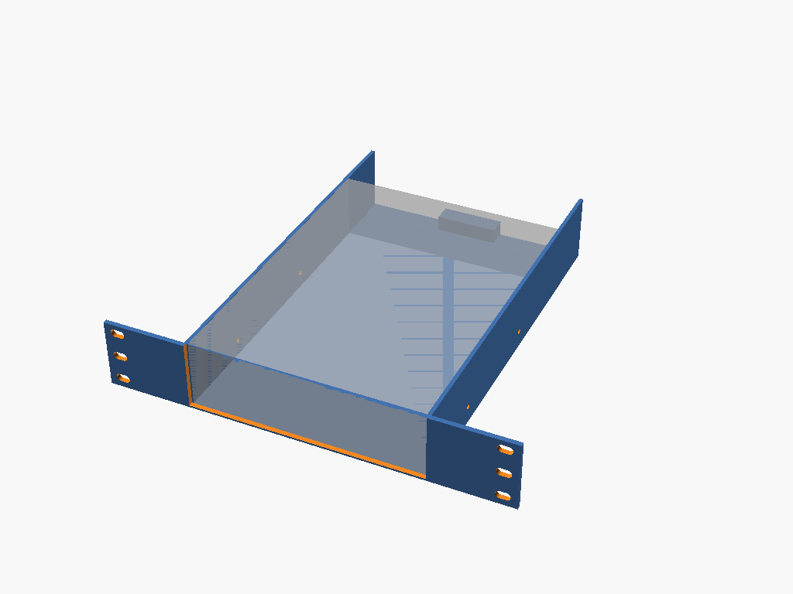

# bay-enclosure

Parametric 1U/2U `rack10` enclosure for a front-accessible bay device
(5.25" optical drive / 3.5" bay accessory: card readers, fan controllers).
Side-rail mount, open front cutout exposing the device face, rear `#40`
`rack-support` mate.

**Status (#41):** in progress. This task built the front rack panel + a
large device-face cutout + the width/height fit-assert (device data from
`drives`, rack geometry from `rack10`). Side-rail mount holes, walls,
gussets, and the rear `rack_support_tongue()` mate land in a follow-up
task; device presets (`bay525_hh`/`bay525_fh`/`bay35`) and full print
guidance are documented once that lands.



## Build

```bash
make run P=bay-enclosure       # interactive
make render P=bay-enclosure    # regenerate the render above
```

See [PRINTING.md](PRINTING.md) for print settings.
