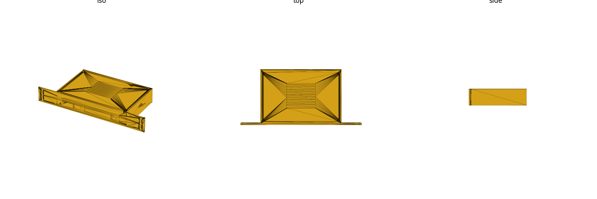

# bpir4-1u-chassis

Enclosed 1U 10-inch (LabRax) rack chassis for the Banana Pi BPI-R4.
Two printed parts: a single-body tray and a flush countersunk lid. The body
is narrowed to hug the board (`body_w()` ≈170mm, not the full rack-clear
width) with four wall-buttressed, support-free corner posts beside it. Rear
exhaust fans are behind an `enable_exhaust` toggle exposed in the assembly
customizer alongside `fan_size`/`fan_count`; passive mode swaps the fan bores
for a rear vent-slot array. Intake air runs through a horizontal vent band
above the IO connector cluster (not side margins), for a straight
cross-chassis path over the SFP/connector tops. Rack ears default to slotted
mounting holes (`ear_hole_type`), with round options available.

All hardware dimensions are pulled live from the repo libraries (`sbc`,
`rack10`, `fans`, `hardware`).

## Render / build

    make render P=bpir4-1u-chassis
    make run    P=bpir4-1u-chassis   # GUI

## Parameters

See `params.scad`. Key: `enable_exhaust` (rear fans on/off, customizer
`/* [Cooling] */` group), `fan_size`, `fan_count`, `stack_gap`,
`ear_hole_type` (`"slot"` default; `"10-32"`/`"m6"`/`"round"` also available).

## Assembly reference

`assembly.scad` has a `show_rack` toggle (`/* [Show] */` group) that renders
a translucent 3U `rack10_placeholder` framing the chassis as the middle U —
a quick sanity check against neighboring rack gear before printing.
