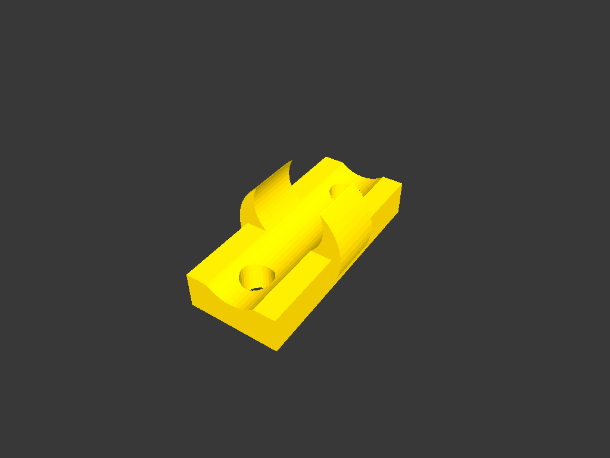

# cable-clip

Wall-mount clip for routing a 8 mm cable, fixed with two M3 screws.



## Build

```bash
make run P=cable-clip       # interactive
make render P=cable-clip    # regenerate the render above
```

See [PRINTING.md](PRINTING.md) for print settings.
