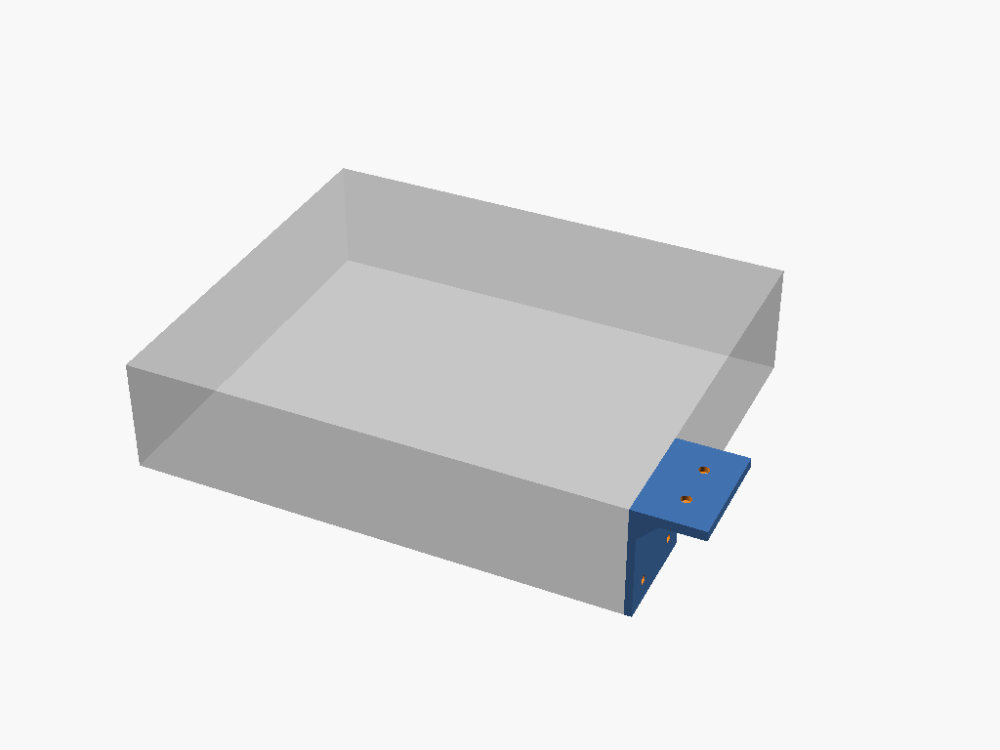

# css610-underdesk-mount

Printed L-bracket to hang a MikroTik CSS610-8G-2S+IN switch under a desk:
bolts to the device's own side M3 pattern, top flange sits flush with the
device top, wood screws go up into the desk. Standalone project (no lib
deps) — device data is project-local. Units: **mm**.



## Design

- **Side-bolt mount, flush top flange.** The bracket's vertical leg lies
  flat against one of the device's side faces and picks up its 4x M3
  mounting holes; the horizontal flange at the top is coplanar with the
  device's top face (`standoff=0` by default) and projects outward past the
  leg to carry the 2 desk-facing wood-screw holes. There is no cradle, tray,
  or bottom support — the device hangs from its own side screws.
- **Fasteners are two different kinds, going into two different things.**
  The 4x M3 clearance holes in the leg bolt into the device's **own tapped
  side holes** (the switch supplies the threads); the 2x countersunk holes
  in the flange take **wood screws driven up into the desk** from below. Do
  not mix these up when sourcing hardware.
- **45° gusset, support-free.** A triangular gusset braces the
  leg-to-flange corner so the flange overhang doesn't rely on the M3 bolts
  alone for rigidity. Both the gusset and the wood-screw countersink are cut
  at exactly 45°.
- **Print 2x, `side` param.** `side="L"` / `side="R"` (default `"R"`)
  mirrors the bracket across Y so one of each hangs on either side of the
  switch. With the CSS610's current (Y-symmetric) hole data, the two
  variants happen to render as the **same congruent solid** — the M3
  hole Y-positions (9.5, 34.5) and the wood-screw Y-positions are each
  symmetric about the leg's mid-span, so mirroring maps the hole set onto
  itself. This is correct, not a bug: the `side` param is still exposed and
  asserted so a future asymmetric correction to the device's hole data would
  produce a genuinely mirrored "L" without a module rewrite. Print one STL
  under each name (or just two copies of the same STL) for the pair.
- **Flat print orientation, support-free.** Print with the flange's
  device-facing top (model `Z = H + standoff`) resting on the print bed —
  i.e. upside-down relative to how it hangs in use, leg rising off the bed.
  In this orientation the wood-screw countersink's cone opens mouth-up as
  build height increases (self-supporting, since its half-angle is exactly
  45°) and the gusset's cross-section shrinks monotonically with build
  height, so no new unsupported material appears at any layer. The 4x M3
  holes end up horizontal (bored across layers) but are well inside the
  ~5mm bridging-safe range this repo's `design-for-print` skill cites, so no
  teardrop treatment is needed. See `css610-underdesk-mount.scad`'s own
  module comment for the verified geometry (headless render + colored
  side-profile overlay against the device envelope).

### Print-quality note: zero margin on the 45° features

The gusset and the wood-screw countersink are both cut at **exactly 45°**,
the outer edge of PETG's safe self-supporting band (roughly 45-50°, per this
repo's `design-for-print` skill house rules) rather than comfortably inside
it. That's fine on a well-tuned printer/slicer, but it leaves no margin for
printer/slicer variance (calibration drift, wet filament, aggressive cooling
settings, etc.) — if either feature comes out drooping or rough on your
printer, that's the likely cause. Increasing `gusset` and/or the derived
countersink cone angle (via `csk_dia`/`wood_screw`) to lean shallower than
45° would trade some clearance/print time for more margin, but isn't done by
default since it currently prints clean at 45° on this repo's reference
printer (Bambu P1S, PETG).

## Customizer parameters

| Param | Default | Notes |
|---|---|---|
| `leg_thickness` | `3` | Vertical leg thickness (against the device side), mm |
| `flange_thickness` | `4` | Top flange thickness, mm |
| `gusset` | `8` | Gusset triangle leg length (equal-leg, 45°), mm |
| `mount_hole` | `3.4` | M3 clearance hole diameter (leg, into the device's own tapped holes) |
| `wood_screw` | `4` | Wood-screw clearance hole diameter (flange, into the desk) |
| `csk_dia` | `8` | Wood-screw countersink mouth diameter, mm |
| `flange_len` | `25` | Flange projection past the leg's outer face, mm |
| `flange_width` | `40` | *(declared but not currently consumed by the module — the leg/flange Y-span is derived from the device hole pattern instead; see the module's own comment)* |
| `standoff` | `0` | Extra gap between the flange top and the device top plane; `0` = flush |
| `side` | `"R"` | `"L"` or `"R"` — print one of each; see "Print 2x" above |

## Sourcing

Device size and the side M3 mounting-hole pattern are project-local `[A]`
data (MikroTik CSS610-8G-2S+IN dimensional drawing) — see
`css610-underdesk-mount.scad`'s own header comment for the literals and
citation. No shared library is consumed; this is a standalone,
single-consumer project (per this repo's device-data-placement convention,
project-local data stays project-local until a second project needs the
same device).

## Build

```bash
make run P=css610-underdesk-mount       # interactive
make render P=css610-underdesk-mount    # regenerate the render above
```

See [PRINTING.md](PRINTING.md) for print settings.
