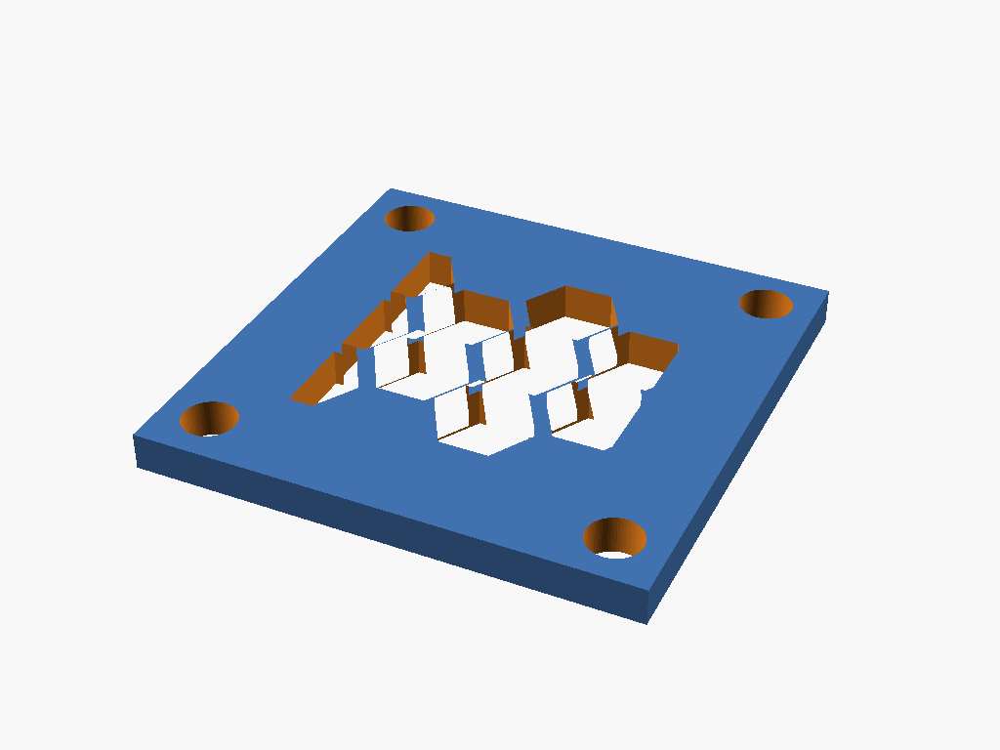

# fan-grille

Flat, support-free honeycomb finger-guard for a case fan. A square plate at
the fan's own footprint, a solid border, a `honeycomb_vent` field over the
airflow opening, and 4 corner mount holes reusing the fan's own screw
positions — so the grille bolts on with the same screws as the fan itself
(or sandwiches between the fan and its mounting surface). Consumes the
`fans` lib (`fan_known_sizes`, `fan_hole_spacing`, `fan_holes`) for mount
geometry and the `honeycomb` lib (`honeycomb_vent`) for the vent field — no
dimensions are copied locally. Units: **mm**.



## Params

| Param | Default | Notes |
|---|---|---|
| `fan_size` | `40` | Fan frame size, mm; must be one of `fan_known_sizes()` (asserted) |
| `plate_th` | `3` | Plate thickness, mm — the short print-vertical axis |
| `cell` | `8.0` | Honeycomb hex point-to-point width, mm (carried from the bpir4 vent tuning) |
| `wall` | `1.2` | Solid gap kept between adjacent hex holes, mm |
| `field_margin` | `8` | Inset of the honeycomb field inboard of the corner mount-hole square, mm |

`field_margin` is the one value tuned per-project rather than sourced from a
lib: at `8`, the honeycomb field clears every corner mount hole (across all
`fan_known_sizes()`) by a constant ~3.5 mm, verified by rendering at every
known fan size (see `tests/test_fan_grille.sh` and the `verify-scad-geometry`
pass run against this project). Tune it further if you need a tighter or
looser border for a specific fan size.

## Build

```bash
make run P=fan-grille       # interactive
make render P=fan-grille    # regenerate the render above
```

See [PRINTING.md](PRINTING.md) for print settings.

## Sourcing

- Mount-hole positions and diameters: `fans` lib's `fan_holes(fan_size, role="structural-mount")`
  — the fan's own corner-hole frame, centered on the fan origin. At the
  default `fan_size=40` the corner tabs between hole and plate edge are thin
  (~1.85 mm) — see [PRINTING.md](PRINTING.md#corner-mount-hole-tab-thickness)
  for fastener-driving guidance.
- Honeycomb vent field: `honeycomb` lib's `honeycomb_vent(width, height, depth, cell, wall)`
  — the same self-supporting hex-hole cutter used by the bpir4 chassis lid/faceplate vents
  (this project is the honeycomb lib's 2nd consumer).

## Print orientation

Prints flat, no rotation, no supports: `plate_th` is the short print-vertical
axis (plate lies flat on the bed), and the honeycomb field is cut straight
through local Z — there is no bridging span in the print-vertical direction,
only the honeycomb lib's own <=5 mm flat-top-hex edges (see
`libraries/honeycomb/honeycomb.scad`'s header comment), which are
self-supporting by design.
