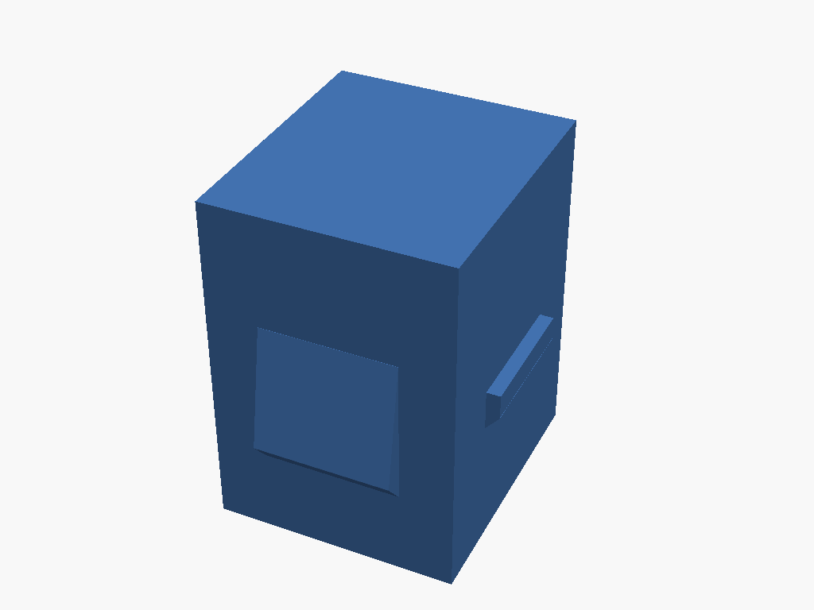

# keystone-blank

Printable, caliper-faithful keystone blank insert. Consumes the `keystone`
library's flagship `keystone_insert()` module (body + guide ribs + fixed
retention lug + cantilever snap-fit latch) to produce a single, standalone
part: a blank plug that snaps into a standard keystone jack opening where no
pass-through jack is needed.



## Params

| Param | Default | Notes |
|---|---|---|
| `fit` | `0.2` | Slot-engagement clearance, mm (shrinks the insert body per side) |
| `latch_wall` | `1.0` | Cantilever beam thickness, mm (bends with PETG's compliance) |

Both are meant to be tuned on the bench against your own printer/material —
see PRINTING.md.

## Build

```bash
make run P=keystone-blank       # interactive
make render P=keystone-blank    # regenerate the render above
```

See [PRINTING.md](PRINTING.md) for print settings.

## Sourcing

All insert geometry (body, guide ribs, lug, latch) comes from the
`keystone` lib's `keystone_insert_*()` caliper data accessors (tiers in
`libraries/keystone/RESEARCH.md`). No dimensions are copied — this project
calls `keystone_insert()` directly, passing only the two bench-tunable
print-fit parameters above.
