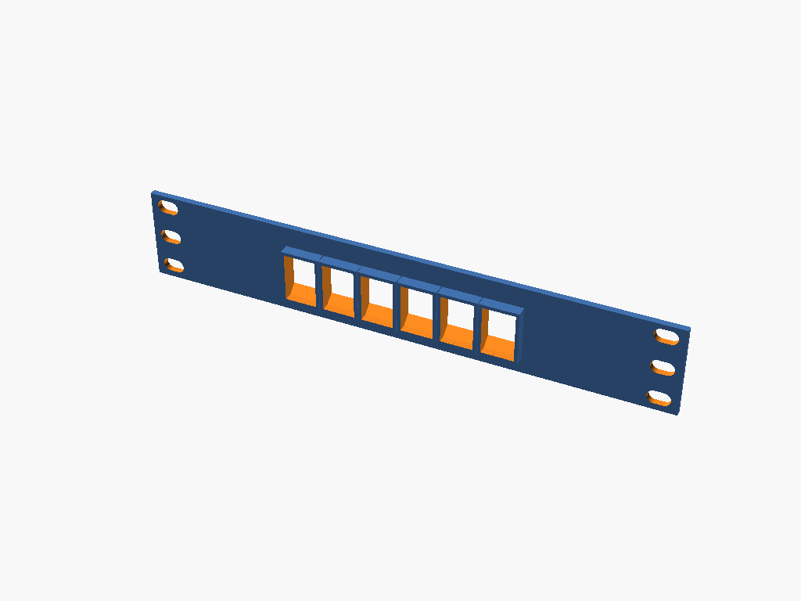

# keystone-faceplate

TODO: describe the item.



## Build

```bash
make run P=keystone-faceplate       # interactive
make render P=keystone-faceplate    # regenerate the render above
```

See [PRINTING.md](PRINTING.md) for print settings.
